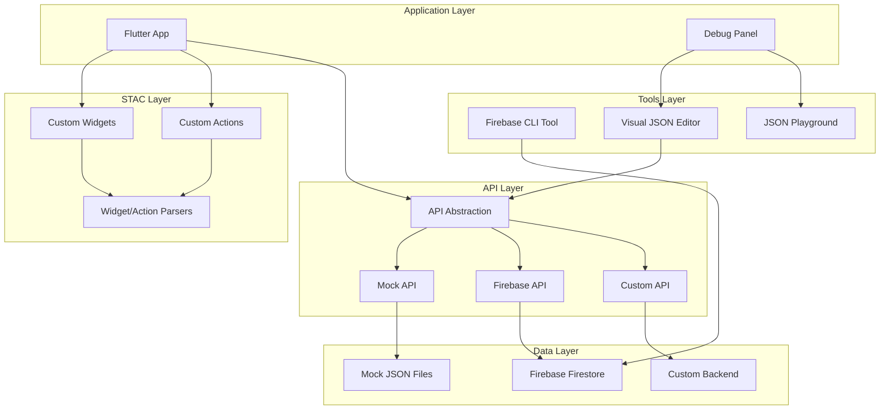
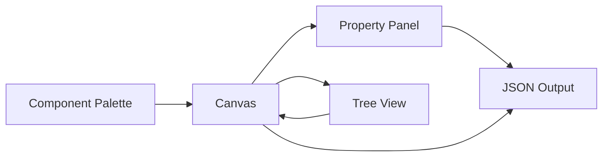

# Design Document

## Overview

This design document outlines the architecture and implementation strategy for building a comprehensive hybrid application framework using STAC (Server-Driven UI) technology. The framework enables seamless development, testing, and deployment of server-driven UI applications with robust tooling, flexible API management, and advanced debugging capabilities.

### Goals

1. **Developer Experience**: Provide intuitive tools and comprehensive documentation for creating custom STAC components
2. **Testing Excellence**: Ensure all features are thoroughly tested with automated test suites
3. **Flexible API Management**: Support mock, Firebase, and custom API layers with easy switching
4. **Advanced Debugging**: Offer powerful debugging tools including live JSON editing and visual editors
5. **Production Ready**: Deliver a framework suitable for production deployment with proper error handling and performance optimization

### Non-Goals

1. Modifying the core STAC framework (`.stac/` folder)
2. Creating a general-purpose CMS system
3. Supporting non-Flutter platforms
4. Providing backend infrastructure beyond Firebase integration

### Essential Documentation Resources

Before implementing any feature, developers and AI agents MUST review the following documentation:

1. **`docs/stac/`**: Comprehensive STAC framework documentation
   - Widget reference (70+ built-in widgets)
   - Action system documentation
   - Parser patterns and examples
   - Theming and styling guides

2. **`docs/stac_core/`**: Core architecture and technical details
   - Architecture overview
   - State management patterns
   - Data binding mechanisms
   - Creating custom components guide

3. **`docs/debug_panel/`**: Existing debug panel documentation
   - Current debug panel features
   - Integration patterns
   - Extension points

4. **`.stac/`**: Original STAC package (READ-ONLY)
   - Reference implementation
   - Core framework code
   - Official examples
   - **DO NOT MODIFY** - Use for understanding only

5. **`stac/` (root directory)**: Custom STAC implementation
   - Project-specific custom widgets
   - Project-specific custom actions
   - Custom parsers and extensions
   - **USE THIS** for all custom components

### Custom STAC vs Core STAC

**Critical Distinction**:
- **`.stac/`**: Original STAC package from GitHub - READ-ONLY reference
- **`stac/`**: Our custom STAC implementation - MODIFY HERE

**Why Separate?**:
1. **Version Control**: Avoid conflicts with upstream STAC updates
2. **Production Safety**: Prevent accidental breaking changes from package updates
3. **Customization**: Full control over custom components without affecting core
4. **Testing**: Isolate custom code for easier testing and debugging

**Implementation Rule**: All custom widgets, actions, and parsers MUST be created in `stac/` directory, NOT in `.stac/` directory.

## Architecture

### High-Level Architecture




### System Components

#### 1. Documentation System (`docs/stac_in_action/`)

**Purpose**: Provide comprehensive, AI-agent-optimized documentation for developers

**Structure**:
```
docs/stac_in_action/
├── README.md                           # Overview and navigation
├── 01-getting-started.md               # Quick start guide
├── 02-custom-widgets-guide.md          # Creating custom widgets
├── 03-custom-actions-guide.md          # Creating custom actions
├── 04-testing-guide.md                 # Testing strategies
├── 05-api-layer-guide.md               # API layer configuration
├── 06-mock-data-guide.md               # Working with mock data
├── 07-firebase-integration.md          # Firebase setup and usage
├── 08-debug-panel-guide.md             # Debug panel features
├── 09-visual-editor-guide.md           # Visual JSON editor
├── 10-json-playground-guide.md         # JSON playground usage
├── 11-cli-tools-guide.md               # CLI tool reference
├── 12-production-deployment.md         # Production best practices
├── 13-troubleshooting.md               # Common issues and solutions
├── examples/                           # Code examples
│   ├── custom-widget-example.dart
│   ├── custom-action-example.dart
│   ├── mock-data-example.json
│   └── firebase-config-example.json
└── diagrams/                           # Architecture diagrams
    ├── api-layer-flow.mmd
    ├── component-creation-flow.mmd
    └── debug-panel-architecture.mmd
```

**Key Features**:
- Clear, concise language optimized for AI agents
- Complete code examples that can be copied directly
- Step-by-step guides with screenshots
- Troubleshooting sections with common errors
- Mermaid diagrams for visual understanding

#### 2. Custom Component System

**Purpose**: Enable easy creation and integration of custom STAC widgets and actions

**Component Structure**:
```
stac/
├── widgets/
│   ├── custom_card/
│   │   ├── custom_card_widget.dart      # Widget model
│   │   └── custom_card_parser.dart      # Widget parser
│   └── product_list/
│       ├── product_list_widget.dart
│       └── product_list_parser.dart
├── actions/
│   ├── api_call/
│   │   ├── api_call_action.dart         # Action model
│   │   └── api_call_parser.dart         # Action parser
│   └── analytics/
│       ├── analytics_action.dart
│       └── analytics_parser.dart
└── registry/
    └── custom_component_registry.dart    # Component registration
```

**Design Patterns**:
- **Model-Parser Separation**: Models define data structure, parsers handle rendering/execution
- **JSON Serialization**: All models use `@JsonSerializable()` for type-safe JSON conversion
- **Registry Pattern**: Central registration system for all custom components
- **Type Safety**: Strong typing with compile-time validation


#### 3. Testing Framework

**Purpose**: Ensure all custom components are thoroughly tested and maintain backward compatibility

**Test Structure**:
```
test/
├── stac/
│   ├── widgets/
│   │   ├── custom_card_test.dart        # Widget unit tests
│   │   └── product_list_test.dart
│   ├── actions/
│   │   ├── api_call_test.dart           # Action unit tests
│   │   └── analytics_test.dart
│   ├── parsers/
│   │   ├── widget_parser_test.dart      # Parser tests
│   │   └── action_parser_test.dart
│   └── integration/
│       ├── component_integration_test.dart
│       └── api_integration_test.dart
├── api/
│   ├── mock_api_test.dart
│   ├── firebase_api_test.dart
│   └── api_abstraction_test.dart
└── helpers/
    └── test_helpers.dart                 # Shared test utilities
```

**Testing Strategy**:
- **Unit Tests**: Test individual components in isolation
- **Widget Tests**: Test widget rendering and interactions
- **Integration Tests**: Test component interactions and API flows
- **Regression Tests**: Ensure new features don't break existing functionality
- **Mock Data**: Use consistent mock data across all tests

**Test Coverage Requirements**:
- Minimum 80% code coverage for custom components
- 100% coverage for critical API layer code
- All public APIs must have tests

#### 4. API Layer Architecture

**Purpose**: Provide flexible, abstracted API layer supporting multiple backends

**API Abstraction Interface**:
```dart
abstract class StacApiService {
  /// Fetch JSON configuration by screen name
  Future<Map<String, dynamic>> fetchScreen(String screenName);
  
  /// Fetch JSON configuration by route
  Future<Map<String, dynamic>> fetchRoute(String route);
  
  /// Refresh cached data
  Future<void> refresh();
  
  /// Clear all cached data
  Future<void> clearCache();
  
  /// Check if data is cached
  bool isCached(String key);
  
  /// Get cached data
  Map<String, dynamic>? getCached(String key);
}
```

**Implementation Classes**:

1. **MockApiService**: Loads JSON from local assets
2. **FirebaseApiService**: Fetches JSON from Firebase Firestore
3. **CustomApiService**: Fetches JSON from custom REST API

**Configuration System**:
```dart
class ApiConfig {
  final ApiMode mode;              // mock, firebase, custom
  final String? firebaseProject;   // Firebase project ID
  final String? customApiUrl;      // Custom API base URL
  final bool enableCaching;        // Enable response caching
  final Duration cacheExpiry;      // Cache expiration time
  
  // Factory constructors for different modes
  factory ApiConfig.mock() => ApiConfig(mode: ApiMode.mock);
  factory ApiConfig.firebase(String projectId) => ...;
  factory ApiConfig.custom(String apiUrl) => ...;
}
```

**Switching Between API Modes**:
```dart
// In app configuration
const bool USE_MOCK_API = true;  // Toggle flag

final apiService = USE_MOCK_API 
    ? MockApiService()
    : FirebaseApiService(projectId: 'my-project');
```


#### 5. Mock API System

**Purpose**: Enable development and testing without backend dependencies

**Mock Data Structure**:
```
assets/mock_data/
├── screens/
│   ├── home_screen.json
│   ├── profile_screen.json
│   └── product_list_screen.json
├── flows/
│   ├── onboarding_flow.json
│   └── checkout_flow.json
└── config/
    ├── navigation_config.json
    └── theme_config.json
```

**Mock API Implementation**:
```dart
class MockApiService implements StacApiService {
  final Map<String, dynamic> _cache = {};
  
  @override
  Future<Map<String, dynamic>> fetchScreen(String screenName) async {
    // Simulate network delay
    await Future.delayed(Duration(milliseconds: 300));
    
    // Load from assets
    final jsonString = await rootBundle.loadString(
      'assets/mock_data/screens/$screenName.json'
    );
    
    final data = jsonDecode(jsonString) as Map<String, dynamic>;
    _cache[screenName] = data;
    return data;
  }
  
  // Hot reload support
  Future<void> reloadMockData() async {
    _cache.clear();
    // Trigger UI refresh
  }
}
```

**Features**:
- Simulated network delays for realistic testing
- Hot reload support for rapid iteration
- Validation of JSON structure before loading
- Error simulation for testing error handling

#### 6. Firebase Integration

**Purpose**: Provide cloud-based JSON storage for development and testing

**Firebase Structure**:
```
Firestore Collection: stac_screens
├── home_screen
│   ├── version: 1
│   ├── updated_at: timestamp
│   └── json: { ... }
├── profile_screen
│   └── ...
└── product_list_screen
    └── ...

Firestore Collection: stac_config
├── navigation
│   └── json: { ... }
└── theme
    └── json: { ... }
```

**Firebase API Implementation**:
```dart
class FirebaseApiService implements StacApiService {
  final FirebaseFirestore _firestore;
  final Map<String, CachedData> _cache = {};
  
  @override
  Future<Map<String, dynamic>> fetchScreen(String screenName) async {
    // Check cache first
    if (_isCacheValid(screenName)) {
      return _cache[screenName]!.data;
    }
    
    // Fetch from Firestore
    final doc = await _firestore
        .collection('stac_screens')
        .doc(screenName)
        .get();
    
    if (!doc.exists) {
      throw ScreenNotFoundException(screenName);
    }
    
    final data = doc.data()!['json'] as Map<String, dynamic>;
    
    // Cache with timestamp
    _cache[screenName] = CachedData(
      data: data,
      timestamp: DateTime.now(),
    );
    
    return data;
  }
  
  bool _isCacheValid(String key) {
    if (!_cache.containsKey(key)) return false;
    final cached = _cache[key]!;
    return DateTime.now().difference(cached.timestamp) < Duration(minutes: 5);
  }
}
```

**Security Rules**:
```javascript
rules_version = '2';
service cloud.firestore {
  match /databases/{database}/documents {
    match /stac_screens/{screen} {
      allow read: if request.auth != null;
      allow write: if request.auth != null && 
                     request.auth.token.admin == true;
    }
    match /stac_config/{config} {
      allow read: if request.auth != null;
      allow write: if request.auth != null && 
                     request.auth.token.admin == true;
    }
  }
}
```


#### 7. Firebase Management Tools

**Purpose**: Provide CLI and GUI tools for managing JSON configurations in Firebase

**CLI Tool Structure**:
```
lib/tools/firebase_cli/
├── commands/
│   ├── upload_command.dart      # Upload JSON to Firebase
│   ├── download_command.dart    # Download JSON from Firebase
│   ├── list_command.dart        # List all screens
│   ├── delete_command.dart      # Delete screen
│   └── validate_command.dart    # Validate JSON structure
├── validators/
│   ├── json_validator.dart      # JSON schema validation
│   └── stac_validator.dart      # STAC-specific validation
└── firebase_cli.dart            # Main CLI entry point
```

**CLI Commands**:
```bash
# Upload screen JSON to Firebase
dart run lib/tools/firebase_cli/firebase_cli.dart upload \
  --screen home_screen \
  --file assets/mock_data/screens/home_screen.json

# Download screen JSON from Firebase
dart run lib/tools/firebase_cli/firebase_cli.dart download \
  --screen home_screen \
  --output assets/mock_data/screens/home_screen.json

# List all screens
dart run lib/tools/firebase_cli/firebase_cli.dart list

# Validate JSON before upload
dart run lib/tools/firebase_cli/firebase_cli.dart validate \
  --file assets/mock_data/screens/home_screen.json

# Delete screen
dart run lib/tools/firebase_cli/firebase_cli.dart delete \
  --screen home_screen
```

**CRUD Interface** (Web-based):
```
lib/tools/firebase_crud/
├── screens/
│   ├── screen_list_screen.dart      # List all screens
│   ├── screen_edit_screen.dart      # Edit screen JSON
│   └── screen_create_screen.dart    # Create new screen
├── widgets/
│   ├── json_editor_widget.dart      # JSON editor component
│   └── screen_card_widget.dart      # Screen list item
└── firebase_crud_app.dart           # Main CRUD app
```

**Features**:
- JSON syntax highlighting and validation
- Version history and rollback
- Bulk operations (upload multiple screens)
- Search and filter capabilities
- Preview JSON before saving

#### 8. STAC Logging Integration

**Purpose**: Integrate STAC-specific logging into existing debug panel and API logger

**Logging Architecture**:
```
lib/core/logging/
├── stac_logger.dart                 # STAC-specific logger
├── stac_log_interceptor.dart        # Intercepts STAC operations
└── stac_log_models.dart             # Log entry models

lib/debug_panel/
├── tabs/
│   ├── stac_logs_tab.dart           # New tab for STAC logs
│   ├── json_editor_tab.dart         # Live JSON editing
│   ├── playground_tab.dart          # JSON playground
│   └── visual_editor_tab.dart       # Visual JSON editor
└── widgets/
    ├── stac_log_viewer.dart         # STAC log viewer widget
    ├── json_viewer.dart             # JSON viewer with syntax highlighting
    └── stac_operation_card.dart     # Log entry card
```

**STAC Logger Implementation**:
```dart
class StacLogger {
  static void logScreenFetch({
    required String screenName,
    required ApiSource source,
    required Duration duration,
    required int jsonSize,
  }) {
    AppLogger.i(
      '📱 STAC Screen Fetch',
      {
        'screen': screenName,
        'source': source.name,
        'duration_ms': duration.inMilliseconds,
        'size_kb': (jsonSize / 1024).toStringAsFixed(2),
      },
    );
  }
  
  static void logJsonParsing({
    required String screenName,
    required List<String> widgetTypes,
    required Duration duration,
    List<String>? warnings,
  }) {
    AppLogger.i(
      '🔄 STAC JSON Parsing',
      {
        'screen': screenName,
        'widgets': widgetTypes.join(', '),
        'duration_ms': duration.inMilliseconds,
        'warnings': warnings?.join('; ') ?? 'none',
      },
    );
  }
  
  static void logComponentRender({
    required String componentType,
    required Map<String, dynamic> properties,
    required Duration duration,
  }) {
    AppLogger.d(
      '🎨 STAC Component Render',
      {
        'type': componentType,
        'properties': properties.keys.join(', '),
        'duration_ms': duration.inMilliseconds,
      },
    );
  }
  
  static void logError({
    required String operation,
    required String error,
    String? jsonPath,
    String? suggestion,
    StackTrace? stackTrace,
  }) {
    AppLogger.e(
      '❌ STAC Error: $operation',
      {
        'error': error,
        'json_path': jsonPath ?? 'unknown',
        'suggestion': suggestion ?? 'Check JSON structure',
      },
      stackTrace,
    );
  }
}
```

**Integration with Existing Logger**:
- Use existing `AppLogger` and `ISpect` infrastructure
- Add STAC-specific log categories
- Leverage existing log filtering and search
- Display STAC logs in existing logs tab with special formatting

**STAC Logs Tab Features**:
- Filter by operation type (fetch, parse, render, error)
- Filter by API source (mock, firebase, custom)
- Search by screen name or component type
- View detailed JSON for each operation
- Performance metrics visualization
- Export STAC-specific logs


#### 9. JSON Playground

**Purpose**: Provide isolated environment for testing STAC JSON configurations

**Playground Architecture**:
```dart
class JsonPlayground extends StatefulWidget {
  @override
  State<JsonPlayground> createState() => _JsonPlaygroundState();
}

class _JsonPlaygroundState extends State<JsonPlayground> {
  String _jsonInput = '';
  Widget? _renderedWidget;
  String? _errorMessage;
  
  void _renderJson() {
    try {
      final json = jsonDecode(_jsonInput);
      setState(() {
        _renderedWidget = StacService.fromJson(json, context);
        _errorMessage = null;
      });
    } catch (e) {
      setState(() {
        _errorMessage = e.toString();
        _renderedWidget = null;
      });
    }
  }
}
```

**Playground Features**:
- Split-view layout (editor on left, preview on right)
- Example templates for common patterns
- Save/load playground sessions
- Share playground configurations
- Export to mock data or Firebase

**Example Templates**:
```dart
final playgroundTemplates = {
  'Simple Text': '''
{
  "type": "text",
  "data": "Hello World",
  "style": {
    "fontSize": 24,
    "color": "#333333"
  }
}
''',
  'Button with Action': '''
{
  "type": "elevatedButton",
  "child": {
    "type": "text",
    "data": "Click Me"
  },
  "onPressed": {
    "actionType": "showDialog",
    "title": "Success",
    "message": "Button clicked!"
  }
}
''',
  // More templates...
};
```

#### 10. Visual JSON Editor

**Purpose**: Enable GUI-based JSON creation without manual JSON writing

**Visual Editor Architecture**:



**Component Palette**:
```dart
class ComponentPalette extends StatelessWidget {
  final List<ComponentCategory> categories = [
    ComponentCategory(
      name: 'Layout',
      components: [
        ComponentItem(type: 'column', icon: Icons.view_column),
        ComponentItem(type: 'row', icon: Icons.view_row),
        ComponentItem(type: 'container', icon: Icons.crop_square),
        ComponentItem(type: 'stack', icon: Icons.layers),
      ],
    ),
    ComponentCategory(
      name: 'Display',
      components: [
        ComponentItem(type: 'text', icon: Icons.text_fields),
        ComponentItem(type: 'image', icon: Icons.image),
        ComponentItem(type: 'icon', icon: Icons.star),
      ],
    ),
    ComponentCategory(
      name: 'Interactive',
      components: [
        ComponentItem(type: 'elevatedButton', icon: Icons.smart_button),
        ComponentItem(type: 'textField', icon: Icons.input),
        ComponentItem(type: 'checkbox', icon: Icons.check_box),
      ],
    ),
  ];
}
```

**Property Editor**:
```dart
class PropertyEditor extends StatelessWidget {
  final WidgetNode selectedNode;
  
  @override
  Widget build(BuildContext context) {
    return Column(
      children: [
        // Common properties
        PropertyField(
          label: 'Type',
          value: selectedNode.type,
          readOnly: true,
        ),
        
        // Type-specific properties
        ...selectedNode.getEditableProperties().map((prop) {
          return PropertyField(
            label: prop.name,
            value: prop.value,
            type: prop.type,
            onChanged: (value) => selectedNode.updateProperty(prop.name, value),
          );
        }),
        
        // Actions
        if (selectedNode.supportsActions)
          ActionEditor(node: selectedNode),
      ],
    );
  }
}
```

**Tree View**:
```dart
class WidgetTreeView extends StatelessWidget {
  final WidgetNode rootNode;
  final WidgetNode? selectedNode;
  final Function(WidgetNode) onNodeSelected;
  
  @override
  Widget build(BuildContext context) {
    return TreeView(
      nodes: [rootNode],
      builder: (node) => TreeNodeWidget(
        node: node,
        isSelected: node == selectedNode,
        onTap: () => onNodeSelected(node),
        onDelete: () => node.parent?.removeChild(node),
        onDuplicate: () => node.parent?.duplicateChild(node),
      ),
    );
  }
}
```

**Drag-and-Drop System**:
```dart
class CanvasDropTarget extends StatelessWidget {
  final WidgetNode parentNode;
  
  @override
  Widget build(BuildContext context) {
    return DragTarget<ComponentItem>(
      onAccept: (component) {
        final newNode = WidgetNode.fromType(component.type);
        parentNode.addChild(newNode);
      },
      builder: (context, candidateData, rejectedData) {
        return Container(
          decoration: BoxDecoration(
            border: candidateData.isNotEmpty
                ? Border.all(color: Colors.blue, width: 2)
                : null,
          ),
          child: parentNode.children.isEmpty
              ? Center(child: Text('Drop components here'))
              : Column(
                  children: parentNode.children.map((child) {
                    return WidgetNodeRenderer(node: child);
                  }).toList(),
                ),
        );
      },
    );
  }
}
```


## Components and Interfaces

### Core Interfaces

#### StacApiService Interface
```dart
abstract class StacApiService {
  Future<Map<String, dynamic>> fetchScreen(String screenName);
  Future<Map<String, dynamic>> fetchRoute(String route);
  Future<void> refresh();
  Future<void> clearCache();
  bool isCached(String key);
  Map<String, dynamic>? getCached(String key);
}
```

#### CustomComponentRegistry Interface
```dart
class CustomComponentRegistry {
  static final CustomComponentRegistry instance = CustomComponentRegistry._();
  
  final Map<String, StacParser> _widgetParsers = {};
  final Map<String, StacActionParser> _actionParsers = {};
  
  void registerWidget(StacParser parser);
  void registerAction(StacActionParser parser);
  StacParser? getWidgetParser(String type);
  StacActionParser? getActionParser(String actionType);
  List<String> getRegisteredWidgets();
  List<String> getRegisteredActions();
}
```

#### JsonValidator Interface
```dart
abstract class JsonValidator {
  ValidationResult validate(Map<String, dynamic> json);
  List<ValidationError> getErrors();
  bool isValid();
}

class StacJsonValidator implements JsonValidator {
  @override
  ValidationResult validate(Map<String, dynamic> json) {
    // Validate STAC-specific structure
    // Check required fields
    // Validate widget types
    // Validate action types
  }
}
```

### Data Models

#### ApiConfig Model
```dart
enum ApiMode { mock, firebase, custom }

class ApiConfig {
  final ApiMode mode;
  final String? firebaseProject;
  final String? customApiUrl;
  final bool enableCaching;
  final Duration cacheExpiry;
  final Map<String, String> headers;
  
  const ApiConfig({
    required this.mode,
    this.firebaseProject,
    this.customApiUrl,
    this.enableCaching = true,
    this.cacheExpiry = const Duration(minutes: 5),
    this.headers = const {},
  });
  
  factory ApiConfig.mock() => ApiConfig(mode: ApiMode.mock);
  factory ApiConfig.firebase(String projectId) => ApiConfig(
    mode: ApiMode.firebase,
    firebaseProject: projectId,
  );
  factory ApiConfig.custom(String apiUrl) => ApiConfig(
    mode: ApiMode.custom,
    customApiUrl: apiUrl,
  );
}
```

#### StacLogEntry Model
```dart
enum StacOperationType { fetch, parse, render, error }
enum ApiSource { mock, firebase, custom }

class StacLogEntry {
  final String id;
  final DateTime timestamp;
  final StacOperationType operationType;
  final String screenName;
  final ApiSource? source;
  final Duration duration;
  final Map<String, dynamic> metadata;
  final String? error;
  final String? suggestion;
  
  const StacLogEntry({
    required this.id,
    required this.timestamp,
    required this.operationType,
    required this.screenName,
    this.source,
    required this.duration,
    this.metadata = const {},
    this.error,
    this.suggestion,
  });
  
  // Helper getters
  bool get isError => operationType == StacOperationType.error;
  bool get isSlow => duration.inMilliseconds > 100;
  String get formattedDuration => '${duration.inMilliseconds}ms';
}
```

#### WidgetNode Model (for Visual Editor)
```dart
class WidgetNode {
  final String id;
  final String type;
  final Map<String, dynamic> properties;
  final List<WidgetNode> children;
  WidgetNode? parent;
  
  WidgetNode({
    required this.id,
    required this.type,
    this.properties = const {},
    this.children = const [],
    this.parent,
  });
  
  void addChild(WidgetNode child);
  void removeChild(WidgetNode child);
  void updateProperty(String key, dynamic value);
  Map<String, dynamic> toJson();
  factory WidgetNode.fromJson(Map<String, dynamic> json);
}
```

## Data Models

### Configuration Models

```dart
// App-wide STAC configuration
class StacAppConfig {
  final ApiConfig apiConfig;
  final bool enableDebugPanel;
  final bool enablePlayground;
  final bool enableVisualEditor;
  final List<String> mockScreens;
  
  const StacAppConfig({
    required this.apiConfig,
    this.enableDebugPanel = true,
    this.enablePlayground = true,
    this.enableVisualEditor = true,
    this.mockScreens = const [],
  });
}

// Screen metadata
class ScreenMetadata {
  final String name;
  final String route;
  final int version;
  final DateTime updatedAt;
  final String? description;
  final List<String> tags;
  
  const ScreenMetadata({
    required this.name,
    required this.route,
    required this.version,
    required this.updatedAt,
    this.description,
    this.tags = const [],
  });
}
```


## Error Handling

### Error Types

```dart
// API Errors
class ApiException implements Exception {
  final String message;
  final int? statusCode;
  final dynamic originalError;
  
  ApiException(this.message, {this.statusCode, this.originalError});
}

class ScreenNotFoundException extends ApiException {
  ScreenNotFoundException(String screenName) 
      : super('Screen not found: $screenName', statusCode: 404);
}

class NetworkException extends ApiException {
  NetworkException(String message) : super(message);
}

// Validation Errors
class ValidationException implements Exception {
  final List<ValidationError> errors;
  
  ValidationException(this.errors);
  
  @override
  String toString() => 'Validation failed: ${errors.length} errors';
}

class ValidationError {
  final String path;
  final String message;
  final dynamic value;
  
  const ValidationError({
    required this.path,
    required this.message,
    this.value,
  });
}

// Parsing Errors
class JsonParsingException implements Exception {
  final String message;
  final String? jsonPath;
  final dynamic originalError;
  
  JsonParsingException(this.message, {this.jsonPath, this.originalError});
}
```

### Error Handling Strategy

```dart
class ErrorHandler {
  static void handleApiError(ApiException error, BuildContext context) {
    if (error is ScreenNotFoundException) {
      // Show screen not found message
      ScaffoldMessenger.of(context).showSnackBar(
        SnackBar(content: Text('Screen not found: ${error.message}')),
      );
    } else if (error is NetworkException) {
      // Show network error with retry option
      ScaffoldMessenger.of(context).showSnackBar(
        SnackBar(
          content: Text('Network error: ${error.message}'),
          action: SnackBarAction(
            label: 'Retry',
            onPressed: () => _retryLastRequest(),
          ),
        ),
      );
    } else {
      // Generic error handling
      ScaffoldMessenger.of(context).showSnackBar(
        SnackBar(content: Text('Error: ${error.message}')),
      );
    }
    
    // Log error for debugging
    AppLogger.e('API Error', error, StackTrace.current);
  }
  
  static Widget buildErrorWidget(Exception error) {
    return Center(
      child: Column(
        mainAxisAlignment: MainAxisAlignment.center,
        children: [
          Icon(Icons.error_outline, size: 48, color: Colors.red),
          SizedBox(height: 16),
          Text(
            'Something went wrong',
            style: TextStyle(fontSize: 18, fontWeight: FontWeight.bold),
          ),
          SizedBox(height: 8),
          Text(error.toString()),
        ],
      ),
    );
  }
}
```

## Testing Strategy

### Test Categories

#### 1. Unit Tests
- Test individual components in isolation
- Mock dependencies
- Fast execution
- High coverage

```dart
// Example: Widget model test
void main() {
  group('CustomCardWidget', () {
    test('should serialize to JSON correctly', () {
      final widget = CustomCardWidget(
        title: 'Test Title',
        subtitle: 'Test Subtitle',
      );
      
      final json = widget.toJson();
      expect(json['type'], 'customCard');
      expect(json['title'], 'Test Title');
      expect(json['subtitle'], 'Test Subtitle');
    });
    
    test('should deserialize from JSON correctly', () {
      final json = {
        'type': 'customCard',
        'title': 'Test Title',
        'subtitle': 'Test Subtitle',
      };
      
      final widget = CustomCardWidget.fromJson(json);
      expect(widget.title, 'Test Title');
      expect(widget.subtitle, 'Test Subtitle');
    });
  });
}
```

#### 2. Widget Tests
- Test widget rendering
- Test user interactions
- Verify UI behavior

```dart
// Example: Parser widget test
void main() {
  group('CustomCardParser', () {
    testWidgets('should render custom card widget', (tester) async {
      final parser = CustomCardParser();
      final model = CustomCardWidget(
        title: 'Test',
        subtitle: 'Subtitle',
      );
      
      await tester.pumpWidget(
        MaterialApp(
          home: Scaffold(
            body: parser.parse(tester.element(find.byType(Scaffold)), model),
          ),
        ),
      );
      
      expect(find.text('Test'), findsOneWidget);
      expect(find.text('Subtitle'), findsOneWidget);
    });
  });
}
```

#### 3. Integration Tests
- Test component interactions
- Test API flows
- Test end-to-end scenarios

```dart
// Example: API integration test
void main() {
  group('API Integration', () {
    test('should fetch screen from mock API', () async {
      final apiService = MockApiService();
      final screen = await apiService.fetchScreen('home_screen');
      
      expect(screen, isNotNull);
      expect(screen['type'], 'scaffold');
    });
    
    test('should cache fetched screens', () async {
      final apiService = MockApiService();
      await apiService.fetchScreen('home_screen');
      
      expect(apiService.isCached('home_screen'), true);
    });
  });
}
```

#### 4. Regression Tests
- Ensure backward compatibility
- Test existing features after changes
- Automated in CI/CD pipeline

```dart
// Example: Regression test suite
void main() {
  group('Regression Tests', () {
    test('all built-in widgets should still work', () async {
      final testCases = [
        {'type': 'text', 'data': 'Hello'},
        {'type': 'container', 'child': {'type': 'text', 'data': 'Test'}},
        {'type': 'column', 'children': []},
      ];
      
      for (final testCase in testCases) {
        expect(
          () => StacService.fromJson(testCase, mockContext),
          returnsNormally,
        );
      }
    });
  });
}
```

### Test Execution Strategy

```bash
# Run all tests
flutter test

# Run specific test file
flutter test test/stac/widgets/custom_card_test.dart

# Run with coverage
flutter test --coverage

# Run integration tests
flutter test integration_test/

# Watch mode for development
flutter test --watch
```


## Performance Considerations

### Optimization Strategies

#### 1. JSON Parsing Optimization
```dart
class OptimizedJsonParser {
  // Cache parsed models to avoid re-parsing
  final Map<String, dynamic> _modelCache = {};
  
  Widget parseWithCache(Map<String, dynamic> json, BuildContext context) {
    final cacheKey = _generateCacheKey(json);
    
    if (_modelCache.containsKey(cacheKey)) {
      return _buildFromCachedModel(_modelCache[cacheKey]!, context);
    }
    
    final model = _parseJson(json);
    _modelCache[cacheKey] = model;
    return _buildFromModel(model, context);
  }
  
  String _generateCacheKey(Map<String, dynamic> json) {
    return jsonEncode(json).hashCode.toString();
  }
}
```

#### 2. Lazy Loading
```dart
class LazyStacScreen extends StatefulWidget {
  final String screenName;
  
  @override
  State<LazyStacScreen> createState() => _LazyStacScreenState();
}

class _LazyStacScreenState extends State<LazyStacScreen> {
  late Future<Map<String, dynamic>> _screenFuture;
  
  @override
  void initState() {
    super.initState();
    _screenFuture = _loadScreen();
  }
  
  Future<Map<String, dynamic>> _loadScreen() async {
    // Load critical content first
    final criticalContent = await apiService.fetchCriticalContent(widget.screenName);
    
    // Lazy load non-critical content
    apiService.fetchNonCriticalContent(widget.screenName).then((content) {
      if (mounted) {
        setState(() {
          // Update with full content
        });
      }
    });
    
    return criticalContent;
  }
}
```

#### 3. Caching Strategy
```dart
class CacheManager {
  final Map<String, CachedData> _memoryCache = {};
  final SharedPreferences _prefs;
  
  // Memory cache for fast access
  Map<String, dynamic>? getFromMemory(String key) {
    final cached = _memoryCache[key];
    if (cached != null && !cached.isExpired) {
      return cached.data;
    }
    return null;
  }
  
  // Disk cache for persistence
  Future<Map<String, dynamic>?> getFromDisk(String key) async {
    final jsonString = _prefs.getString('cache_$key');
    if (jsonString != null) {
      return jsonDecode(jsonString);
    }
    return null;
  }
  
  // Cache with expiry
  void cache(String key, Map<String, dynamic> data, Duration expiry) {
    _memoryCache[key] = CachedData(
      data: data,
      timestamp: DateTime.now(),
      expiry: expiry,
    );
    
    // Also cache to disk
    _prefs.setString('cache_$key', jsonEncode(data));
  }
}
```

#### 4. Widget Optimization
```dart
// Use const constructors where possible
class OptimizedStacWidget extends StatelessWidget {
  const OptimizedStacWidget({Key? key}) : super(key: key);
  
  @override
  Widget build(BuildContext context) {
    return const Text('Optimized'); // const widget
  }
}

// Implement shouldRebuild for custom widgets
class CustomStacWidget extends StatefulWidget {
  final Map<String, dynamic> json;
  
  const CustomStacWidget({Key? key, required this.json}) : super(key: key);
  
  @override
  State<CustomStacWidget> createState() => _CustomStacWidgetState();
}

class _CustomStacWidgetState extends State<CustomStacWidget> {
  @override
  void didUpdateWidget(CustomStacWidget oldWidget) {
    super.didUpdateWidget(oldWidget);
    // Only rebuild if JSON actually changed
    if (oldWidget.json != widget.json) {
      // Trigger rebuild
    }
  }
}
```

### Performance Monitoring

```dart
class PerformanceMonitor {
  static void trackJsonParsing(String screenName, Duration duration) {
    if (duration.inMilliseconds > 100) {
      AppLogger.w('Slow JSON parsing for $screenName: ${duration.inMilliseconds}ms');
    }
  }
  
  static void trackApiCall(String endpoint, Duration duration) {
    if (duration.inMilliseconds > 1000) {
      AppLogger.w('Slow API call to $endpoint: ${duration.inMilliseconds}ms');
    }
  }
  
  static void trackWidgetBuild(String widgetType, Duration duration) {
    if (duration.inMilliseconds > 16) { // 60fps = 16ms per frame
      AppLogger.w('Slow widget build for $widgetType: ${duration.inMilliseconds}ms');
    }
  }
}
```

## Security Considerations

### Data Protection

#### 1. Secure API Communication
```dart
class SecureApiService {
  final Dio _dio;
  
  SecureApiService() : _dio = Dio() {
    // Force HTTPS
    _dio.options.baseUrl = 'https://api.example.com';
    
    // Add security headers
    _dio.options.headers = {
      'Content-Type': 'application/json',
      'X-API-Version': '1.0',
    };
    
    // Certificate pinning (optional)
    (_dio.httpClientAdapter as DefaultHttpClientAdapter).onHttpClientCreate = 
        (client) {
      client.badCertificateCallback = 
          (X509Certificate cert, String host, int port) => false;
      return client;
    };
  }
}
```

#### 2. Input Validation
```dart
class InputValidator {
  static bool validateJsonStructure(Map<String, dynamic> json) {
    // Check for required fields
    if (!json.containsKey('type')) {
      throw ValidationException([
        ValidationError(path: 'root', message: 'Missing required field: type')
      ]);
    }
    
    // Validate against schema
    final validator = StacJsonValidator();
    final result = validator.validate(json);
    
    if (!result.isValid) {
      throw ValidationException(result.errors);
    }
    
    return true;
  }
  
  static String sanitizeInput(String input) {
    // Remove potentially dangerous characters
    return input
        .replaceAll(RegExp(r'[<>]'), '')
        .replaceAll(RegExp(r'javascript:', caseSensitive: false), '');
  }
}
```

#### 3. Secure Storage
```dart
class SecureConfigStorage {
  final FlutterSecureStorage _storage;
  
  SecureConfigStorage() : _storage = const FlutterSecureStorage();
  
  Future<void> saveApiKey(String key) async {
    await _storage.write(key: 'api_key', value: key);
  }
  
  Future<String?> getApiKey() async {
    return await _storage.read(key: 'api_key');
  }
  
  Future<void> saveFirebaseConfig(Map<String, String> config) async {
    await _storage.write(
      key: 'firebase_config',
      value: jsonEncode(config),
    );
  }
}
```

### Firebase Security Rules

```javascript
rules_version = '2';
service cloud.firestore {
  match /databases/{database}/documents {
    // Helper functions
    function isAuthenticated() {
      return request.auth != null;
    }
    
    function isAdmin() {
      return isAuthenticated() && 
             request.auth.token.admin == true;
    }
    
    function isValidScreen(screen) {
      return screen.keys().hasAll(['version', 'updated_at', 'json']) &&
             screen.version is int &&
             screen.updated_at is timestamp &&
             screen.json is map;
    }
    
    // STAC screens collection
    match /stac_screens/{screen} {
      // Anyone authenticated can read
      allow read: if isAuthenticated();
      
      // Only admins can write
      allow create: if isAdmin() && isValidScreen(request.resource.data);
      allow update: if isAdmin() && isValidScreen(request.resource.data);
      allow delete: if isAdmin();
    }
    
    // STAC config collection
    match /stac_config/{config} {
      allow read: if isAuthenticated();
      allow write: if isAdmin();
    }
    
    // Version history (read-only for non-admins)
    match /stac_versions/{version} {
      allow read: if isAuthenticated();
      allow write: if isAdmin();
    }
  }
}
```

## Deployment Strategy

### Development Environment
```dart
const bool IS_DEVELOPMENT = true;
const bool USE_MOCK_API = true;
const bool ENABLE_DEBUG_PANEL = true;
const bool ENABLE_PLAYGROUND = true;
const bool ENABLE_VISUAL_EDITOR = true;

final devConfig = StacAppConfig(
  apiConfig: ApiConfig.mock(),
  enableDebugPanel: ENABLE_DEBUG_PANEL,
  enablePlayground: ENABLE_PLAYGROUND,
  enableVisualEditor: ENABLE_VISUAL_EDITOR,
);
```

### Staging Environment
```dart
const bool IS_DEVELOPMENT = false;
const bool USE_MOCK_API = false;
const bool ENABLE_DEBUG_PANEL = true;
const bool ENABLE_PLAYGROUND = false;
const bool ENABLE_VISUAL_EDITOR = false;

final stagingConfig = StacAppConfig(
  apiConfig: ApiConfig.firebase('staging-project-id'),
  enableDebugPanel: ENABLE_DEBUG_PANEL,
  enablePlayground: false,
  enableVisualEditor: false,
);
```

### Production Environment
```dart
const bool IS_DEVELOPMENT = false;
const bool USE_MOCK_API = false;
const bool ENABLE_DEBUG_PANEL = false;
const bool ENABLE_PLAYGROUND = false;
const bool ENABLE_VISUAL_EDITOR = false;

final productionConfig = StacAppConfig(
  apiConfig: ApiConfig.custom('https://api.production.com'),
  enableDebugPanel: false,
  enablePlayground: false,
  enableVisualEditor: false,
);
```

### Build Configuration
```bash
# Development build
flutter build apk --debug --dart-define=ENVIRONMENT=development

# Staging build
flutter build apk --release --dart-define=ENVIRONMENT=staging

# Production build
flutter build apk --release --dart-define=ENVIRONMENT=production
```

## Summary

This design provides a comprehensive framework for building hybrid STAC applications with:

1. **Flexible API Layer**: Support for mock, Firebase, and custom backends
2. **Developer Tools**: Debug panel, playground, and visual editor
3. **Testing Framework**: Comprehensive test coverage with automated regression tests
4. **Documentation**: AI-agent-optimized documentation in `docs/stac_in_action/`
5. **Performance**: Optimized parsing, caching, and lazy loading
6. **Security**: Secure API communication, input validation, and Firebase security rules
7. **Production Ready**: Environment-specific configurations and deployment strategies

The architecture is designed to be extensible, maintainable, and production-ready while providing excellent developer experience.
