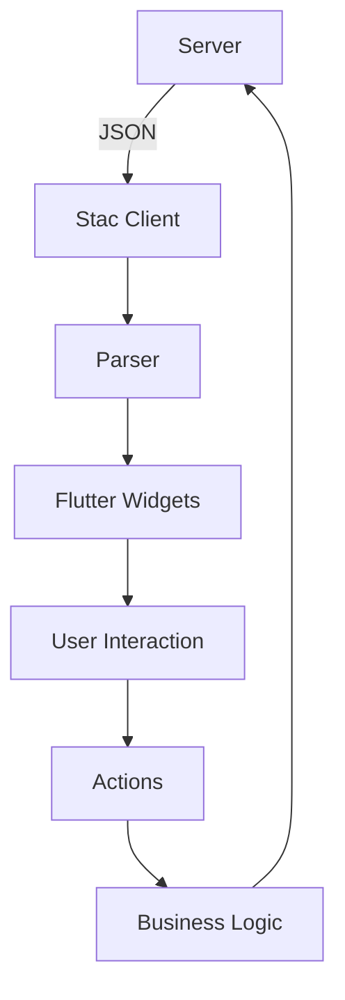

# Core Concepts

Understanding the core concepts of Stac is essential for building effective server-driven UIs. This guide covers the fundamental principles and architecture that make Stac work.

## Architecture Overview

Stac follows a client-server architecture where:

1. **Server**: Defines UI structure and behavior in JSON
2. **Client**: Renders UI based on JSON instructions
3. **Parser**: Converts JSON to Flutter widgets
4. **Actions**: Handle user interactions and business logic



## Key Components

### 1. Stac Widgets

Stac widgets are JSON representations of Flutter widgets. Each widget has:

- **Type**: Identifies the widget (e.g., "text", "button", "container")
- **Properties**: Configuration options specific to the widget
- **Children**: Nested widgets (for layout widgets)

```json
{
  "type": "text",
  "data": "Hello World",
  "style": {
    "fontSize": 16,
    "color": "#333333"
  }
}
```

### 2. Parsers

Parsers are responsible for converting JSON into Flutter widgets. Stac includes:

- **Built-in Parsers**: For common Flutter widgets
- **Custom Parsers**: For specialized or third-party widgets

```dart
class StacTextParser extends StacParser<StacText> {
  @override
  String get type => 'text';
  
  @override
  StacText getModel(Map<String, dynamic> json) => StacText.fromJson(json);
  
  @override
  Widget parse(BuildContext context, StacText model) {
    return Text(
      model.data,
      style: model.style?.toTextStyle(),
    );
  }
}
```

### 3. Actions

Actions handle user interactions and business logic:

- **Navigation**: Move between screens
- **API Calls**: Fetch or send data
- **Form Operations**: Validate and submit forms
- **UI Updates**: Show dialogs, snack bars, etc.

```json
{
  "actionType": "navigate",
  "route": "/profile",
  "arguments": {
    "userId": "123"
  }
}
```

### 4. Stac Registry

The registry manages parsers and actions:

```dart
// Register a custom parser
StacRegistry.instance.register(CustomWidgetParser());

// Register a custom action
StacRegistry.instance.registerAction(CustomActionParser());
```

## Data Flow

### 1. Initialization

```dart
void main() async {
  await Stac.initialize(
    parsers: [CustomParser()],
    actionParsers: [CustomActionParser()],
  );
  runApp(MyApp());
}
```

### 2. JSON Loading

```dart
// From assets
Stac.fromAsset('assets/ui.json', context)

// From network
Stac.fromNetwork(StacNetworkRequest(url: '...'), context)

// From JSON object
Stac.fromJson(jsonObject, context)
```

### 3. Parsing and Rendering

1. JSON is parsed into widget models
2. Models are converted to Flutter widgets
3. Widgets are rendered in the widget tree
4. User interactions trigger actions

### 4. Action Execution

1. User interacts with widget (tap, input, etc.)
2. Action is triggered based on JSON configuration
3. Action parser executes the business logic
4. UI updates or navigation occurs

## Widget Lifecycle

### 1. Creation

```json
{
  "type": "container",
  "child": {
    "type": "text",
    "data": "Hello"
  }
}
```

### 2. Parsing

```dart
// JSON is parsed into StacContainer model
final model = StacContainer.fromJson(json);

// Model is converted to Flutter widget
final widget = Container(
  child: Text(model.child.data),
);
```

### 3. Rendering

The widget is added to the Flutter widget tree and rendered.

### 4. Interaction

User interactions trigger actions defined in the JSON.

## State Management

### 1. Form State

Forms maintain their own state:

```json
{
  "type": "form",
  "key": "userForm",
  "child": {
    "type": "textFormField",
    "key": "name"
  }
}
```

### 2. Variable Resolution

Stac supports variable resolution for dynamic content:

```json
{
  "type": "text",
  "data": "Hello {{user.name}}"
}
```

### 3. Conditional Rendering

Show/hide widgets based on conditions:

```json
{
  "type": "conditional",
  "condition": "user.isLoggedIn",
  "trueChild": {
    "type": "text",
    "data": "Welcome back!"
  },
  "falseChild": {
    "type": "text",
    "data": "Please sign in"
  }
}
```

## Error Handling

### 1. JSON Parsing Errors

```dart
try {
  final widget = Stac.fromJson(json, context);
} catch (e) {
  // Handle parsing error
  return ErrorWidget('Failed to parse UI: $e');
}
```

### 2. Widget Rendering Errors

```dart
class SafeStacWidget extends StatelessWidget {
  @override
  Widget build(BuildContext context) {
    return ErrorBoundary(
      child: Stac.fromJson(json, context),
      onError: (error) => ErrorWidget('UI Error: $error'),
    );
  }
}
```

### 3. Action Errors

```dart
class SafeActionParser extends StacActionParser {
  @override
  FutureOr onCall(BuildContext context, model) async {
    try {
      await performAction();
    } catch (e) {
      // Handle action error
      ScaffoldMessenger.of(context).showSnackBar(
        SnackBar(content: Text('Action failed: $e')),
      );
    }
  }
}
```

## Performance Considerations

### 1. JSON Size

- Keep JSON payloads small
- Use efficient data structures
- Consider compression for large payloads

### 2. Parsing Performance

- Cache parsed models when possible
- Use efficient JSON parsing libraries
- Minimize deep nesting in JSON

### 3. Widget Rendering

- Avoid unnecessary widget rebuilds
- Use const constructors where possible
- Implement proper widget keys

## Security Considerations

### 1. JSON Validation

```dart
class SecureStacParser extends StacParser {
  @override
  Widget parse(BuildContext context, model) {
    // Validate model before rendering
    if (!isValidModel(model)) {
      return ErrorWidget('Invalid widget model');
    }
    return buildWidget(model);
  }
}
```

### 2. Action Security

```dart
class SecureActionParser extends StacActionParser {
  @override
  FutureOr onCall(BuildContext context, model) async {
    // Validate action before execution
    if (!isAllowedAction(model)) {
      throw SecurityException('Action not allowed');
    }
    await executeAction(model);
  }
}
```

### 3. Network Security

```dart
await Stac.initialize(
  networkConfig: StacNetworkConfig(
    baseUrl: 'https://secure-api.example.com',
    headers: {
      'Authorization': 'Bearer $token',
    },
    validateCertificate: true,
  ),
);
```

## Best Practices

### 1. JSON Structure

- Use consistent naming conventions
- Keep JSON readable and well-formatted
- Document custom widget properties

### 2. Parser Design

- Create focused, single-purpose parsers
- Handle edge cases gracefully
- Provide meaningful error messages

### 3. Action Design

- Keep actions simple and focused
- Handle errors appropriately
- Provide user feedback

### 4. Performance

- Minimize JSON payload size
- Cache frequently used data
- Optimize widget rendering

## Advanced Concepts

### 1. Custom Widget Types

```dart
@freezed
class CustomWidget with _$CustomWidget {
  const factory CustomWidget({
    required String title,
    required List<String> items,
  }) = _CustomWidget;

  factory CustomWidget.fromJson(Map<String, dynamic> json) =>
      _$CustomWidgetFromJson(json);
}

class CustomWidgetParser extends StacParser<CustomWidget> {
  @override
  String get type => 'customWidget';
  
  @override
  CustomWidget getModel(Map<String, dynamic> json) => CustomWidget.fromJson(json);
  
  @override
  Widget parse(BuildContext context, CustomWidget model) {
    return CustomFlutterWidget(
      title: model.title,
      items: model.items,
    );
  }
}
```

### 2. Dynamic Actions

```dart
class DynamicActionParser extends StacActionParser {
  @override
  String get actionType => 'dynamic';
  
  @override
  FutureOr onCall(BuildContext context, model) async {
    // Execute action based on model configuration
    switch (model.actionType) {
      case 'navigate':
        await navigateToRoute(model.route);
        break;
      case 'api':
        await makeApiCall(model.url);
        break;
      default:
        throw UnsupportedError('Unknown action type: ${model.actionType}');
    }
  }
}
```

### 3. Theme Integration

```dart
class ThemedStacParser extends StacParser {
  @override
  Widget parse(BuildContext context, model) {
    final theme = Theme.of(context);
    return ThemedWidget(
      model: model,
      theme: theme,
    );
  }
}
```

## Next Steps

Now that you understand the core concepts:

- [Widgets](./06-widgets.md) - Explore available widgets
- [Actions](./07-actions.md) - Learn about actions and interactions
- [Parsers](./08-parsers.md) - Create custom parsers
- [Theming](./09-theming-styles.md) - Customize appearance
