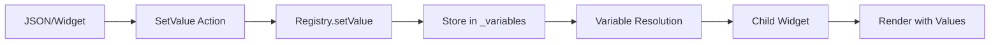
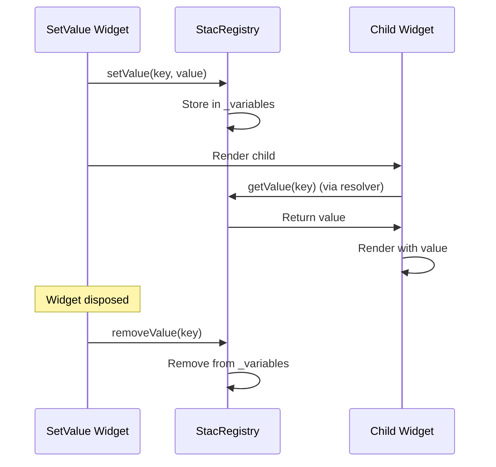

# State Management

## 🎯 Overview

Stac uses a **centralized registry pattern** for state management. The `StacRegistry` singleton manages all application state through key-value pairs stored in memory.

## 🏗️ Architecture

### State Storage

```dart
class StacRegistry {
  static final Map<String, dynamic> _variables = {};
  
  // Set value
  dynamic setValue(String key, dynamic value);
  
  // Get value
  dynamic getValue(String key);
  
  // Remove value
  dynamic removeValue(String key);
  
  // Clear all values
  void clearAllValues();
}
```

### State Flow



## 🔄 How State Works

### 1. Setting State

#### Via SetValue Widget

```json
{
  "type": "setValue",
  "values": [
    {"key": "userName", "value": "John Doe"},
    {"key": "isLoggedIn", "value": true}
  ],
  "child": {
    "type": "text",
    "data": "Welcome {{userName}}"
  }
}
```

**Implementation**:

```12:45:.stac/packages/stac/lib/src/parsers/widgets/stac_set_value/stac_set_value_parser.dart
class _SetValueWidget extends StatefulWidget {
  const _SetValueWidget({required this.model});

  final StacSetValue model;

  @override
  State<_SetValueWidget> createState() => _SetValueWidgetState();
}

class _SetValueWidgetState extends State<_SetValueWidget> {
  final StacRegistry _stacRegistry = StacRegistry.instance;

  @override
  void initState() {
    super.initState();

    for (final value in widget.model.values) {
      _stacRegistry.setValue(value['key'] as String, value['value']);
    }
  }

  @override
  void dispose() {
    for (final value in widget.model.values) {
      _stacRegistry.removeValue(value['key'] as String);
    }
    super.dispose();
  }

  @override
  Widget build(BuildContext context) {
    if (widget.model.child == null) {
      return const SizedBox();
    }

    // Convert the StacWidget to JSON, resolve variables, then parse it back
    final childJson = widget.model.child!.toJson();

    final resolvedJson = resolveVariablesInJson(
      childJson,
      _stacRegistry,
    );

    return Stac.fromJson(resolvedJson, context) ?? const SizedBox();
  }
}
```

#### Via SetValue Action

```json
{
  "type": "setValue",
  "values": [
    {"key": "isLoggedIn", "value": true}
  ],
  "action": {
    "type": "navigate",
    "route": "/home"
  }
}
```

### 2. Getting State

#### Via Variable Resolution

```dart
dynamic resolveVariablesInJson(dynamic json, StacRegistry registry) {
  if (json is String) {
    // Replace all {{variable_name}} with their values from registry
    return json.replaceAllMapped(RegExp(r'{{(.*?)}}'), (match) {
      final variableName = match.group(1)?.trim();
      final value = registry.getValue(variableName ?? '');
      return value != null ? value.toString() : match.group(0) ?? '';
    });
  }
  // ... handle maps and lists
}
```

#### Usage in JSON

```json
{
  "type": "text",
  "data": "Hello {{userName}}"
}
```

Results in: `"Hello John Doe"`

### 3. State Lifecycle



## 🎨 State Management Patterns

### 1. Form State

Form state is managed separately using Flutter's Form widget:

```json
{
  "type": "form",
  "key": "loginForm",
  "child": {
    "type": "textFormField",
    "key": "email",
    "hintText": "Enter email"
  }
}
```

### 2. Scoped State (setValue Widget)

SetValue widgets create scoped state that is automatically cleaned up:

```dart
@override
void dispose() {
  for (final value in widget.model.values) {
    _stacRegistry.removeValue(value['key'] as String);
  }
  super.dispose();
}
```

### 3. Global State

Global state persists across the app lifecycle until explicitly cleared:

```dart
// Set global state
StacRegistry.instance.setValue('globalToken', 'abc123');

// Use in any widget
// {{globalToken}}

// Clear when needed
StacRegistry.instance.removeValue('globalToken');
```

## 🔍 State Access Patterns

### Pattern 1: Direct Registry Access

```dart
final token = StacRegistry.instance.getValue('token');
```

### Pattern 2: Variable Resolution (Recommended)

```json
{
  "type": "text",
  "data": "Token: {{token}}"
}
```

### Pattern 3: Dynamic Values

```json
{
  "type": "text",
  "data": "{{user.name}} - {{user.email}}"
}
```

## ⚡ Performance Considerations

### 1. State Storage

- **Type**: In-memory map
- **Performance**: O(1) get/set operations
- **Limitation**: Lost on app restart

### 2. Variable Resolution

- **Operation**: Regex-based string replacement
- **Performance**: O(n) where n is string length
- **Optimization**: Cache resolved values if needed

### 3. Widget Rebuilds

SetValue widgets trigger rebuilds of their children only:

```dart
@override
Widget build(BuildContext context) {
  // Only this widget and its children rebuild
  // not the entire widget tree
  return Stac.fromJson(resolvedJson, context) ?? const SizedBox();
}
```

## 🚨 Limitations & Considerations

### 1. No Reactive Updates

State changes don't automatically trigger widget rebuilds:

```json
{
  "type": "setValue",
  "values": [{"key": "count", "value": 1}],
  "child": {
    "type": "text",
    "data": "Count: {{count}}"
  }
}
```

Changing count later won't update the widget automatically.

### 2. Type Safety

All values are stored as `dynamic`:

```dart
final Map<String, dynamic> _variables = {};
```

Runtime type checking required.

### 3. No Persistence

State is in-memory only. Use localStorage/SharedPreferences for persistence:

```dart
// Save to persistent storage
SharedPreferences.getInstance().then((prefs) {
  prefs.setString('token', token);
});

// Load from persistent storage
final token = prefs.getString('token');
```

## 💡 Best Practices

### 1. Use SetValue Widget for Scoped State

```json
{
  "type": "setValue",
  "values": [
    {"key": "screenType", "value": "home"}
  ],
  "child": {
    "type": "text",
    "data": "Screen: {{screenType}}"
  }
}
```

### 2. Clear State When Done

SetValue widgets automatically clean up on dispose.

### 3. Use Descriptive Keys

```dart
// Good
setValue('userProfileName', 'John');

// Bad
setValue('name', 'John');
```

### 4. Validate Values

```dart
final value = registry.getValue('userId');
if (value is String) {
  // Use value
} else {
  // Handle error
}
```

## 🔄 Comparison with Other Solutions

| Feature | Stac Registry | Provider | Riverpod |
|---------|--------------|----------|----------|
| Type Safety | No | Yes | Yes |
| Reactive | No | Yes | Yes |
| Scoped | Yes | Yes | Yes |
| Global | Yes | Yes | Yes |
| Persistence | No | Manual | Manual |
| Learning Curve | Low | Medium | Medium |

## 🎓 Summary

Stac's state management is:

- **Simple**: Key-value based
- **Flexible**: Works with any data type
- **Scoped**: Automatic cleanup
- **Lightweight**: No external dependencies

Ideal for server-driven UIs where state comes from JSON configurations.
