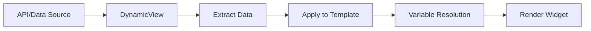
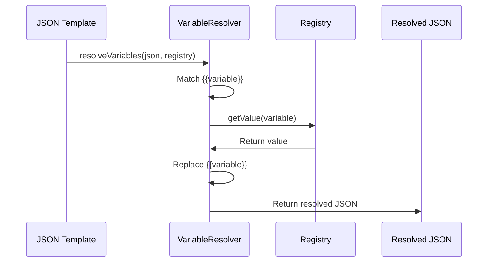

# Data Binding

## 🎯 Overview

Stac implements **template-based data binding** with variable resolution. Data flows from external sources (JSON, API) into templates, which are then rendered as Flutter widgets.

## 🏗️ Binding Architecture

### Core Components

1. **Dynamic View**: Fetches data and applies to template
2. **Variable Resolution**: Resolves `{{variable}}` placeholders
3. **Template Processing**: Recursive processing of nested templates

## 📊 Data Flow



## 🔄 Binding Mechanisms

### 1. Dynamic View Binding

The `StacDynamicView` widget fetches data and binds it to a template:

```json
{
  "type": "dynamicView",
  "request": {
    "url": "https://api.example.com/users",
    "method": "GET"
  },
  "template": {
    "type": "text",
    "data": "Name: {{data.name}}"
  }
}
```

**Implementation Flow**:

```45:80:.stac/packages/stac/lib/src/parsers/widgets/stac_dynamic_view/stac_dynamic_view_parser.dart
responseData = response.data;
              }

              final data = model.targetPath?.isEmpty ?? true
                  ? responseData
                  : _extractNestedData(
                      responseData,
                      model.targetPath?.split('.') ?? [],
                    );

              Log.d("data: $data");

              if (data != null) {
                // Check if data is an empty list and we have an empty template
                if (_isEmptyList(data) && model.emptyTemplate != null) {
                  Log.d("Data is empty list, using empty template");
                  return model.emptyTemplate.parse(context) ?? const SizedBox();
                }

                // Prepare data for template based on resultTarget
                final dataForTemplate =
                    (model.resultTarget?.isNotEmpty ?? false)
                        ? {model.resultTarget: data}
                        : data;

                // Apply the data to the template
                final renderedTemplate = _applyDataToTemplate(
                  model.template ?? StacSizedBox(),
                  dataForTemplate,
                  model.resultTarget ?? "",
                );
                return Stac.fromJson(renderedTemplate, context) ??
                    const SizedBox();
              }
            } catch (e) {
              Log.e('Error parsing API response: $e');
              return model.errorWidget.parse(context) ?? const SizedBox();
            }
```

### 2. Variable Resolution Binding

Variable resolution replaces `{{variable}}` placeholders with actual values:

```1:23:.stac/packages/stac/lib/src/utils/variable_resolver.dart
dynamic resolveVariablesInJson(dynamic json, StacRegistry registry) {
  if (json is String) {
    // Replace all {{variable_name}} with their values from registry
    return json.replaceAllMapped(RegExp(r'{{(.*?)}}'), (match) {
      final variableName = match.group(1)?.trim();
      final value = registry.getValue(variableName ?? '');
      return value != null ? value.toString() : match.group(0) ?? '';
    });
  } else if (json is Map<String, dynamic>) {
    // // Skip variable resol~ution for dynamicView and SetValue widget types
    // if (json.containsKey('type') &&
    //     (json['type'] == 'dynamicView' || json['type'] == 'SetValue')) {
    //   return json;
    // }
    return json.map(
        (key, value) => MapEntry(key, resolveVariablesInJson(value, registry)));
  } else if (json is List) {
    return json.map((item) => resolveVariablesInJson(item, registry)).toList();
  }
  return json;
}
```

**Processing Flow**:



## 🎨 Binding Patterns

### Pattern 1: Simple String Binding

```json
{
  "type": "text",
  "data": "Hello {{userName}}"
}
```

**Result**: "Hello John" (if userName = "John")

### Pattern 2: Nested Data Binding

```json
{
  "type": "text",
  "data": "{{user.profile.name}}"
}
```

**Resolution**:
```dart
// Extracts nested value using dot notation
_extractNestedData(data, ['user', 'profile', 'name'])
```

### Pattern 3: List Binding

```json
{
  "type": "column",
  "children": {
    "itemTemplate": {
      "type": "text",
      "data": "{{item.name}}"
    }
  }
}
```

**Processing**:
```163:207:.stac/packages/stac/lib/src/parsers/widgets/stac_dynamic_view/stac_dynamic_view_parser.dart
// Check for list processing with itemTemplate
    if (resolvedTemplateJson.containsKey('itemTemplate') &&
        resolvedTemplateJson.containsKey('children')) {
      final dynamic itemTemplate = resolvedTemplateJson['itemTemplate'];
      final dynamic children = resolvedTemplateJson['children'];
      final dynamic dataContext = data;

      if (dataContext != null) {
        // Check if dataContext is a List
        List processedChildItems = [];

        if (dataContext is List) {
          // Iterate over each item in the list
          for (var item in dataContext) {
            if (item is Map) {
              // Process each item with the template
              final Map<dynamic, dynamic> itemMap =
                  Map<dynamic, dynamic>.from(item);
              final processedItem =
                  _applyDataToItem(itemTemplate as Map<String, dynamic>, itemMap);
              processedChildItems.add(processedItem);
            }
          }
        }

        if (!resolvedTemplateJson.containsKey('children')) {
          resolvedTemplateJson['children'] = [];
        }
        if (resolvedTemplateJson['children'] is List) {
          (resolvedTemplateJson['children'] as List)
              .addAll(processedChildItems);
        } else {
          Log.w(
              "Template has 'children' but it's not a List. Overwriting with processed items.");
          resolvedTemplateJson['children'] = processedChildItems;
        }
      } else {
        Log.d(
            "itemTemplate found but no list to iterate in dataContext. Template: $currentTemplate, DataContext: $data");
      }
    }
```

### Pattern 4: Conditional Binding

```json
{
  "type": "conditional",
  "condition": "{{isLoggedIn}}",
  "trueChild": {
    "type": "text",
    "data": "Welcome!"
  },
  "falseChild": {
    "type": "text",
    "data": "Please login"
  }
}
```

## 🔧 Data Extraction

### Simple Extraction

```dart
// Direct access
final name = data['name'];
```

### Nested Extraction

```95:140:.stac/packages/stac/lib/src/parsers/widgets/stac_dynamic_view/stac_dynamic_view_parser.dart
dynamic _extractNestedData(dynamic data, List<String> keys) {
    dynamic current = data;
    final RegExp arrayKeyRegex = RegExp(r'(\w+)\[(\d+)\]');

    for (final key in keys) {
      Match? arrayMatch = arrayKeyRegex.firstMatch(key);

      if (arrayMatch != null) {
        final String actualKey = arrayMatch.group(1)!;
        final int index = int.parse(arrayMatch.group(2)!);

        if (current is Map && current.containsKey(actualKey)) {
          dynamic potentialList = current[actualKey];
          if (potentialList is List) {
            if (index >= 0 && index < potentialList.length) {
              current = potentialList[index];
            } else {
              return null;
            }
          } else {
            return null;
          }
        } else {
          return null;
        }
      } else {
        if (current is Map && current.containsKey(key)) {
          current = current[key];
        } else if (current is List) {
          try {
            int index = int.parse(key);
            if (index >= 0 && index < current.length) {
              current = current[index];
            } else {
              return null;
            }
          } catch (e) {
            return null;
          }
        } else {
          return null;
        }
      }
    }
    if (current == null) {
      return "null";
    } else {
      return current;
    }
  }
```

**Supports**:
- Dot notation: `user.profile.name`
- Array access: `items[0].name`
- Mixed: `user.items[0].name`

## 📝 Template Processing

### Recursive Processing

```241:285:.stac/packages/stac/lib/src/parsers/widgets/stac_dynamic_view/stac_dynamic_view_parser.dart
dynamic _processTemplateRecursively(
    dynamic template,
    Map<dynamic, dynamic> data,
  ) {
    if (template is Map) {
      for (final key in template.keys.toList()) {
        final value = template[key];

        if (value is String) {
          // Check if the string contains any placeholders
          if (value.contains('{{') && value.contains('}}')) {
            // Process multiple placeholders in a single string
            String processedValue = value;
            final regex = RegExp(r'\{\{([^}]+)\}\}');
            final matches = regex.allMatches(value);

            for (final match in matches) {
              final placeholder = match.group(0)!;
              final dataKey = match.group(1)!.trim();
              final keys = dataKey.split('.');

              // Extract the value from the data
              final dataValue = _extractNestedData(data, keys);

              if (dataValue != null) {
                processedValue = processedValue.replaceAll(
                    placeholder, dataValue.toString());
              }
            }

            template[key] = processedValue;
          }
        } else if (value is Map || value is List) {
          // Recursively process nested maps and lists
          _processTemplateRecursively(value, data);
        }
      }
    } else if (template is List) {
      for (int i = 0; i < template.length; i++) {
        _processTemplateRecursively(template[i], data);
      }
    }
    return template;
  }
```

## 🎯 Binding Features

### 1. Multiple Placeholders

```json
{
  "type": "text",
  "data": "Hello {{firstName}} {{lastName}}"
}
```

### 2. Nested Binding

```json
{
  "type": "column",
  "children": [
    {
      "type": "text",
      "data": "{{user.name}}"
    },
    {
      "type": "text",
      "data": "{{user.email}}"
    }
  ]
}
```

### 3. Array Iteration

```json
{
  "type": "column",
  "children": {
    "itemTemplate": {
      "type": "card",
      "child": {
        "type": "text",
        "data": "{{item.title}}"
      }
    }
  }
}
```

### 4. Conditional Rendering

```json
{
  "type": "conditional",
  "condition": "{{data.hasData}}",
  "trueChild": {
    "type": "text",
    "data": "Found: {{data.count}} items"
  },
  "falseChild": {
    "type": "text",
    "data": "No data"
  }
}
```

## ⚡ Performance Considerations

### 1. Resolution Timing

- Variables resolved at parse time
- No reactive updates
- One-time binding

### 2. Processing Cost

- Regex matching for each string
- Recursive processing for nested structures
- No caching of resolved values

### 3. Memory Usage

- Templates copied before processing
- Deep cloning for safety
- Original templates preserved

## 🚨 Limitations

### 1. No Two-Way Binding

Data flows one direction: Source → Template → UI

### 2. No Reactive Updates

Changes to source data don't update the UI automatically

### 3. Type Coercion

All values converted to strings: `value.toString()`

## 💡 Best Practices

### 1. Use Meaningful Placeholders

```json
// Good
"data": "{{user.profile.name}}"

// Avoid
"data": "{{a}}"
```

### 2. Handle Null Values

```json
{
  "type": "text",
  "data": "{{name ?? 'Guest'}}"
}
```

### 3. Structure Data Properly

```json
// API Response
{
  "users": [
    {"name": "John", "email": "john@example.com"}
  ]
}

// Template
{
  "type": "dynamicView",
  "targetPath": "users",
  "template": {
    "type": "text",
    "data": "{{item.name}}"
  }
}
```

## 🎓 Summary

Stac's data binding provides:

- **Flexible**: Works with any data structure
- **Powerful**: Nested binding, arrays, conditionals
- **Simple**: Template-based with familiar syntax
- **Type-safe**: Runtime type checking

Ideal for server-driven UIs with dynamic content.
