# Flow Diagrams

## 🎯 Overview

This document contains comprehensive flow diagrams for understanding how Stac works internally.

## 📊 Complete System Flow

### 1. Application Initialization

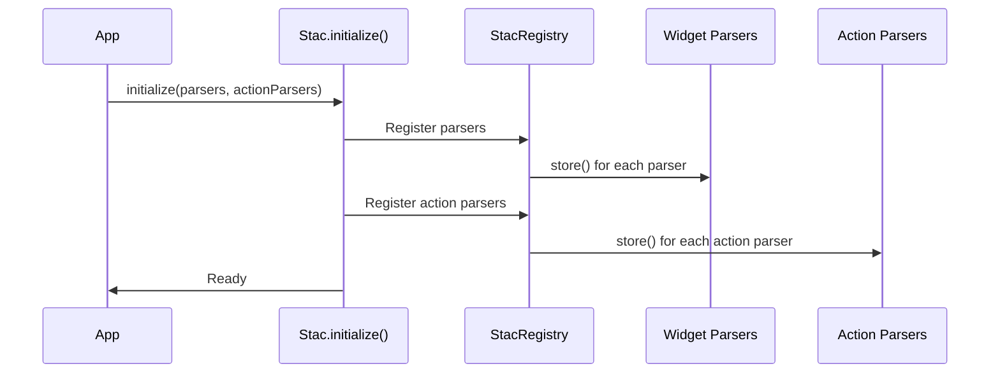

### 2. Widget Rendering Flow

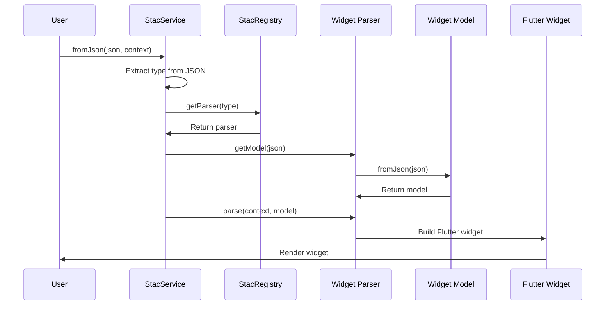

### 3. Action Execution Flow

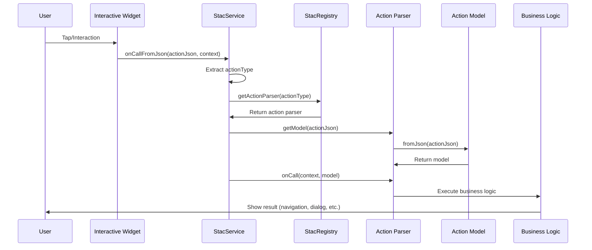

## 🔄 State Management Flow

### 4. Setting State

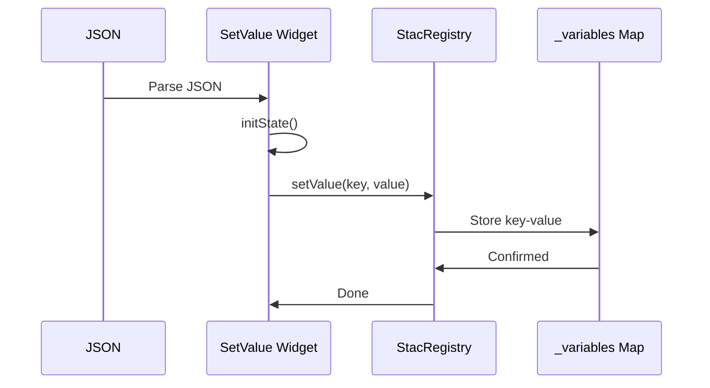

### 5. Resolving Variables

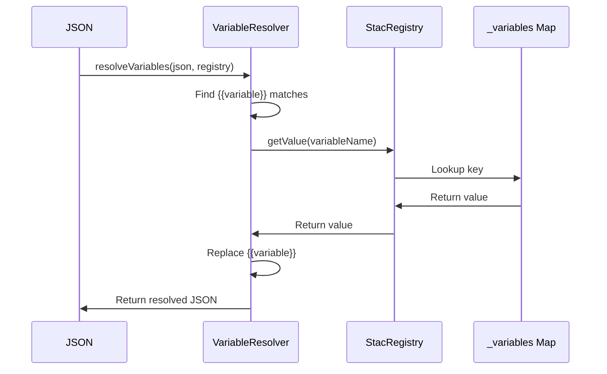

## 🌐 Data Flow

### 6. Dynamic View Data Flow

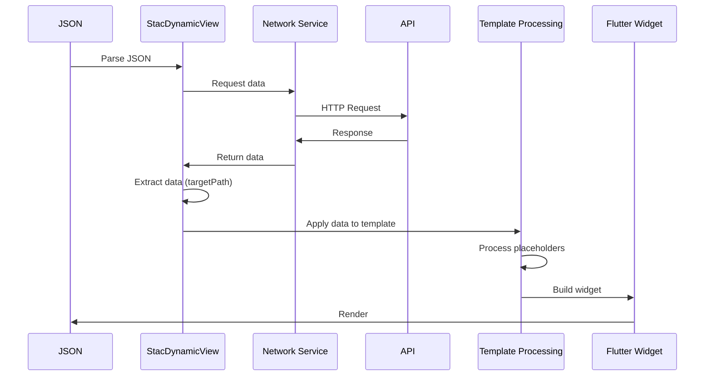

### 7. Template Processing Flow

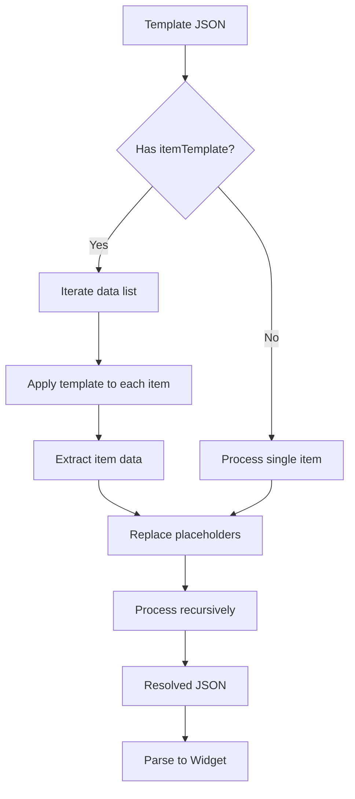

## 🎨 Widget Lifecycle

### 8. Widget Lifecycle (with SetValue)

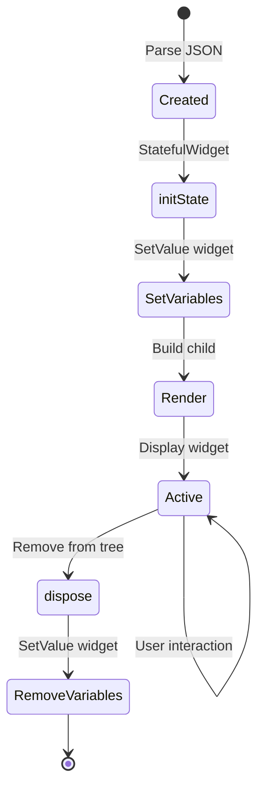

## 🔗 Component Interactions

### 9. Complete Request-Response Cycle

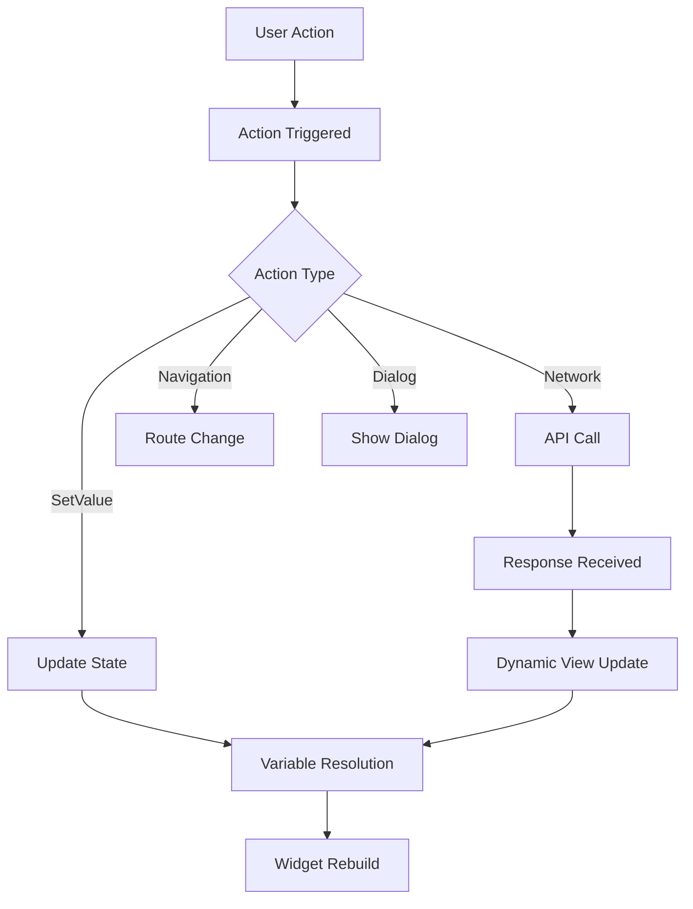

### 10. Parsing Flow

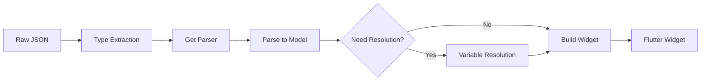

## 🏗️ Architecture Layers

### 11. Layer Interaction

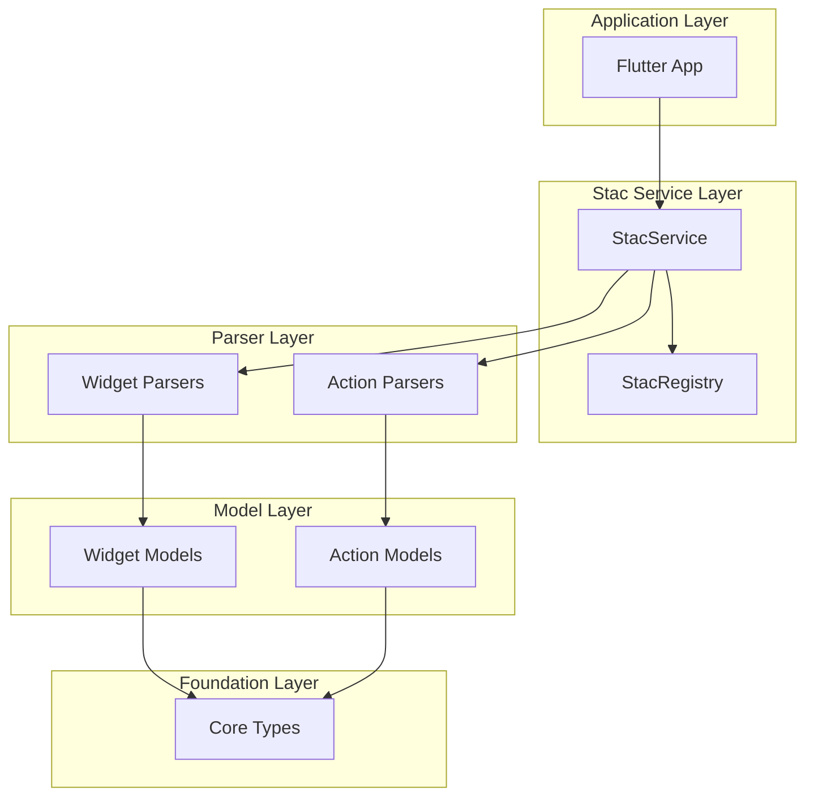

## 🔍 Error Handling Flow

### 12. Error Handling

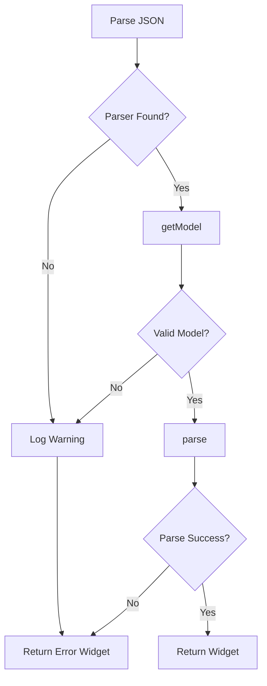

## 📦 Package Dependencies

### 13. Package Dependency Flow

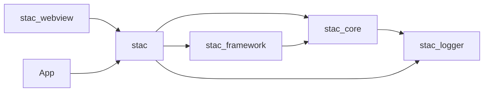

## 🎯 Summary

These diagrams cover:

1. **Initialization**: How Stac starts up
2. **Widget Rendering**: JSON to Flutter widget
3. **Action Execution**: User interactions
4. **State Management**: Setting and getting state
5. **Variable Resolution**: Template processing
6. **Data Flow**: Dynamic content
7. **Widget Lifecycle**: Creation to disposal
8. **Request-Response**: Complete cycles
9. **Parsing Flow**: JSON transformation
10. **Architecture**: Layer interactions
11. **Error Handling**: Error recovery
12. **Dependencies**: Package relationships

Use these diagrams to understand the complete flow and identify improvement opportunities.
