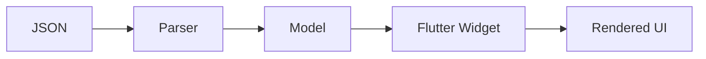

# Custom Widgets Development Guide

This comprehensive guide covers everything you need to know about creating custom STAC widgets, from basic patterns to advanced techniques.

## 📋 Table of Contents

1. [Widget Architecture](#widget-architecture)
2. [Creating Basic Widgets](#creating-basic-widgets)
3. [Advanced Widget Patterns](#advanced-widget-patterns)
4. [Parser Registration](#parser-registration)
5. [Testing Custom Widgets](#testing-custom-widgets)
6. [Best Practices](#best-practices)
7. [Troubleshooting](#troubleshooting)

## 🏗️ Widget Architecture

### Component Structure

Every custom STAC widget consists of three parts:

```
stac/widgets/my_widget/
├── my_widget.dart          # Widget model (data structure)
├── my_widget_parser.dart   # Widget parser (rendering logic)
└── my_widget.g.dart        # Generated code (JSON serialization)
```

### Data Flow



1. **JSON**: Server-provided widget configuration
2. **Parser**: Converts JSON to model
3. **Model**: Type-safe data structure
4. **Flutter Widget**: Actual UI component
5. **Rendered UI**: What the user sees

## 🎯 Creating Basic Widgets

### Step 1: Define the Widget Model

The model defines the data structure for your widget.

**File**: `stac/widgets/info_card/info_card_widget.dart`

```dart
import 'package:json_annotation/json_annotation.dart';

part 'info_card_widget.g.dart';

/// A card widget that displays information with an icon.
///
/// Example JSON:
/// ```json
/// {
///   "type": "infoCard",
///   "title": "Welcome",
///   "description": "Get started with STAC",
///   "icon": "info",
///   "color": "#2196F3"
/// }
/// ```
@JsonSerializable()
class InfoCardWidget {
  /// The title text displayed prominently
  final String title;
  
  /// The description text displayed below the title
  final String description;
  
  /// Icon name (from Material Icons)
  final String? icon;
  
  /// Hex color code for the card accent
  final String? color;
  
  const InfoCardWidget({
    required this.title,
    required this.description,
    this.icon,
    this.color,
  });

  factory InfoCardWidget.fromJson(Map<String, dynamic> json) =>
      _$InfoCardWidgetFromJson(json);

  Map<String, dynamic> toJson() => _$InfoCardWidgetToJson(this);
}
```

**Key Points**:
- Use `@JsonSerializable()` for automatic JSON conversion
- Add `part` directive for generated code
- Document with dartdoc comments
- Use `final` for immutability
- Mark optional fields with `?`

### Step 2: Create the Widget Parser

The parser converts the model into a Flutter widget.

**File**: `stac/widgets/info_card/info_card_parser.dart`

```dart
import 'package:flutter/material.dart';
import 'package:stac_core/stac_core.dart';
import 'package:tobank_sdui/stac/widgets/info_card/info_card_widget.dart';

/// Parser for InfoCardWidget
class InfoCardParser extends StacParser<InfoCardWidget> {
  @override
  String get type => 'infoCard';

  @override
  InfoCardWidget getModel(Map<String, dynamic> json) =>
      InfoCardWidget.fromJson(json);

  @override
  Widget parse(BuildContext context, InfoCardWidget model) {
    // Parse color from hex string
    final color = model.color != null
        ? Color(int.parse(model.color!.replaceFirst('#', '0xFF')))
        : Theme.of(context).primaryColor;

    // Get icon from name
    final icon = _getIconFromName(model.icon ?? 'info');

    return Card(
      elevation: 2,
      margin: const EdgeInsets.all(16),
      child: Padding(
        padding: const EdgeInsets.all(16),
        child: Row(
          crossAxisAlignment: CrossAxisAlignment.start,
          children: [
            // Icon
            Container(
              padding: const EdgeInsets.all(12),
              decoration: BoxDecoration(
                color: color.withOpacity(0.1),
                borderRadius: BorderRadius.circular(8),
              ),
              child: Icon(icon, color: color, size: 32),
            ),
            const SizedBox(width: 16),
            // Content
            Expanded(
              child: Column(
                crossAxisAlignment: CrossAxisAlignment.start,
                children: [
                  Text(
                    model.title,
                    style: Theme.of(context).textTheme.titleLarge?.copyWith(
                          fontWeight: FontWeight.bold,
                        ),
                  ),
                  const SizedBox(height: 8),
                  Text(
                    model.description,
                    style: Theme.of(context).textTheme.bodyMedium,
                  ),
                ],
              ),
            ),
          ],
        ),
      ),
    );
  }

  IconData _getIconFromName(String name) {
    switch (name.toLowerCase()) {
      case 'info':
        return Icons.info_outline;
      case 'warning':
        return Icons.warning_amber_outlined;
      case 'error':
        return Icons.error_outline;
      case 'success':
        return Icons.check_circle_outline;
      case 'star':
        return Icons.star_outline;
      default:
        return Icons.info_outline;
    }
  }
}
```

**Key Points**:
- Extend `StacParser<YourModel>`
- Override `type` to match JSON type field
- Override `getModel` to deserialize JSON
- Override `parse` to build Flutter widget
- Use theme for consistent styling
- Handle null values gracefully

### Step 3: Generate Code

```bash
# Generate JSON serialization code
dart run build_runner build --delete-conflicting-outputs

# This creates: info_card_widget.g.dart
```

### Step 4: Register the Parser

**File**: `stac/registry/custom_component_registry.dart`

```dart
import 'package:tobank_sdui/stac/widgets/info_card/info_card_parser.dart';

class CustomComponentRegistry {
  static final CustomComponentRegistry instance = CustomComponentRegistry._();
  CustomComponentRegistry._();

  final Map<String, dynamic> _widgetParsers = {};

  void registerWidget(dynamic parser) {
    final type = parser.type as String;
    _widgetParsers[type] = parser;
  }

  dynamic getWidgetParser(String type) => _widgetParsers[type];

  void registerAll() {
    // Register custom widgets
    registerWidget(InfoCardParser());
  }
}
```

### Step 5: Use in JSON

```json
{
  "type": "scaffold",
  "appBar": {
    "type": "appBar",
    "title": {
      "type": "text",
      "data": "Info Card Demo"
    }
  },
  "body": {
    "type": "column",
    "children": [
      {
        "type": "infoCard",
        "title": "Getting Started",
        "description": "Learn how to create custom STAC widgets",
        "icon": "info",
        "color": "#2196F3"
      },
      {
        "type": "infoCard",
        "title": "Warning",
        "description": "Always test your custom widgets",
        "icon": "warning",
        "color": "#FF9800"
      },
      {
        "type": "infoCard",
        "title": "Success",
        "description": "You've created your first custom widget!",
        "icon": "success",
        "color": "#4CAF50"
      }
    ]
  }
}
```

## 🚀 Advanced Widget Patterns

### Pattern 1: Widgets with Children

Create widgets that can contain other widgets.

**Model**:
```dart
@JsonSerializable()
class CustomContainerWidget {
  final String? backgroundColor;
  final double? padding;
  final double? borderRadius;
  final Map<String, dynamic>? child;  // Child widget as JSON
  
  const CustomContainerWidget({
    this.backgroundColor,
    this.padding,
    this.borderRadius,
    this.child,
  });

  factory CustomContainerWidget.fromJson(Map<String, dynamic> json) =>
      _$CustomContainerWidgetFromJson(json);

  Map<String, dynamic> toJson() => _$CustomContainerWidgetToJson(this);
}
```

**Parser**:
```dart
class CustomContainerParser extends StacParser<CustomContainerWidget> {
  @override
  String get type => 'customContainer';

  @override
  CustomContainerWidget getModel(Map<String, dynamic> json) =>
      CustomContainerWidget.fromJson(json);

  @override
  Widget parse(BuildContext context, CustomContainerWidget model) {
    // Parse child widget if present
    Widget? child;
    if (model.child != null) {
      child = Stac.fromJson(model.child!, context);
    }

    return Container(
      padding: EdgeInsets.all(model.padding ?? 16),
      decoration: BoxDecoration(
        color: model.backgroundColor != null
            ? Color(int.parse(model.backgroundColor!.replaceFirst('#', '0xFF')))
            : null,
        borderRadius: BorderRadius.circular(model.borderRadius ?? 8),
      ),
      child: child,
    );
  }
}
```

**JSON**:
```json
{
  "type": "customContainer",
  "backgroundColor": "#E3F2FD",
  "padding": 20,
  "borderRadius": 12,
  "child": {
    "type": "text",
    "data": "This is inside a custom container"
  }
}
```

### Pattern 2: Widgets with Multiple Children

**Model**:
```dart
@JsonSerializable()
class CustomListWidget {
  final String title;
  final List<Map<String, dynamic>> items;  // List of child widgets
  
  const CustomListWidget({
    required this.title,
    required this.items,
  });

  factory CustomListWidget.fromJson(Map<String, dynamic> json) =>
      _$CustomListWidgetFromJson(json);

  Map<String, dynamic> toJson() => _$CustomListWidgetToJson(this);
}
```

**Parser**:
```dart
class CustomListParser extends StacParser<CustomListWidget> {
  @override
  String get type => 'customList';

  @override
  CustomListWidget getModel(Map<String, dynamic> json) =>
      CustomListWidget.fromJson(json);

  @override
  Widget parse(BuildContext context, CustomListWidget model) {
    return Column(
      crossAxisAlignment: CrossAxisAlignment.start,
      children: [
        Padding(
          padding: const EdgeInsets.all(16),
          child: Text(
            model.title,
            style: Theme.of(context).textTheme.headlineSmall,
          ),
        ),
        ...model.items.map((itemJson) {
          return Stac.fromJson(itemJson, context);
        }).toList(),
      ],
    );
  }
}
```

### Pattern 3: Widgets with Actions

**Model**:
```dart
@JsonSerializable()
class ActionButtonWidget {
  final String text;
  final String? icon;
  final Map<String, dynamic>? onPressed;  // Action as JSON
  
  const ActionButtonWidget({
    required this.text,
    this.icon,
    this.onPressed,
  });

  factory ActionButtonWidget.fromJson(Map<String, dynamic> json) =>
      _$ActionButtonWidgetFromJson(json);

  Map<String, dynamic> toJson() => _$ActionButtonWidgetToJson(this);
}
```

**Parser**:
```dart
class ActionButtonParser extends StacParser<ActionButtonWidget> {
  @override
  String get type => 'actionButton';

  @override
  ActionButtonWidget getModel(Map<String, dynamic> json) =>
      ActionButtonWidget.fromJson(json);

  @override
  Widget parse(BuildContext context, ActionButtonWidget model) {
    return ElevatedButton.icon(
      onPressed: model.onPressed != null
          ? () => _executeAction(context, model.onPressed!)
          : null,
      icon: model.icon != null
          ? Icon(_getIconFromName(model.icon!))
          : const SizedBox.shrink(),
      label: Text(model.text),
    );
  }

  void _executeAction(BuildContext context, Map<String, dynamic> actionJson) {
    // Execute STAC action
    StacRegistry.instance.executeAction(context, actionJson);
  }

  IconData _getIconFromName(String name) {
    // Icon mapping logic
    return Icons.arrow_forward;
  }
}
```

**JSON**:
```json
{
  "type": "actionButton",
  "text": "Navigate to Profile",
  "icon": "person",
  "onPressed": {
    "actionType": "navigate",
    "route": "/profile"
  }
}
```

### Pattern 4: Stateful Widgets

For widgets that need to maintain state:

**Model**:
```dart
@JsonSerializable()
class CounterWidget {
  final int initialValue;
  final int step;
  
  const CounterWidget({
    this.initialValue = 0,
    this.step = 1,
  });

  factory CounterWidget.fromJson(Map<String, dynamic> json) =>
      _$CounterWidgetFromJson(json);

  Map<String, dynamic> toJson() => _$CounterWidgetToJson(this);
}
```

**Parser**:
```dart
class CounterParser extends StacParser<CounterWidget> {
  @override
  String get type => 'counter';

  @override
  CounterWidget getModel(Map<String, dynamic> json) =>
      CounterWidget.fromJson(json);

  @override
  Widget parse(BuildContext context, CounterWidget model) {
    return _CounterWidgetState(model: model);
  }
}

class _CounterWidgetState extends StatefulWidget {
  final CounterWidget model;

  const _CounterWidgetState({required this.model});

  @override
  State<_CounterWidgetState> createState() => _CounterWidgetStateImpl();
}

class _CounterWidgetStateImpl extends State<_CounterWidgetState> {
  late int _count;

  @override
  void initState() {
    super.initState();
    _count = widget.model.initialValue;
  }

  void _increment() {
    setState(() {
      _count += widget.model.step;
    });
  }

  void _decrement() {
    setState(() {
      _count -= widget.model.step;
    });
  }

  @override
  Widget build(BuildContext context) {
    return Card(
      child: Padding(
        padding: const EdgeInsets.all(16),
        child: Column(
          mainAxisSize: MainAxisSize.min,
          children: [
            Text(
              '$_count',
              style: Theme.of(context).textTheme.displayMedium,
            ),
            const SizedBox(height: 16),
            Row(
              mainAxisAlignment: MainAxisAlignment.center,
              children: [
                IconButton(
                  onPressed: _decrement,
                  icon: const Icon(Icons.remove),
                ),
                const SizedBox(width: 16),
                IconButton(
                  onPressed: _increment,
                  icon: const Icon(Icons.add),
                ),
              ],
            ),
          ],
        ),
      ),
    );
  }
}
```

### Pattern 5: Conditional Rendering

**Model**:
```dart
@JsonSerializable()
class ConditionalWidget {
  final String condition;  // Variable name to check
  final Map<String, dynamic>? trueChild;
  final Map<String, dynamic>? falseChild;
  
  const ConditionalWidget({
    required this.condition,
    this.trueChild,
    this.falseChild,
  });

  factory ConditionalWidget.fromJson(Map<String, dynamic> json) =>
      _$ConditionalWidgetFromJson(json);

  Map<String, dynamic> toJson() => _$ConditionalWidgetToJson(this);
}
```

**Parser**:
```dart
class ConditionalParser extends StacParser<ConditionalWidget> {
  @override
  String get type => 'conditional';

  @override
  ConditionalWidget getModel(Map<String, dynamic> json) =>
      ConditionalWidget.fromJson(json);

  @override
  Widget parse(BuildContext context, ConditionalWidget model) {
    // Get condition value from registry or state
    final conditionValue = _evaluateCondition(model.condition);

    if (conditionValue && model.trueChild != null) {
      return Stac.fromJson(model.trueChild!, context);
    } else if (!conditionValue && model.falseChild != null) {
      return Stac.fromJson(model.falseChild!, context);
    }

    return const SizedBox.shrink();
  }

  bool _evaluateCondition(String condition) {
    // Evaluate condition from state/registry
    // This is a simplified example
    return StacRegistry.instance.getVariable(condition) == true;
  }
}
```

## 📝 Parser Registration

### Single Parser Registration

```dart
// In main.dart or app initialization
CustomComponentRegistry.instance.registerWidget(InfoCardParser());
```

### Bulk Registration

```dart
class CustomComponentRegistry {
  void registerAll() {
    // Register all custom widgets
    final widgetParsers = [
      InfoCardParser(),
      CustomContainerParser(),
      CustomListParser(),
      ActionButtonParser(),
      CounterParser(),
      ConditionalParser(),
    ];

    for (final parser in widgetParsers) {
      registerWidget(parser);
    }
  }
}

// In main.dart
void main() {
  WidgetsFlutterBinding.ensureInitialized();
  CustomComponentRegistry.instance.registerAll();
  runApp(const MyApp());
}
```

### Lazy Registration

For better performance, register parsers only when needed:

```dart
class LazyComponentRegistry {
  final Map<String, Function> _parserFactories = {};

  void registerFactory(String type, Function factory) {
    _parserFactories[type] = factory;
  }

  dynamic getParser(String type) {
    if (_parserFactories.containsKey(type)) {
      return _parserFactories[type]!();
    }
    return null;
  }

  void registerAll() {
    registerFactory('infoCard', () => InfoCardParser());
    registerFactory('customContainer', () => CustomContainerParser());
    // ... more registrations
  }
}
```

## 🧪 Testing Custom Widgets

### Unit Tests

Test model serialization and deserialization:

```dart
import 'package:flutter_test/flutter_test.dart';
import 'package:tobank_sdui/stac/widgets/info_card/info_card_widget.dart';

void main() {
  group('InfoCardWidget', () {
    test('should serialize to JSON', () {
      final widget = InfoCardWidget(
        title: 'Test Title',
        description: 'Test Description',
        icon: 'info',
        color: '#2196F3',
      );

      final json = widget.toJson();

      expect(json['title'], 'Test Title');
      expect(json['description'], 'Test Description');
      expect(json['icon'], 'info');
      expect(json['color'], '#2196F3');
    });

    test('should deserialize from JSON', () {
      final json = {
        'title': 'Test Title',
        'description': 'Test Description',
        'icon': 'info',
        'color': '#2196F3',
      };

      final widget = InfoCardWidget.fromJson(json);

      expect(widget.title, 'Test Title');
      expect(widget.description, 'Test Description');
      expect(widget.icon, 'info');
      expect(widget.color, '#2196F3');
    });

    test('should handle optional fields', () {
      final json = {
        'title': 'Test Title',
        'description': 'Test Description',
      };

      final widget = InfoCardWidget.fromJson(json);

      expect(widget.title, 'Test Title');
      expect(widget.description, 'Test Description');
      expect(widget.icon, null);
      expect(widget.color, null);
    });
  });
}
```

### Widget Tests

Test widget rendering:

```dart
import 'package:flutter/material.dart';
import 'package:flutter_test/flutter_test.dart';
import 'package:tobank_sdui/stac/widgets/info_card/info_card_widget.dart';
import 'package:tobank_sdui/stac/widgets/info_card/info_card_parser.dart';

void main() {
  group('InfoCardParser', () {
    testWidgets('should render info card', (tester) async {
      final parser = InfoCardParser();
      final model = InfoCardWidget(
        title: 'Test Title',
        description: 'Test Description',
        icon: 'info',
        color: '#2196F3',
      );

      await tester.pumpWidget(
        MaterialApp(
          home: Scaffold(
            body: parser.parse(
              tester.element(find.byType(Scaffold)),
              model,
            ),
          ),
        ),
      );

      expect(find.text('Test Title'), findsOneWidget);
      expect(find.text('Test Description'), findsOneWidget);
      expect(find.byIcon(Icons.info_outline), findsOneWidget);
    });

    testWidgets('should handle missing optional fields', (tester) async {
      final parser = InfoCardParser();
      final model = InfoCardWidget(
        title: 'Test Title',
        description: 'Test Description',
      );

      await tester.pumpWidget(
        MaterialApp(
          home: Scaffold(
            body: parser.parse(
              tester.element(find.byType(Scaffold)),
              model,
            ),
          ),
        ),
      );

      expect(find.text('Test Title'), findsOneWidget);
      expect(find.text('Test Description'), findsOneWidget);
    });
  });
}
```

### Integration Tests

Test widget with STAC framework:

```dart
import 'package:flutter/material.dart';
import 'package:flutter_test/flutter_test.dart';
import 'package:stac_core/stac_core.dart';
import 'package:tobank_sdui/stac/registry/custom_component_registry.dart';

void main() {
  setUpAll(() {
    // Register custom components
    CustomComponentRegistry.instance.registerAll();
  });

  testWidgets('should render from JSON', (tester) async {
    final json = {
      'type': 'infoCard',
      'title': 'Test Title',
      'description': 'Test Description',
      'icon': 'info',
      'color': '#2196F3',
    };

    await tester.pumpWidget(
      MaterialApp(
        home: Scaffold(
          body: Stac.fromJson(json, tester.element(find.byType(Scaffold))),
        ),
      ),
    );

    expect(find.text('Test Title'), findsOneWidget);
    expect(find.text('Test Description'), findsOneWidget);
  });
}
```

## ✅ Best Practices

### 1. Keep Models Simple

```dart
// ✅ Good: Simple, focused model
@JsonSerializable()
class SimpleWidget {
  final String title;
  final String? subtitle;
  
  const SimpleWidget({required this.title, this.subtitle});
}

// ❌ Bad: Too complex
@JsonSerializable()
class ComplexWidget {
  final String title;
  final List<Map<String, dynamic>> items;
  final Function? callback;  // Can't be serialized!
  final Widget? child;       // Can't be serialized!
}
```

### 2. Use Descriptive Type Names

```dart
// ✅ Good: Clear, descriptive
@override
String get type => 'infoCard';

// ❌ Bad: Unclear, abbreviated
@override
String get type => 'ic';
```

### 3. Handle Null Safety Properly

```dart
// ✅ Good: Proper null handling
Widget parse(BuildContext context, MyWidget model) {
  final color = model.color != null
      ? Color(int.parse(model.color!.replaceFirst('#', '0xFF')))
      : Theme.of(context).primaryColor;
  
  return Container(color: color);
}

// ❌ Bad: Unsafe null handling
Widget parse(BuildContext context, MyWidget model) {
  final color = Color(int.parse(model.color.replaceFirst('#', '0xFF')));
  return Container(color: color);  // Crashes if color is null!
}
```

### 4. Use Theme for Styling

```dart
// ✅ Good: Uses theme
Text(
  model.title,
  style: Theme.of(context).textTheme.titleLarge,
)

// ❌ Bad: Hardcoded styles
Text(
  model.title,
  style: TextStyle(fontSize: 20, fontWeight: FontWeight.bold),
)
```

### 5. Document Your Widgets

```dart
/// A custom card widget for displaying information.
///
/// This widget shows a title, description, and optional icon.
/// The card can be customized with different colors and icons.
///
/// Example JSON:
/// ```json
/// {
///   "type": "infoCard",
///   "title": "Welcome",
///   "description": "Get started",
///   "icon": "info",
///   "color": "#2196F3"
/// }
/// ```
@JsonSerializable()
class InfoCardWidget {
  // ...
}
```

### 6. Provide Sensible Defaults

```dart
@JsonSerializable()
class ConfigurableWidget {
  final String title;
  final double? padding;      // Optional with default in parser
  final String? backgroundColor;  // Optional with default in parser
  
  const ConfigurableWidget({
    required this.title,
    this.padding,
    this.backgroundColor,
  });
}

// In parser
Widget parse(BuildContext context, ConfigurableWidget model) {
  return Container(
    padding: EdgeInsets.all(model.padding ?? 16.0),  // Default: 16
    color: model.backgroundColor != null
        ? Color(int.parse(model.backgroundColor!.replaceFirst('#', '0xFF')))
        : Colors.white,  // Default: white
    child: Text(model.title),
  );
}
```

## 🐛 Troubleshooting

### Issue: "Type 'X' is not a subtype of type 'Y'"

**Cause**: Generated code is out of sync

**Solution**:
```bash
dart run build_runner build --delete-conflicting-outputs
```

### Issue: "Parser not found for type 'myWidget'"

**Cause**: Parser not registered or type mismatch

**Solution**:
1. Check parser is registered:
```dart
CustomComponentRegistry.instance.registerWidget(MyWidgetParser());
```

2. Verify type matches:
```dart
// In parser
@override
String get type => 'myWidget';  // Must match JSON "type" field
```

### Issue: "JSON serialization failed"

**Cause**: Model contains non-serializable types

**Solution**: Only use serializable types:
- ✅ String, int, double, bool
- ✅ List, Map
- ✅ Other @JsonSerializable classes
- ❌ Function, Widget, BuildContext

### Issue: "Widget not rendering"

**Cause**: Multiple possible causes

**Solution**:
1. Check JSON structure is valid
2. Verify all required fields are present
3. Check parser logic for errors
4. Use debug panel to inspect JSON
5. Add print statements in parser

### Issue: "Null check operator used on null value"

**Cause**: Accessing nullable field without null check

**Solution**:
```dart
// ❌ Bad
final color = Color(int.parse(model.color.replaceFirst('#', '0xFF')));

// ✅ Good
final color = model.color != null
    ? Color(int.parse(model.color!.replaceFirst('#', '0xFF')))
    : Colors.blue;
```

## 📚 Next Steps

- **[Custom Actions Guide](./03-custom-actions-guide.md)** - Create interactive actions
- **[Testing Guide](./04-testing-guide.md)** - Comprehensive testing strategies
- **[API Layer Guide](./05-api-layer-guide.md)** - Set up API layer

## 📖 Additional Resources

- **[STAC Widgets Reference](../stac/06-widgets.md)** - Built-in widgets
- **[STAC Core Concepts](../stac/05-core-concepts.md)** - Framework fundamentals
- **[Creating Custom Components](../stac_core/11-creating-custom-components.md)** - Advanced patterns

---

**Next**: [Custom Actions Guide](./03-custom-actions-guide.md)

