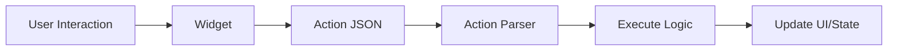

# Custom Actions Development Guide

This comprehensive guide covers everything you need to know about creating custom STAC actions, from basic patterns to advanced techniques.

## 📋 Table of Contents

1. [Action Architecture](#action-architecture)
2. [Creating Basic Actions](#creating-basic-actions)
3. [Advanced Action Patterns](#advanced-action-patterns)
4. [Action Parser Registration](#action-parser-registration)
5. [Testing Custom Actions](#testing-custom-actions)
6. [Best Practices](#best-practices)
7. [Troubleshooting](#troubleshooting)

## 🏗️ Action Architecture

### What are Actions?

Actions handle user interactions and business logic in STAC applications:

- **Navigation**: Move between screens
- **API Calls**: Fetch or send data
- **State Updates**: Modify application state
- **UI Operations**: Show dialogs, snackbars, etc.
- **Business Logic**: Execute custom operations

### Component Structure

Every custom STAC action consists of three parts:

```
stac/actions/my_action/
├── my_action.dart          # Action model (data structure)
├── my_action_parser.dart   # Action parser (execution logic)
└── my_action.g.dart        # Generated code (JSON serialization)
```

### Data Flow



## 🎯 Creating Basic Actions

### Step 1: Define the Action Model

The model defines the data structure for your action.

**File**: `stac/actions/show_toast/show_toast_action.dart`

```dart
import 'package:json_annotation/json_annotation.dart';

part 'show_toast_action.g.dart';

/// An action that displays a toast message.
///
/// Example JSON:
/// ```json
/// {
///   "actionType": "showToast",
///   "message": "Hello World",
///   "duration": 3000,
///   "type": "info"
/// }
/// ```
@JsonSerializable()
class ShowToastAction {
  /// The message to display
  final String message;
  
  /// Duration in milliseconds (default: 2000)
  final int? duration;
  
  /// Toast type: info, success, warning, error
  final String? type;
  
  const ShowToastAction({
    required this.message,
    this.duration,
    this.type,
  });

  factory ShowToastAction.fromJson(Map<String, dynamic> json) =>
      _$ShowToastActionFromJson(json);

  Map<String, dynamic> toJson() => _$ShowToastActionToJson(this);
}
```

**Key Points**:
- Use `@JsonSerializable()` for automatic JSON conversion
- Add `part` directive for generated code
- Document with dartdoc comments
- Use `final` for immutability
- Mark optional fields with `?`

### Step 2: Create the Action Parser

The parser executes the action logic.

**File**: `stac/actions/show_toast/show_toast_parser.dart`

```dart
import 'dart:async';
import 'package:flutter/material.dart';
import 'package:stac_core/stac_core.dart';
import 'package:tobank_sdui/stac/actions/show_toast/show_toast_action.dart';

/// Parser for ShowToastAction
class ShowToastParser extends StacActionParser<ShowToastAction> {
  @override
  String get actionType => 'showToast';

  @override
  ShowToastAction getModel(Map<String, dynamic> json) =>
      ShowToastAction.fromJson(json);

  @override
  FutureOr onCall(BuildContext context, ShowToastAction model) {
    // Get color based on type
    final color = _getColorForType(model.type ?? 'info');
    
    // Get duration
    final duration = Duration(milliseconds: model.duration ?? 2000);

    // Show snackbar
    ScaffoldMessenger.of(context).showSnackBar(
      SnackBar(
        content: Text(model.message),
        backgroundColor: color,
        duration: duration,
        behavior: SnackBarBehavior.floating,
        shape: RoundedRectangleBorder(
          borderRadius: BorderRadius.circular(8),
        ),
      ),
    );
  }

  Color _getColorForType(String type) {
    switch (type.toLowerCase()) {
      case 'success':
        return Colors.green;
      case 'warning':
        return Colors.orange;
      case 'error':
        return Colors.red;
      case 'info':
      default:
        return Colors.blue;
    }
  }
}
```

**Key Points**:
- Extend `StacActionParser<YourModel>`
- Override `actionType` to match JSON actionType field
- Override `getModel` to deserialize JSON
- Override `onCall` to execute action logic
- Return `FutureOr` for sync or async operations

### Step 3: Generate Code

```bash
# Generate JSON serialization code
dart run build_runner build --delete-conflicting-outputs

# This creates: show_toast_action.g.dart
```

### Step 4: Register the Parser

**File**: `stac/registry/custom_component_registry.dart`

```dart
import 'package:tobank_sdui/stac/actions/show_toast/show_toast_parser.dart';

class CustomComponentRegistry {
  static final CustomComponentRegistry instance = CustomComponentRegistry._();
  CustomComponentRegistry._();

  final Map<String, dynamic> _actionParsers = {};

  void registerAction(dynamic parser) {
    final actionType = parser.actionType as String;
    _actionParsers[actionType] = parser;
  }

  dynamic getActionParser(String actionType) => _actionParsers[actionType];

  void registerAll() {
    // Register custom actions
    registerAction(ShowToastParser());
  }
}
```

### Step 5: Use in JSON

```json
{
  "type": "elevatedButton",
  "child": {
    "type": "text",
    "data": "Show Toast"
  },
  "onPressed": {
    "actionType": "showToast",
    "message": "Hello from STAC!",
    "duration": 3000,
    "type": "success"
  }
}
```

## 🚀 Advanced Action Patterns

### Pattern 1: Navigation Actions

**Model**:
```dart
@JsonSerializable()
class NavigateAction {
  final String route;
  final Map<String, dynamic>? arguments;
  final bool? replace;
  
  const NavigateAction({
    required this.route,
    this.arguments,
    this.replace,
  });

  factory NavigateAction.fromJson(Map<String, dynamic> json) =>
      _$NavigateActionFromJson(json);

  Map<String, dynamic> toJson() => _$NavigateActionToJson(this);
}
```

**Parser**:
```dart
class NavigateParser extends StacActionParser<NavigateAction> {
  @override
  String get actionType => 'navigate';

  @override
  NavigateAction getModel(Map<String, dynamic> json) =>
      NavigateAction.fromJson(json);

  @override
  FutureOr onCall(BuildContext context, NavigateAction model) {
    if (model.replace == true) {
      Navigator.of(context).pushReplacementNamed(
        model.route,
        arguments: model.arguments,
      );
    } else {
      Navigator.of(context).pushNamed(
        model.route,
        arguments: model.arguments,
      );
    }
  }
}
```

**JSON**:
```json
{
  "actionType": "navigate",
  "route": "/profile",
  "arguments": {
    "userId": "123"
  },
  "replace": false
}
```

### Pattern 2: API Call Actions

**Model**:
```dart
@JsonSerializable()
class ApiCallAction {
  final String url;
  final String method;  // GET, POST, PUT, DELETE
  final Map<String, dynamic>? body;
  final Map<String, String>? headers;
  final String? successMessage;
  final String? errorMessage;
  
  const ApiCallAction({
    required this.url,
    this.method = 'GET',
    this.body,
    this.headers,
    this.successMessage,
    this.errorMessage,
  });

  factory ApiCallAction.fromJson(Map<String, dynamic> json) =>
      _$ApiCallActionFromJson(json);

  Map<String, dynamic> toJson() => _$ApiCallActionToJson(this);
}
```

**Parser**:
```dart
import 'package:dio/dio.dart';

class ApiCallParser extends StacActionParser<ApiCallAction> {
  final Dio _dio = Dio();

  @override
  String get actionType => 'apiCall';

  @override
  ApiCallAction getModel(Map<String, dynamic> json) =>
      ApiCallAction.fromJson(json);

  @override
  Future<void> onCall(BuildContext context, ApiCallAction model) async {
    try {
      // Show loading indicator
      _showLoading(context);

      // Make API call
      final response = await _makeRequest(model);

      // Hide loading
      Navigator.of(context).pop();

      // Show success message
      if (model.successMessage != null) {
        _showSnackBar(context, model.successMessage!, Colors.green);
      }

      // Handle response (could trigger another action)
      _handleResponse(context, response.data);
    } catch (e) {
      // Hide loading
      Navigator.of(context).pop();

      // Show error message
      final errorMsg = model.errorMessage ?? 'API call failed: $e';
      _showSnackBar(context, errorMsg, Colors.red);
    }
  }

  Future<Response> _makeRequest(ApiCallAction model) async {
    switch (model.method.toUpperCase()) {
      case 'POST':
        return await _dio.post(
          model.url,
          data: model.body,
          options: Options(headers: model.headers),
        );
      case 'PUT':
        return await _dio.put(
          model.url,
          data: model.body,
          options: Options(headers: model.headers),
        );
      case 'DELETE':
        return await _dio.delete(
          model.url,
          options: Options(headers: model.headers),
        );
      case 'GET':
      default:
        return await _dio.get(
          model.url,
          options: Options(headers: model.headers),
        );
    }
  }

  void _showLoading(BuildContext context) {
    showDialog(
      context: context,
      barrierDismissible: false,
      builder: (context) => const Center(
        child: CircularProgressIndicator(),
      ),
    );
  }

  void _showSnackBar(BuildContext context, String message, Color color) {
    ScaffoldMessenger.of(context).showSnackBar(
      SnackBar(
        content: Text(message),
        backgroundColor: color,
      ),
    );
  }

  void _handleResponse(BuildContext context, dynamic data) {
    // Could trigger another action based on response
    // For example, navigate to a new screen or update state
  }
}
```

**JSON**:
```json
{
  "actionType": "apiCall",
  "url": "https://api.example.com/users",
  "method": "POST",
  "body": {
    "name": "John Doe",
    "email": "john@example.com"
  },
  "headers": {
    "Authorization": "Bearer token123"
  },
  "successMessage": "User created successfully",
  "errorMessage": "Failed to create user"
}
```

### Pattern 3: State Update Actions

**Model**:
```dart
@JsonSerializable()
class SetStateAction {
  final String key;
  final dynamic value;
  
  const SetStateAction({
    required this.key,
    required this.value,
  });

  factory SetStateAction.fromJson(Map<String, dynamic> json) =>
      _$SetStateActionFromJson(json);

  Map<String, dynamic> toJson() => _$SetStateActionToJson(this);
}
```

**Parser**:
```dart
class SetStateParser extends StacActionParser<SetStateAction> {
  @override
  String get actionType => 'setState';

  @override
  SetStateAction getModel(Map<String, dynamic> json) =>
      SetStateAction.fromJson(json);

  @override
  FutureOr onCall(BuildContext context, SetStateAction model) {
    // Update state in registry
    StacRegistry.instance.setVariable(model.key, model.value);
    
    // Trigger UI refresh if needed
    // This depends on your state management solution
  }
}
```

**JSON**:
```json
{
  "actionType": "setState",
  "key": "user.isLoggedIn",
  "value": true
}
```

### Pattern 4: Dialog Actions

**Model**:
```dart
@JsonSerializable()
class ShowDialogAction {
  final String title;
  final String message;
  final String? confirmText;
  final String? cancelText;
  final Map<String, dynamic>? onConfirm;
  final Map<String, dynamic>? onCancel;
  
  const ShowDialogAction({
    required this.title,
    required this.message,
    this.confirmText,
    this.cancelText,
    this.onConfirm,
    this.onCancel,
  });

  factory ShowDialogAction.fromJson(Map<String, dynamic> json) =>
      _$ShowDialogActionFromJson(json);

  Map<String, dynamic> toJson() => _$ShowDialogActionToJson(this);
}
```

**Parser**:
```dart
class ShowDialogParser extends StacActionParser<ShowDialogAction> {
  @override
  String get actionType => 'showDialog';

  @override
  ShowDialogAction getModel(Map<String, dynamic> json) =>
      ShowDialogAction.fromJson(json);

  @override
  Future<void> onCall(BuildContext context, ShowDialogAction model) async {
    final result = await showDialog<bool>(
      context: context,
      builder: (context) => AlertDialog(
        title: Text(model.title),
        content: Text(model.message),
        actions: [
          if (model.cancelText != null)
            TextButton(
              onPressed: () => Navigator.of(context).pop(false),
              child: Text(model.cancelText!),
            ),
          TextButton(
            onPressed: () => Navigator.of(context).pop(true),
            child: Text(model.confirmText ?? 'OK'),
          ),
        ],
      ),
    );

    // Execute callback actions
    if (result == true && model.onConfirm != null) {
      StacRegistry.instance.executeAction(context, model.onConfirm!);
    } else if (result == false && model.onCancel != null) {
      StacRegistry.instance.executeAction(context, model.onCancel!);
    }
  }
}
```

**JSON**:
```json
{
  "actionType": "showDialog",
  "title": "Confirm Delete",
  "message": "Are you sure you want to delete this item?",
  "confirmText": "Delete",
  "cancelText": "Cancel",
  "onConfirm": {
    "actionType": "apiCall",
    "url": "https://api.example.com/items/123",
    "method": "DELETE"
  }
}
```

### Pattern 5: Chained Actions

Execute multiple actions in sequence:

**Model**:
```dart
@JsonSerializable()
class ChainAction {
  final List<Map<String, dynamic>> actions;
  
  const ChainAction({required this.actions});

  factory ChainAction.fromJson(Map<String, dynamic> json) =>
      _$ChainActionFromJson(json);

  Map<String, dynamic> toJson() => _$ChainActionToJson(this);
}
```

**Parser**:
```dart
class ChainParser extends StacActionParser<ChainAction> {
  @override
  String get actionType => 'chain';

  @override
  ChainAction getModel(Map<String, dynamic> json) =>
      ChainAction.fromJson(json);

  @override
  Future<void> onCall(BuildContext context, ChainAction model) async {
    for (final actionJson in model.actions) {
      await StacRegistry.instance.executeAction(context, actionJson);
    }
  }
}
```

**JSON**:
```json
{
  "actionType": "chain",
  "actions": [
    {
      "actionType": "showToast",
      "message": "Saving...",
      "type": "info"
    },
    {
      "actionType": "apiCall",
      "url": "https://api.example.com/save",
      "method": "POST"
    },
    {
      "actionType": "navigate",
      "route": "/success"
    }
  ]
}
```

### Pattern 6: Conditional Actions

Execute actions based on conditions:

**Model**:
```dart
@JsonSerializable()
class ConditionalAction {
  final String condition;
  final Map<String, dynamic>? trueAction;
  final Map<String, dynamic>? falseAction;
  
  const ConditionalAction({
    required this.condition,
    this.trueAction,
    this.falseAction,
  });

  factory ConditionalAction.fromJson(Map<String, dynamic> json) =>
      _$ConditionalActionFromJson(json);

  Map<String, dynamic> toJson() => _$ConditionalActionToJson(this);
}
```

**Parser**:
```dart
class ConditionalParser extends StacActionParser<ConditionalAction> {
  @override
  String get actionType => 'conditional';

  @override
  ConditionalAction getModel(Map<String, dynamic> json) =>
      ConditionalAction.fromJson(json);

  @override
  FutureOr onCall(BuildContext context, ConditionalAction model) {
    final conditionValue = _evaluateCondition(model.condition);

    if (conditionValue && model.trueAction != null) {
      return StacRegistry.instance.executeAction(context, model.trueAction!);
    } else if (!conditionValue && model.falseAction != null) {
      return StacRegistry.instance.executeAction(context, model.falseAction!);
    }
  }

  bool _evaluateCondition(String condition) {
    // Evaluate condition from state/registry
    return StacRegistry.instance.getVariable(condition) == true;
  }
}
```

**JSON**:
```json
{
  "actionType": "conditional",
  "condition": "user.isLoggedIn",
  "trueAction": {
    "actionType": "navigate",
    "route": "/dashboard"
  },
  "falseAction": {
    "actionType": "navigate",
    "route": "/login"
  }
}
```

## 📝 Action Parser Registration

### Single Parser Registration

```dart
// In main.dart or app initialization
CustomComponentRegistry.instance.registerAction(ShowToastParser());
```

### Bulk Registration

```dart
class CustomComponentRegistry {
  void registerAll() {
    // Register all custom actions
    final actionParsers = [
      ShowToastParser(),
      NavigateParser(),
      ApiCallParser(),
      SetStateParser(),
      ShowDialogParser(),
      ChainParser(),
      ConditionalParser(),
    ];

    for (final parser in actionParsers) {
      registerAction(parser);
    }
  }
}

// In main.dart
void main() {
  WidgetsFlutterBinding.ensureInitialized();
  CustomComponentRegistry.instance.registerAll();
  runApp(const MyApp());
}
```

## 🧪 Testing Custom Actions

### Unit Tests

Test action model serialization:

```dart
import 'package:flutter_test/flutter_test.dart';
import 'package:tobank_sdui/stac/actions/show_toast/show_toast_action.dart';

void main() {
  group('ShowToastAction', () {
    test('should serialize to JSON', () {
      final action = ShowToastAction(
        message: 'Test Message',
        duration: 3000,
        type: 'success',
      );

      final json = action.toJson();

      expect(json['message'], 'Test Message');
      expect(json['duration'], 3000);
      expect(json['type'], 'success');
    });

    test('should deserialize from JSON', () {
      final json = {
        'message': 'Test Message',
        'duration': 3000,
        'type': 'success',
      };

      final action = ShowToastAction.fromJson(json);

      expect(action.message, 'Test Message');
      expect(action.duration, 3000);
      expect(action.type, 'success');
    });

    test('should handle optional fields', () {
      final json = {
        'message': 'Test Message',
      };

      final action = ShowToastAction.fromJson(json);

      expect(action.message, 'Test Message');
      expect(action.duration, null);
      expect(action.type, null);
    });
  });
}
```

### Integration Tests

Test action execution:

```dart
import 'package:flutter/material.dart';
import 'package:flutter_test/flutter_test.dart';
import 'package:tobank_sdui/stac/actions/show_toast/show_toast_action.dart';
import 'package:tobank_sdui/stac/actions/show_toast/show_toast_parser.dart';

void main() {
  group('ShowToastParser', () {
    testWidgets('should execute action', (tester) async {
      final parser = ShowToastParser();
      final model = ShowToastAction(
        message: 'Test Message',
        type: 'success',
      );

      await tester.pumpWidget(
        MaterialApp(
          home: Scaffold(
            body: Builder(
              builder: (context) {
                return ElevatedButton(
                  onPressed: () => parser.onCall(context, model),
                  child: const Text('Test'),
                );
              },
            ),
          ),
        ),
      );

      // Tap button to trigger action
      await tester.tap(find.text('Test'));
      await tester.pump();

      // Verify snackbar is shown
      expect(find.text('Test Message'), findsOneWidget);
    });
  });
}
```

### Mock API Tests

Test API call actions with mocked responses:

```dart
import 'package:dio/dio.dart';
import 'package:flutter_test/flutter_test.dart';
import 'package:mockito/mockito.dart';
import 'package:tobank_sdui/stac/actions/api_call/api_call_action.dart';
import 'package:tobank_sdui/stac/actions/api_call/api_call_parser.dart';

class MockDio extends Mock implements Dio {}

void main() {
  group('ApiCallParser', () {
    test('should make GET request', () async {
      final mockDio = MockDio();
      final parser = ApiCallParser(dio: mockDio);
      
      when(mockDio.get(any)).thenAnswer(
        (_) async => Response(
          data: {'success': true},
          statusCode: 200,
          requestOptions: RequestOptions(path: ''),
        ),
      );

      final model = ApiCallAction(
        url: 'https://api.example.com/data',
        method: 'GET',
      );

      // Execute action
      await parser.onCall(mockContext, model);

      // Verify request was made
      verify(mockDio.get('https://api.example.com/data')).called(1);
    });
  });
}
```

## ✅ Best Practices

### 1. Keep Actions Focused

```dart
// ✅ Good: Single responsibility
class ShowToastAction {
  final String message;
  final String? type;
}

// ❌ Bad: Too many responsibilities
class ComplexAction {
  final String? toastMessage;
  final String? navigationRoute;
  final Map<String, dynamic>? apiCall;
}
```

### 2. Handle Errors Gracefully

```dart
@override
Future<void> onCall(BuildContext context, ApiCallAction model) async {
  try {
    final response = await _dio.get(model.url);
    _handleSuccess(context, response);
  } on DioException catch (e) {
    _handleDioError(context, e);
  } catch (e) {
    _handleGenericError(context, e);
  }
}
```

### 3. Provide User Feedback

```dart
@override
Future<void> onCall(BuildContext context, SaveAction model) async {
  // Show loading
  _showLoading(context);
  
  try {
    await _saveData(model);
    // Show success
    _showSuccess(context, 'Data saved successfully');
  } catch (e) {
    // Show error
    _showError(context, 'Failed to save data');
  } finally {
    // Hide loading
    _hideLoading(context);
  }
}
```

### 4. Use Async/Await Properly

```dart
// ✅ Good: Proper async handling
@override
Future<void> onCall(BuildContext context, MyAction model) async {
  await _doSomethingAsync();
  await _doSomethingElse();
}

// ❌ Bad: Not awaiting async operations
@override
FutureOr onCall(BuildContext context, MyAction model) {
  _doSomethingAsync();  // Not awaited!
  _doSomethingElse();   // May execute before first completes
}
```

### 5. Document Action Behavior

```dart
/// An action that saves user data to the server.
///
/// This action performs the following steps:
/// 1. Validates the data
/// 2. Shows a loading indicator
/// 3. Makes an API call to save the data
/// 4. Shows success or error message
/// 5. Navigates to the next screen on success
///
/// Example JSON:
/// ```json
/// {
///   "actionType": "saveData",
///   "data": {"name": "John", "email": "john@example.com"},
///   "successRoute": "/success"
/// }
/// ```
@JsonSerializable()
class SaveDataAction {
  // ...
}
```

## 🐛 Troubleshooting

### Issue: "Action not executing"

**Cause**: Parser not registered or actionType mismatch

**Solution**:
1. Check parser is registered
2. Verify actionType matches JSON field
3. Check for errors in parser logic

### Issue: "Async action not completing"

**Cause**: Not awaiting async operations

**Solution**:
```dart
// ✅ Correct
@override
Future<void> onCall(BuildContext context, MyAction model) async {
  await _asyncOperation();
}

// ❌ Wrong
@override
FutureOr onCall(BuildContext context, MyAction model) {
  _asyncOperation();  // Not awaited
}
```

### Issue: "Context not valid"

**Cause**: Using context after widget is disposed

**Solution**:
```dart
@override
Future<void> onCall(BuildContext context, MyAction model) async {
  await _asyncOperation();
  
  // Check if context is still mounted
  if (context.mounted) {
    Navigator.of(context).pop();
  }
}
```

### Issue: "Action causing memory leak"

**Cause**: Not disposing resources

**Solution**:
```dart
class MyActionParser extends StacActionParser<MyAction> {
  final StreamController _controller = StreamController();

  @override
  Future<void> onCall(BuildContext context, MyAction model) async {
    try {
      // Use controller
    } finally {
      // Always dispose
      await _controller.close();
    }
  }
}
```

## 📚 Next Steps

- **[Testing Guide](./04-testing-guide.md)** - Comprehensive testing strategies
- **[API Layer Guide](./05-api-layer-guide.md)** - Set up API layer
- **[Mock Data Guide](./06-mock-data-guide.md)** - Working with mock data

## 📖 Additional Resources

- **[STAC Actions Reference](../stac/07-actions.md)** - Built-in actions
- **[STAC Core Concepts](../stac/05-core-concepts.md)** - Framework fundamentals
- **[Action Parsers](../stac/concepts_action_parsers.md)** - Action parser patterns

---

**Next**: [Testing Guide](./04-testing-guide.md)

