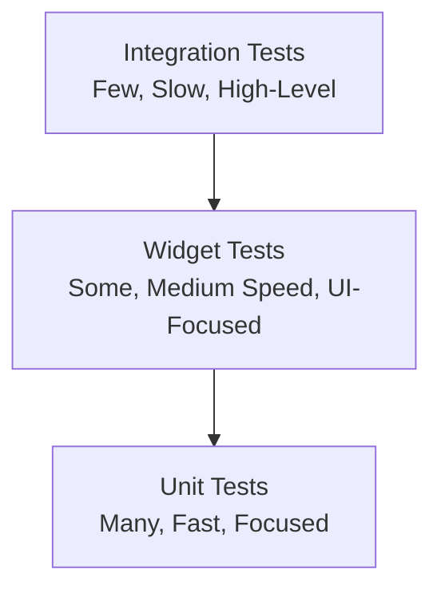

# Testing Guide

This comprehensive guide covers testing strategies for STAC custom components, from unit tests to integration tests.

## 📋 Table of Contents

1. [Testing Philosophy](#testing-philosophy)
2. [Unit Testing](#unit-testing)
3. [Widget Testing](#widget-testing)
4. [Integration Testing](#integration-testing)
5. [Test Organization](#test-organization)
6. [Best Practices](#best-practices)
7. [Troubleshooting](#troubleshooting)

## 🎯 Testing Philosophy

### Why Test?

Testing custom STAC components ensures:

- **Correctness**: Components work as expected
- **Reliability**: Changes don't break existing functionality
- **Confidence**: Safe to refactor and improve code
- **Documentation**: Tests serve as usage examples
- **Quality**: Maintain high code quality standards

### Testing Pyramid



- **Unit Tests**: Test individual components in isolation (70%)
- **Widget Tests**: Test widget rendering and interactions (20%)
- **Integration Tests**: Test complete workflows (10%)

### Test Coverage Goals

- **Custom Components**: 80%+ coverage
- **Critical Paths**: 100% coverage
- **Overall Project**: 70%+ coverage

## 🧪 Unit Testing

Unit tests verify individual components work correctly in isolation.

### Testing Widget Models

Test JSON serialization and deserialization:

**File**: `test/stac/widgets/info_card_test.dart`

```dart
import 'package:flutter_test/flutter_test.dart';
import 'package:tobank_sdui/stac/widgets/info_card/info_card_widget.dart';

void main() {
  group('InfoCardWidget', () {
    group('JSON Serialization', () {
      test('should serialize to JSON with all fields', () {
        // Arrange
        final widget = InfoCardWidget(
          title: 'Test Title',
          description: 'Test Description',
          icon: 'info',
          color: '#2196F3',
        );

        // Act
        final json = widget.toJson();

        // Assert
        expect(json['title'], 'Test Title');
        expect(json['description'], 'Test Description');
        expect(json['icon'], 'info');
        expect(json['color'], '#2196F3');
      });

      test('should serialize to JSON with required fields only', () {
        // Arrange
        final widget = InfoCardWidget(
          title: 'Test Title',
          description: 'Test Description',
        );

        // Act
        final json = widget.toJson();

        // Assert
        expect(json['title'], 'Test Title');
        expect(json['description'], 'Test Description');
        expect(json.containsKey('icon'), false);
        expect(json.containsKey('color'), false);
      });
    });

    group('JSON Deserialization', () {
      test('should deserialize from JSON with all fields', () {
        // Arrange
        final json = {
          'title': 'Test Title',
          'description': 'Test Description',
          'icon': 'info',
          'color': '#2196F3',
        };

        // Act
        final widget = InfoCardWidget.fromJson(json);

        // Assert
        expect(widget.title, 'Test Title');
        expect(widget.description, 'Test Description');
        expect(widget.icon, 'info');
        expect(widget.color, '#2196F3');
      });

      test('should deserialize from JSON with required fields only', () {
        // Arrange
        final json = {
          'title': 'Test Title',
          'description': 'Test Description',
        };

        // Act
        final widget = InfoCardWidget.fromJson(json);

        // Assert
        expect(widget.title, 'Test Title');
        expect(widget.description, 'Test Description');
        expect(widget.icon, null);
        expect(widget.color, null);
      });

      test('should throw error when required field is missing', () {
        // Arrange
        final json = {
          'title': 'Test Title',
          // Missing 'description'
        };

        // Act & Assert
        expect(
          () => InfoCardWidget.fromJson(json),
          throwsA(isA<TypeError>()),
        );
      });
    });

    group('Round-trip Serialization', () {
      test('should maintain data through serialize-deserialize cycle', () {
        // Arrange
        final original = InfoCardWidget(
          title: 'Test Title',
          description: 'Test Description',
          icon: 'info',
          color: '#2196F3',
        );

        // Act
        final json = original.toJson();
        final deserialized = InfoCardWidget.fromJson(json);

        // Assert
        expect(deserialized.title, original.title);
        expect(deserialized.description, original.description);
        expect(deserialized.icon, original.icon);
        expect(deserialized.color, original.color);
      });
    });
  });
}
```

### Testing Action Models

**File**: `test/stac/actions/show_toast_test.dart`

```dart
import 'package:flutter_test/flutter_test.dart';
import 'package:tobank_sdui/stac/actions/show_toast/show_toast_action.dart';

void main() {
  group('ShowToastAction', () {
    test('should serialize to JSON', () {
      final action = ShowToastAction(
        message: 'Test Message',
        duration: 3000,
        type: 'success',
      );

      final json = action.toJson();

      expect(json['message'], 'Test Message');
      expect(json['duration'], 3000);
      expect(json['type'], 'success');
    });

    test('should deserialize from JSON', () {
      final json = {
        'message': 'Test Message',
        'duration': 3000,
        'type': 'success',
      };

      final action = ShowToastAction.fromJson(json);

      expect(action.message, 'Test Message');
      expect(action.duration, 3000);
      expect(action.type, 'success');
    });

    test('should handle optional fields', () {
      final json = {
        'message': 'Test Message',
      };

      final action = ShowToastAction.fromJson(json);

      expect(action.message, 'Test Message');
      expect(action.duration, null);
      expect(action.type, null);
    });
  });
}
```

### Testing Parser Logic

**File**: `test/stac/widgets/info_card_parser_test.dart`

```dart
import 'package:flutter_test/flutter_test.dart';
import 'package:tobank_sdui/stac/widgets/info_card/info_card_parser.dart';
import 'package:tobank_sdui/stac/widgets/info_card/info_card_widget.dart';

void main() {
  group('InfoCardParser', () {
    late InfoCardParser parser;

    setUp(() {
      parser = InfoCardParser();
    });

    test('should have correct type', () {
      expect(parser.type, 'infoCard');
    });

    test('should parse model from JSON', () {
      final json = {
        'title': 'Test Title',
        'description': 'Test Description',
        'icon': 'info',
        'color': '#2196F3',
      };

      final model = parser.getModel(json);

      expect(model, isA<InfoCardWidget>());
      expect(model.title, 'Test Title');
      expect(model.description, 'Test Description');
      expect(model.icon, 'info');
      expect(model.color, '#2196F3');
    });

    test('should handle invalid JSON gracefully', () {
      final json = {
        'title': 'Test Title',
        // Missing required 'description'
      };

      expect(
        () => parser.getModel(json),
        throwsA(isA<TypeError>()),
      );
    });
  });
}
```

## 🎨 Widget Testing

Widget tests verify that widgets render correctly and respond to user interactions.

### Testing Widget Rendering

**File**: `test/stac/widgets/info_card_widget_test.dart`

```dart
import 'package:flutter/material.dart';
import 'package:flutter_test/flutter_test.dart';
import 'package:tobank_sdui/stac/widgets/info_card/info_card_widget.dart';
import 'package:tobank_sdui/stac/widgets/info_card/info_card_parser.dart';

void main() {
  group('InfoCardParser Widget Tests', () {
    testWidgets('should render info card with all fields', (tester) async {
      // Arrange
      final parser = InfoCardParser();
      final model = InfoCardWidget(
        title: 'Test Title',
        description: 'Test Description',
        icon: 'info',
        color: '#2196F3',
      );

      // Act
      await tester.pumpWidget(
        MaterialApp(
          home: Scaffold(
            body: parser.parse(
              tester.element(find.byType(Scaffold)),
              model,
            ),
          ),
        ),
      );

      // Assert
      expect(find.text('Test Title'), findsOneWidget);
      expect(find.text('Test Description'), findsOneWidget);
      expect(find.byIcon(Icons.info_outline), findsOneWidget);
    });

    testWidgets('should render without optional fields', (tester) async {
      // Arrange
      final parser = InfoCardParser();
      final model = InfoCardWidget(
        title: 'Test Title',
        description: 'Test Description',
      );

      // Act
      await tester.pumpWidget(
        MaterialApp(
          home: Scaffold(
            body: parser.parse(
              tester.element(find.byType(Scaffold)),
              model,
            ),
          ),
        ),
      );

      // Assert
      expect(find.text('Test Title'), findsOneWidget);
      expect(find.text('Test Description'), findsOneWidget);
      // Should use default icon
      expect(find.byIcon(Icons.info_outline), findsOneWidget);
    });

    testWidgets('should apply correct styling', (tester) async {
      // Arrange
      final parser = InfoCardParser();
      final model = InfoCardWidget(
        title: 'Test Title',
        description: 'Test Description',
        color: '#FF0000',
      );

      // Act
      await tester.pumpWidget(
        MaterialApp(
          home: Scaffold(
            body: parser.parse(
              tester.element(find.byType(Scaffold)),
              model,
            ),
          ),
        ),
      );

      // Assert
      final icon = tester.widget<Icon>(find.byType(Icon));
      expect(icon.color, const Color(0xFFFF0000));
    });
  });
}
```

### Testing Widget Interactions

**File**: `test/stac/widgets/counter_widget_test.dart`

```dart
import 'package:flutter/material.dart';
import 'package:flutter_test/flutter_test.dart';
import 'package:tobank_sdui/stac/widgets/counter/counter_widget.dart';
import 'package:tobank_sdui/stac/widgets/counter/counter_parser.dart';

void main() {
  group('CounterParser Widget Tests', () {
    testWidgets('should increment counter on button press', (tester) async {
      // Arrange
      final parser = CounterParser();
      final model = CounterWidget(initialValue: 0, step: 1);

      await tester.pumpWidget(
        MaterialApp(
          home: Scaffold(
            body: parser.parse(
              tester.element(find.byType(Scaffold)),
              model,
            ),
          ),
        ),
      );

      // Initial state
      expect(find.text('0'), findsOneWidget);

      // Act
      await tester.tap(find.byIcon(Icons.add));
      await tester.pump();

      // Assert
      expect(find.text('1'), findsOneWidget);
    });

    testWidgets('should decrement counter on button press', (tester) async {
      // Arrange
      final parser = CounterParser();
      final model = CounterWidget(initialValue: 5, step: 1);

      await tester.pumpWidget(
        MaterialApp(
          home: Scaffold(
            body: parser.parse(
              tester.element(find.byType(Scaffold)),
              model,
            ),
          ),
        ),
      );

      // Initial state
      expect(find.text('5'), findsOneWidget);

      // Act
      await tester.tap(find.byIcon(Icons.remove));
      await tester.pump();

      // Assert
      expect(find.text('4'), findsOneWidget);
    });

    testWidgets('should use custom step value', (tester) async {
      // Arrange
      final parser = CounterParser();
      final model = CounterWidget(initialValue: 0, step: 5);

      await tester.pumpWidget(
        MaterialApp(
          home: Scaffold(
            body: parser.parse(
              tester.element(find.byType(Scaffold)),
              model,
            ),
          ),
        ),
      );

      // Act
      await tester.tap(find.byIcon(Icons.add));
      await tester.pump();

      // Assert
      expect(find.text('5'), findsOneWidget);
    });
  });
}
```

### Testing Action Execution

**File**: `test/stac/actions/show_toast_action_test.dart`

```dart
import 'package:flutter/material.dart';
import 'package:flutter_test/flutter_test.dart';
import 'package:tobank_sdui/stac/actions/show_toast/show_toast_action.dart';
import 'package:tobank_sdui/stac/actions/show_toast/show_toast_parser.dart';

void main() {
  group('ShowToastParser Action Tests', () {
    testWidgets('should show snackbar with message', (tester) async {
      // Arrange
      final parser = ShowToastParser();
      final model = ShowToastAction(
        message: 'Test Message',
        type: 'success',
      );

      await tester.pumpWidget(
        MaterialApp(
          home: Scaffold(
            body: Builder(
              builder: (context) {
                return ElevatedButton(
                  onPressed: () => parser.onCall(context, model),
                  child: const Text('Show Toast'),
                );
              },
            ),
          ),
        ),
      );

      // Act
      await tester.tap(find.text('Show Toast'));
      await tester.pump();

      // Assert
      expect(find.text('Test Message'), findsOneWidget);
      expect(find.byType(SnackBar), findsOneWidget);
    });

    testWidgets('should apply correct color based on type', (tester) async {
      // Arrange
      final parser = ShowToastParser();
      final model = ShowToastAction(
        message: 'Success Message',
        type: 'success',
      );

      await tester.pumpWidget(
        MaterialApp(
          home: Scaffold(
            body: Builder(
              builder: (context) {
                return ElevatedButton(
                  onPressed: () => parser.onCall(context, model),
                  child: const Text('Show Toast'),
                );
              },
            ),
          ),
        ),
      );

      // Act
      await tester.tap(find.text('Show Toast'));
      await tester.pump();

      // Assert
      final snackBar = tester.widget<SnackBar>(find.byType(SnackBar));
      expect(snackBar.backgroundColor, Colors.green);
    });
  });
}
```

## 🔗 Integration Testing

Integration tests verify that components work together correctly.

### Testing STAC Integration

**File**: `test/integration/stac_integration_test.dart`

```dart
import 'package:flutter/material.dart';
import 'package:flutter_test/flutter_test.dart';
import 'package:stac_core/stac_core.dart';
import 'package:tobank_sdui/stac/registry/custom_component_registry.dart';

void main() {
  setUpAll(() {
    // Register all custom components
    CustomComponentRegistry.instance.registerAll();
  });

  group('STAC Integration Tests', () {
    testWidgets('should render custom widget from JSON', (tester) async {
      // Arrange
      final json = {
        'type': 'infoCard',
        'title': 'Integration Test',
        'description': 'Testing STAC integration',
        'icon': 'info',
        'color': '#2196F3',
      };

      // Act
      await tester.pumpWidget(
        MaterialApp(
          home: Scaffold(
            body: Stac.fromJson(
              json,
              tester.element(find.byType(Scaffold)),
            ),
          ),
        ),
      );

      // Assert
      expect(find.text('Integration Test'), findsOneWidget);
      expect(find.text('Testing STAC integration'), findsOneWidget);
    });

    testWidgets('should render nested widgets from JSON', (tester) async {
      // Arrange
      final json = {
        'type': 'column',
        'children': [
          {
            'type': 'infoCard',
            'title': 'Card 1',
            'description': 'First card',
          },
          {
            'type': 'infoCard',
            'title': 'Card 2',
            'description': 'Second card',
          },
        ],
      };

      // Act
      await tester.pumpWidget(
        MaterialApp(
          home: Scaffold(
            body: Stac.fromJson(
              json,
              tester.element(find.byType(Scaffold)),
            ),
          ),
        ),
      );

      // Assert
      expect(find.text('Card 1'), findsOneWidget);
      expect(find.text('Card 2'), findsOneWidget);
    });

    testWidgets('should execute custom action from JSON', (tester) async {
      // Arrange
      final json = {
        'type': 'elevatedButton',
        'child': {
          'type': 'text',
          'data': 'Click Me',
        },
        'onPressed': {
          'actionType': 'showToast',
          'message': 'Button clicked!',
          'type': 'success',
        },
      };

      // Act
      await tester.pumpWidget(
        MaterialApp(
          home: Scaffold(
            body: Stac.fromJson(
              json,
              tester.element(find.byType(Scaffold)),
            ),
          ),
        ),
      );

      await tester.tap(find.text('Click Me'));
      await tester.pump();

      // Assert
      expect(find.text('Button clicked!'), findsOneWidget);
    });
  });
}
```

### Testing Complete Workflows

**File**: `test/integration/workflow_test.dart`

```dart
import 'package:flutter/material.dart';
import 'package:flutter_test/flutter_test.dart';
import 'package:stac_core/stac_core.dart';
import 'package:tobank_sdui/stac/registry/custom_component_registry.dart';

void main() {
  setUpAll(() {
    CustomComponentRegistry.instance.registerAll();
  });

  group('Workflow Integration Tests', () {
    testWidgets('should complete form submission workflow', (tester) async {
      // Arrange
      final json = {
        'type': 'scaffold',
        'appBar': {
          'type': 'appBar',
          'title': {'type': 'text', 'data': 'Form Test'},
        },
        'body': {
          'type': 'column',
          'children': [
            {
              'type': 'textField',
              'key': 'name',
              'decoration': {
                'labelText': 'Name',
              },
            },
            {
              'type': 'elevatedButton',
              'child': {'type': 'text', 'data': 'Submit'},
              'onPressed': {
                'actionType': 'showToast',
                'message': 'Form submitted',
                'type': 'success',
              },
            },
          ],
        },
      };

      // Act
      await tester.pumpWidget(
        MaterialApp(
          home: Stac.fromJson(
            json,
            tester.element(find.byType(MaterialApp)),
          ),
        ),
      );

      // Enter text
      await tester.enterText(find.byType(TextField), 'John Doe');
      await tester.pump();

      // Submit form
      await tester.tap(find.text('Submit'));
      await tester.pump();

      // Assert
      expect(find.text('Form submitted'), findsOneWidget);
    });
  });
}
```

## 📁 Test Organization

### Directory Structure

```
test/
├── stac/
│   ├── widgets/
│   │   ├── info_card_test.dart
│   │   ├── info_card_parser_test.dart
│   │   ├── info_card_widget_test.dart
│   │   └── counter_widget_test.dart
│   ├── actions/
│   │   ├── show_toast_test.dart
│   │   ├── show_toast_action_test.dart
│   │   └── navigate_action_test.dart
│   └── registry/
│       └── custom_component_registry_test.dart
├── integration/
│   ├── stac_integration_test.dart
│   └── workflow_test.dart
└── helpers/
    ├── test_helpers.dart
    └── mock_data.dart
```

### Test Helpers

**File**: `test/helpers/test_helpers.dart`

```dart
import 'package:flutter/material.dart';
import 'package:flutter_test/flutter_test.dart';

/// Pumps a widget wrapped in MaterialApp for testing
Future<void> pumpTestWidget(
  WidgetTester tester,
  Widget widget,
) async {
  await tester.pumpWidget(
    MaterialApp(
      home: Scaffold(
        body: widget,
      ),
    ),
  );
}

/// Creates a mock BuildContext for testing
BuildContext getMockContext(WidgetTester tester) {
  return tester.element(find.byType(Scaffold));
}

/// Waits for all animations to complete
Future<void> pumpAndSettle(WidgetTester tester) async {
  await tester.pumpAndSettle();
}
```

**File**: `test/helpers/mock_data.dart`

```dart
/// Mock JSON data for testing
class MockData {
  static Map<String, dynamic> get infoCardJson => {
        'type': 'infoCard',
        'title': 'Test Title',
        'description': 'Test Description',
        'icon': 'info',
        'color': '#2196F3',
      };

  static Map<String, dynamic> get showToastActionJson => {
        'actionType': 'showToast',
        'message': 'Test Message',
        'duration': 3000,
        'type': 'success',
      };

  static Map<String, dynamic> get scaffoldWithInfoCardJson => {
        'type': 'scaffold',
        'appBar': {
          'type': 'appBar',
          'title': {'type': 'text', 'data': 'Test'},
        },
        'body': infoCardJson,
      };
}
```

## ✅ Best Practices

### 1. Follow AAA Pattern

```dart
test('should do something', () {
  // Arrange: Set up test data
  final widget = InfoCardWidget(
    title: 'Test',
    description: 'Description',
  );

  // Act: Execute the code being tested
  final json = widget.toJson();

  // Assert: Verify the results
  expect(json['title'], 'Test');
});
```

### 2. Use Descriptive Test Names

```dart
// ✅ Good: Descriptive
test('should serialize to JSON with all fields', () { ... });
test('should throw error when required field is missing', () { ... });

// ❌ Bad: Vague
test('test1', () { ... });
test('works', () { ... });
```

### 3. Test One Thing at a Time

```dart
// ✅ Good: Single responsibility
test('should serialize title', () {
  final widget = InfoCardWidget(title: 'Test', description: 'Desc');
  expect(widget.toJson()['title'], 'Test');
});

test('should serialize description', () {
  final widget = InfoCardWidget(title: 'Test', description: 'Desc');
  expect(widget.toJson()['description'], 'Desc');
});

// ❌ Bad: Testing multiple things
test('should serialize everything', () {
  final widget = InfoCardWidget(title: 'Test', description: 'Desc');
  expect(widget.toJson()['title'], 'Test');
  expect(widget.toJson()['description'], 'Desc');
  expect(widget.toJson()['icon'], null);
  // ... many more assertions
});
```

### 4. Use setUp and tearDown

```dart
group('InfoCardParser', () {
  late InfoCardParser parser;

  setUp(() {
    // Runs before each test
    parser = InfoCardParser();
  });

  tearDown(() {
    // Runs after each test
    // Clean up resources if needed
  });

  test('test 1', () { ... });
  test('test 2', () { ... });
});
```

### 5. Test Edge Cases

```dart
group('Edge Cases', () {
  test('should handle empty string', () { ... });
  test('should handle null values', () { ... });
  test('should handle very long strings', () { ... });
  test('should handle special characters', () { ... });
  test('should handle invalid JSON', () { ... });
});
```

## 🐛 Troubleshooting

### Issue: "Test fails intermittently"

**Cause**: Async timing issues

**Solution**:
```dart
// Use pumpAndSettle for animations
await tester.pumpAndSettle();

// Or pump with specific duration
await tester.pump(const Duration(seconds: 1));
```

### Issue: "Widget not found in test"

**Cause**: Widget not rendered or wrong finder

**Solution**:
```dart
// Print widget tree for debugging
debugDumpApp();

// Use different finders
find.text('exact text');
find.textContaining('partial');
find.byType(MyWidget);
find.byKey(Key('my-key'));
```

### Issue: "Context not available in test"

**Cause**: Missing MaterialApp wrapper

**Solution**:
```dart
await tester.pumpWidget(
  MaterialApp(  // Add MaterialApp wrapper
    home: Scaffold(
      body: MyWidget(),
    ),
  ),
);
```

## 📚 Next Steps

- **[API Layer Guide](./05-api-layer-guide.md)** - Set up API layer
- **[Mock Data Guide](./06-mock-data-guide.md)** - Working with mock data
- **[Debug Panel Guide](./08-debug-panel-guide.md)** - Using debug tools

---

**Next**: [API Layer Guide](./05-api-layer-guide.md)

