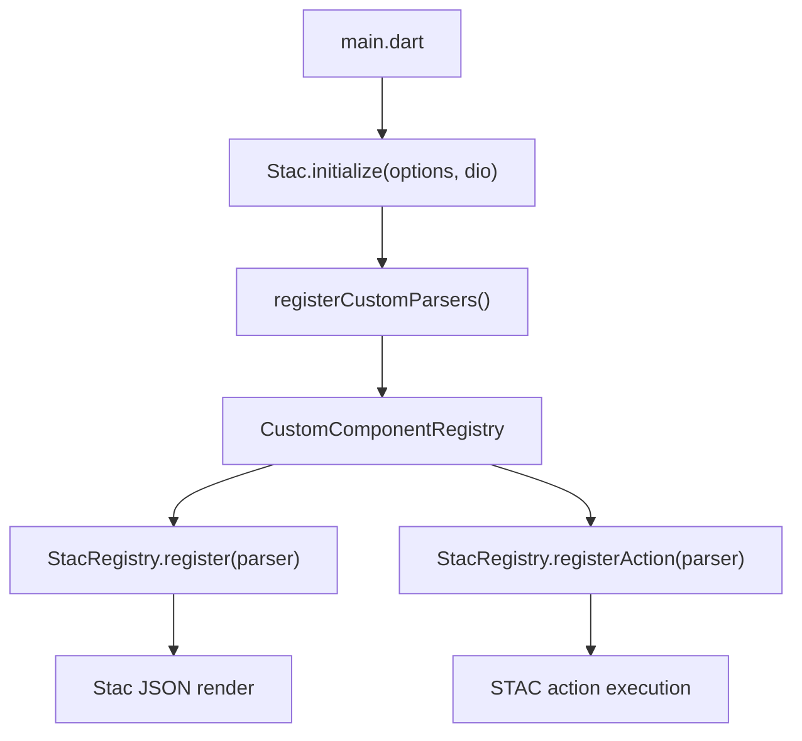

# Tobank STAC SDUI Interface Description Language

This document is the project IDL for Tobank server-driven UI screens. Use it when adding a new STAC feature, reviewing JSON from the server, or wiring a new custom widget/action parser.

The IDL describes the JSON contract that the server may send and the Flutter client can safely render or execute. It is based on the current code in `lib/core/stac`, `lib/core/plugins`, `lib/core/services`, `lib/core/storage`, `lib/core/utils`, `lib/core/widgets`, `lib/stac/registry`, and `lib/stac/tobank`.

## Design Rules

- Every custom widget uses `"type": "<widgetType>"`.
- Every custom action uses `"actionType": "<actionType>"`.
- Prefer existing STAC widgets/actions first. Add custom extensions only for native integration, registry reactivity, branded UI, or domain behavior.
- Keep custom JSON schemas small, explicit, and versionable. Do not send arbitrary executable logic.
- Use registry keys for cross-widget state, data binding, design tokens, and request results.
- Use `sequence` when one interaction must run multiple actions in order.
- Use `{{registry.path}}` for STAC variable interpolation and `[[registry.path]]` for custom boolean/reactive visibility patterns used by this app.
- Register new parsers through `CustomComponentRegistry` and then into `StacRegistry` via `registerCustomParsers()`.

External references used for this format:

- Stac introduction: https://stac.mintlify.app/introduction
- Stac project structure and custom parser placement: https://docs.stac.dev/project_structure
- Stac action parser contract: https://docs.stac.dev/concepts/action_parsers/
- Stac custom widgets/actions article: https://stac.dev/blogs/cutom-widget
- Stac package API and capability list: https://pub.dev/packages/stac
- Stac Dart API reference: https://pub.dev/documentation/stac/latest/stac/

## IDL Notation

```idl
WidgetNode = {
  "type": WidgetType,
  ...widgetProperties
}

ActionNode = {
  "actionType": ActionType,
  ...actionProperties
}

StacChild = WidgetNode
StacAction = ActionNode
RegistryKey = string              // Example: "form.amountRaw"
RegistryRef = "{{" RegistryKey "}}"
ReactiveRef = "[[" RegistryKey "]]"
ColorRef = "{{appColors.current.<path>}}"
AssetRef = "{{appAssets.<path>}}" | "{{appAssets.current.<path>}}"
StringRef = "{{appStrings.<path>}}"
StyleRef = "{{appStyles.<path>}}"
```

Required fields are listed without `?`. Optional fields are listed with `?`.

## Global Resources

### Strings File

Loader: `lib/core/stac/loaders/tobank/tobank_strings_loader.dart`

Source endpoint: `https://api.tobank.com/strings`

Registry prefix: `appStrings`

Syntax:

```json
{
  "type": "text",
  "data": "{{appStrings.login.validationTitle}}"
}
```

Contract:

- The response must contain `data`.
- Nested maps are flattened into dot notation.
- Values are stored once at startup and can be force reloaded.
- Missing strings should not crash rendering; use stable fallback text in Dart parsers where needed.

### Assets File

Loader: `lib/core/stac/loaders/tobank/tobank_assets_loader.dart`

Source endpoint: `https://api.tobank.com/assets`

Registry prefix: `appAssets`

Syntax:

```json
{
  "type": "image",
  "src": "{{appAssets.icons.support}}",
  "imageType": "asset"
}
```

Theme-aware syntax:

```json
{
  "type": "image",
  "src": "{{appAssets.current.icons.logo}}",
  "imageType": "asset"
}
```

Contract:

- Nested maps are flattened into dot notation.
- `Light` and `Dark` suffix pairs create `Current` aliases and `appAssets.current.*` aliases.
- `TobankAssetsLoader.setCurrentTheme(theme)` refreshes current aliases.

### Color File

Loader: `lib/core/stac/loaders/tobank/tobank_colors_loader.dart`

Source endpoint: `https://api.tobank.com/colors`

Registry prefix: `appColors`

Syntax:

```json
{
  "type": "container",
  "color": "{{appColors.current.background.surface}}"
}
```

Contract:

- Store both explicit theme paths, such as `appColors.light.*` and `appColors.dark.*`.
- Store selected theme aliases under `appColors.current.*`.
- Store active theme name under `appTheme.current`.
- Color values should be hex strings accepted by STAC/Flutter color parsing.

### Styles File

Loader: `lib/core/stac/loaders/tobank/tobank_styles_loader.dart`

Source endpoint: `https://api.tobank.com/styles`

Registry prefix: `appStyles`

Syntax:

```json
{
  "type": "elevatedButton",
  "style": {
    "backgroundColor": "{{appStyles.button.primary.backgroundColor}}",
    "foregroundColor": "{{appStyles.button.primary.foregroundColor}}"
  }
}
```

Contract:

- Styles are flattened into dot notation.
- Color references are resolved before storage, so stored style leaves should be concrete values.
- Prefer referencing leaf style values inside a STAC style object.

### Cache Manager System

Status: reserved for future documentation.

Known code locations:

- `lib/core/cache/cache_manager.dart`
- `lib/core/cache/json_parse_cache.dart`
- `lib/core/api/cache/disk_cache_manager.dart`

## Registry And Registration Flow

Runtime flow:



Important files:

- `lib/main.dart`: initializes STAC, registers custom parsers, then loads strings/colors/assets/styles.
- `lib/core/stac/registry/custom_component_registry.dart`: local registry for custom widget/action parsers.
- `lib/core/stac/registry/register_custom_parsers.dart`: source of truth for registered global custom parsers.
- `lib/stac/registry/register_custom_parsers.dart`: older/light registry path. Prefer the `lib/core/stac/registry` version for current global registration.

Overrides:

- Widget overrides: `image`, `visibility`, `textFormField`, `bottomNavigationView`, `bottomNavigationBar`, `stateful`, `stateFull`.
- Action overrides: `navigate`, `setValue`, `validateFields`, `networkRequest`.

## Custom Widget IDL

| Widget type | Purpose | Syntax fields | Example |
| --- | --- | --- | --- |
| `assetWidget` | Load a widget tree from a local/API asset path. | `type`, `assetPath?`, `request?`, `fallback?` | `{"type":"assetWidget","assetPath":"lib/stac/tobank/flows/x/json/page.json"}` |
| `bottomNavigationBar` | Override STAC bottom navigation bar with softer splash/highlight. | Standard STAC bottom navigation fields. | `{"type":"bottomNavigationBar","items":[],"showSelectedLabels":false}` |
| `bottomNavigationView` | Keep bottom-nav tab pages mounted across tab switches. | `type`, `children` | `{"type":"bottomNavigationView","children":[{"type":"scaffold"},{"type":"scaffold"}]}` |
| `image` | Override STAC image for Tobank asset/SVG/color behavior. | Standard STAC image fields. | `{"type":"image","src":"{{appAssets.icons.support}}","imageType":"asset","width":24,"height":24}` |
| `textFormField` | Override STAC text form field and register controllers by `id`. | Standard STAC text form field fields plus `id`. | `{"type":"textFormField","id":"phone","keyboardType":"number","maxLength":11}` |
| `visibility` | Dynamic visibility with registry/reactive expressions. | `type`, `visible`, `child`, `replacement?` | `{"type":"visibility","visible":"[[form.canContinue]]","child":{"type":"text","data":"Ready"}}` |
| `exampleCard` | Example custom parser reference. | `type`, `title?`, `description?`, `icon?` | `{"type":"exampleCard","title":"Example","description":"Demo"}` |
| `onMountAction` | Execute an action when the child is mounted. | `type`, `action`, `child` | `{"type":"onMountAction","action":{"actionType":"log","message":"mounted"},"child":{"type":"text","data":"Loading"}}` |
| `otpCountdownButton` | OTP request/retry countdown button. | `type`, `initialSeconds?`, `startOnTap?`, `requestLabel?`, `retryLabel?`, `onPressed?` | `{"type":"otpCountdownButton","initialSeconds":119,"requestLabel":"OTP","retryLabel":"Retry"}` |
| `pdfPreview` | Preview a PDF from base64/registry content. | `type`, `src?`, `registryKey?`, `width?`, `height?` | `{"type":"pdfPreview","registryKey":"serverSignedPdf","height":500}` |
| `promissory_real_loader` | Loader for Promissory Real server config flow. | `type` plus loader-specific request data. | `{"type":"promissory_real_loader"}` |
| `reactiveElevatedButton` | Elevated button that reacts to registry enabled state. | `type`, `enabled?`, `enabledKey?`, `style?`, `child`, `onPressed?` | `{"type":"reactiveElevatedButton","enabledKey":"form.canContinue","child":{"type":"text","data":"Continue"}}` |
| `reactiveListView` | Build list items from registry data and react to load/error/selection keys. | `type`, `dataKey`, `dataPath?`, `isLoadedKey?`, `errorKey?`, `itemIdField?`, `selectedIdKey?`, `itemBuilder` | `{"type":"reactiveListView","dataKey":"deposits.rawData","dataPath":"data","itemIdField":"id","itemBuilder":{"type":"text","data":"{{item.title}}"}}` |
| `reactiveSwitch` | Registry-backed switch. | `type`, `valueKey`, `initialValue?`, `onChanged?`, `activeColor?`, `scale?` | `{"type":"reactiveSwitch","valueKey":"settings.enabled","initialValue":false}` |
| `receiptRepaintBoundary` | Capture/share receipt content by boundary key. | `type`, `boundaryKey`, `child` | `{"type":"receiptRepaintBoundary","boundaryKey":"receiptContent","child":{"type":"column","children":[]}}` |
| `registryReactive` | Rebuild child when registry data changes. | `type`, `child` | `{"type":"registryReactive","child":{"type":"text","data":"{{form.amount}}"}}` |
| `signaturePad` | Handwritten signature capture. | `type`, `valueKey`, `hasSignatureKey?`, `clearKey?`, `strokeColor?`, `backgroundColor?`, `strokeWidth?` | `{"type":"signaturePad","valueKey":"signature.image","hasSignatureKey":"signature.hasValue"}` |
| `stateful` | Lifecycle wrapper around child. | `type`, `child`, `onInit?`, `onDispose?` | `{"type":"stateful","onInit":{"actionType":"log","message":"init"},"child":{"type":"scaffold"}}` |
| `stateFull` | Alias for `stateful` with preferred casing. | Same as `stateful`. | `{"type":"stateFull","child":{"type":"scaffold"}}` |
| `timedSplash` | Timed splash screen with auto-navigation. | `type`, `duration?`, `action?`, `child?`, `splashWidgetType?` | `{"type":"timedSplash","duration":1500,"action":{"actionType":"navigate","routeName":"login"}}` |
| `tobankAcceptorWebView` | Tobank acceptor web view. | `type`, `url?`, `title?` | `{"type":"tobankAcceptorWebView","url":"https://example.com"}` |
| `tobankBannerCarousel` | Home banner carousel with auto-scroll and indicators. | `type`, `imageUrls`, `height?`, `borderRadius?`, `autoScrollSeconds?`, `showIndicators?` | `{"type":"tobankBannerCarousel","imageUrls":["https://example.com/banner.jpg"],"height":106}` |
| `tobankCardsCarousel` | Page-view carousel for cards. | `type`, `pages`, `height?`, `initialPage?`, indicator fields. | `{"type":"tobankCardsCarousel","pages":[{"type":"container"}],"height":268}` |
| `tobankCardsStackScroller` | Stacked card scroller for dashboard cards. | `type`, `walletCard?`, `cards`, sizing/scale fields. | `{"type":"tobankCardsStackScroller","cards":[{"type":"container"}],"itemHeight":125}` |
| `tobankCardManagementSlider` | Card management slider. | `type`, `cards?`, `height?`, `initialPage?` | `{"type":"tobankCardManagementSlider","cards":[],"height":240}` |
| `tobankMegaGashtWebView` | MegaGasht web view. | `type`, `url?`, `title?` | `{"type":"tobankMegaGashtWebView","url":"https://example.com"}` |
| `tobank_onboarding_slider` | Tobank onboarding slider. | `type`, `pages`, `onFinish?` | `{"type":"tobank_onboarding_slider","pages":[{"title":"T","description":"D","image":"asset.png"}],"onFinish":{"actionType":"navigate","routeName":"login"}}` |
| `authentication_real_loader` | Loader for Verify Identity Real config flow. | `type` plus loader-specific request data. | `{"type":"authentication_real_loader"}` |

## Custom Action IDL

| Action type | Purpose | Syntax fields | Example |
| --- | --- | --- | --- |
| `addGiftCardAmountCard` | Show next gift-card amount card. | `actionType`, `secondCardVisibleKey`, `thirdCardVisibleKey` | `{"actionType":"addGiftCardAmountCard","secondCardVisibleKey":"gift.show2","thirdCardVisibleKey":"gift.show3"}` |
| `amountToWords` | Convert numeric amount to words. | `actionType`, `sourceKey`, `destinationKey`, `divideBy?`, `minDigits?`, `suffix?` | `{"actionType":"amountToWords","sourceKey":"form.amountRaw","destinationKey":"form.amountWords","suffix":"Toman"}` |
| `auth_persist` | Persist auth/session data. | `actionType`, auth fields from response/context. | `{"actionType":"auth_persist"}` |
| `biometricDebug` | Debug biometric module. | `actionType`, debug operation fields. | `{"actionType":"biometricDebug","operation":"status"}` |
| `biometricRegister` | Register biometric credential. | `actionType`, registration fields. | `{"actionType":"biometricRegister"}` |
| `calculateSum` | Sum numeric field values into a result key. | `actionType`, source field keys, result key. | `{"actionType":"calculateSum","fields":["a","b"],"resultKey":"sum"}` |
| `closeDialog` | Close current dialog/sheet route. | `actionType` | `{"actionType":"closeDialog"}` |
| `navigate` | Tobank override for STAC navigation, including asset/API loading and themed destination screens. | Standard STAC navigate fields plus `assetPath?`, `request?`, `widgetType?`. | `{"actionType":"navigate","navigationStyle":"push","assetPath":"lib/stac/tobank/flows/x/json/page.json"}` |
| `networkRequest` | Tobank override for STAC network request with registry result storage. | Standard STAC request fields: `url`, `method`, `headers?`, `body?`, `result?`. | `{"actionType":"networkRequest","url":"https://api.example.com","method":"get"}` |
| `setValue` | Tobank override that resolves form values before storing registry values. | `actionType`, `values:[{key,value}]` | `{"actionType":"setValue","values":[{"key":"form.phone","value":"09120000000"}]}` |
| `exampleAction` | Example custom action reference. | `actionType`, `message?` | `{"actionType":"exampleAction","message":"Hello"}` |
| `pickFile` | Pick/capture file, optionally crop image, and store path/base64 metadata. | `actionType`, `fileType?`, `allowMultiple?`, `targetKey`, `hasValueKey?`, `fileNameKey?`, `source?`, crop fields. | `{"actionType":"pickFile","fileType":"image","targetKey":"photo.path","source":"camera","cropImage":true}` |
| `filterTransferIbanList` | Filter transfer destination list based on input. | `actionType`, `fieldId`, `ibanValues`, `visibleKeys`, `continueEnabledKey?`, `isSearchingKey?` | `{"actionType":"filterTransferIbanList","fieldId":"iban","ibanValues":["IR..."],"visibleKeys":["iban.visible1"]}` |
| `fingerPrint` | Run biometric verification and branch to success/failure action. | `actionType`, `title?`, `description?`, `onSuccess?`, `onFailure?` | `{"actionType":"fingerPrint","onSuccess":{"actionType":"showSnackBar","message":"OK"}}` |
| `flowNext` | Move to next flow step or run fallback action. | `actionType`, `fallback?` | `{"actionType":"flowNext","fallback":{"actionType":"navigate","navigationStyle":"popAll"}}` |
| `formatDate` | Format raw date/time registry value. | `actionType`, `sourceKey`, `destinationKey` | `{"actionType":"formatDate","sourceKey":"rawDate","destinationKey":"dateLabel"}` |
| `formatNumber` | Format numeric registry value. | `actionType`, `sourceKey`, `destinationKey` | `{"actionType":"formatNumber","sourceKey":"form.amount","destinationKey":"form.amountFormatted"}` |
| `hideSnackBar` | Hide the current snackbar. | `actionType` | `{"actionType":"hideSnackBar"}` |
| `launchUrl` | Open URL with selected launch mode. | `actionType`, `url`, `mode?` | `{"actionType":"launchUrl","url":"https://example.com","mode":"inAppWebView"}` |
| `log` | Write diagnostic log. | `actionType`, `message` | `{"actionType":"log","message":"screen mounted"}` |
| `persianDatePicker` | Show Jalali date picker and write selected value to a form field. | `actionType`, `formFieldId`, `firstDate?`, `lastDate?`, `onDateSelected?` | `{"actionType":"persianDatePicker","formFieldId":"birthdate","firstDate":"1350/01/01"}` |
| `pickContactPhone` | Pick a phone number from contacts and write to field/registry. | `actionType`, `formFieldId`, `targetKey?`, messages, `onContactSelected?` | `{"actionType":"pickContactPhone","formFieldId":"phone","targetKey":"form.phone"}` |
| `playAudioUrl` | Play remote audio in-app. | `actionType`, `url`, `stopPrevious?` | `{"actionType":"playAudioUrl","url":"https://example.com/a.mp3","stopPrevious":true}` |
| `stopAudioUrl` | Stop current in-app audio. | `actionType` | `{"actionType":"stopAudioUrl"}` |
| `promissorySign` | Sign promissory PDF and run success/failure action. | `actionType`, `unsignedContract`, `signLocation`, `promissoryTitle?`, `onSuccess?`, `onFailure?` | `{"actionType":"promissorySign","unsignedContract":"{{form.pdf}}","signLocation":{"x":450,"y":450,"width":150,"height":50}}` |
| `promissory_real_login` | Static Promissory Real login helper and registry token writer. | `actionType` | `{"actionType":"promissory_real_login"}` |
| `removeGiftCardAmountCard` | Hide gift-card amount card by index. | `actionType`, `cardIndex`, visible keys. | `{"actionType":"removeGiftCardAmountCard","cardIndex":2,"secondCardVisibleKey":"gift.show2","thirdCardVisibleKey":"gift.show3"}` |
| `saveFile` | Save base64/text content to file. | `actionType`, `fileName`, `registryKey?`, `content?`, `isBase64?` | `{"actionType":"saveFile","fileName":"file.pdf","registryKey":"pdf.base64","isBase64":true}` |
| `sequence` | Execute actions sequentially. | `actionType`, `actions` | `{"actionType":"sequence","actions":[{"actionType":"setValue","values":[{"key":"x","value":1}]},{"actionType":"navigate","routeName":"next"}]}` |
| `setTransferDestinationFromIban` | Resolve selected IBAN to destination name/IBAN keys. | `actionType`, `fieldId`, `ibanValues`, `destinationNames`, destination keys. | `{"actionType":"setTransferDestinationFromIban","fieldId":"iban","ibanValues":["IR..."],"destinationNames":["Name"],"destinationNameKey":"dest.name"}` |
| `setTransferDetailsContinueEnabled` | Enable transfer details continue button. | `actionType`, `amountRawKey`, `reasonSelectedKey`, `continueEnabledKey` | `{"actionType":"setTransferDetailsContinueEnabled","amountRawKey":"amount","reasonSelectedKey":"hasReason","continueEnabledKey":"canContinue"}` |
| `setTransferInBankContinueEnabled` | Validate in-bank account input and enable continue. | `actionType`, `fieldId`, `rawValueKey`, `continueEnabledKey`, `hasTextKey?`, `destinationIbanKey?`, length fields. | `{"actionType":"setTransferInBankContinueEnabled","fieldId":"account","rawValueKey":"account.raw","continueEnabledKey":"canContinue"}` |
| `shareFile` | Share base64/text content as a file. | `actionType`, `fileName`, `registryKey?`, `content?`, `mimeType?` | `{"actionType":"shareFile","fileName":"file.pdf","registryKey":"pdf.base64","mimeType":"application/pdf"}` |
| `showAddDestinationCardBottomSheet` | Add destination card sheet. | `actionType`, sheet labels/keys. | `{"actionType":"showAddDestinationCardBottomSheet"}` |
| `showBankAddressBottomSheet` | Bank address selector/editor sheet. | `actionType`, address fields/actions. | `{"actionType":"showBankAddressBottomSheet"}` |
| `showBottomSheet` | Generic server-described bottom sheet. | `actionType`, `backgroundColor?`, `sheet` | `{"actionType":"showBottomSheet","sheet":{"type":"container","child":{"type":"text","data":"Sheet"}}}` |
| `showMobileBankServicesBottomSheet` | Mobile bank services sheet alias in generic bottom sheet parser. | `actionType`, service fields. | `{"actionType":"showMobileBankServicesBottomSheet"}` |
| `showCardExpireSelectBottomSheet` | Select card expiry month/year. | `actionType`, `formFieldId`, labels, `onSelectedAction?` | `{"actionType":"showCardExpireSelectBottomSheet","formFieldId":"cardExpire","confirmText":"OK"}` |
| `showDeleteAccountConfirmBottomSheet` | Delete account confirmation sheet. | `actionType`, title/description/warning/button fields. | `{"actionType":"showDeleteAccountConfirmBottomSheet","title":"Delete account","confirmText":"Delete"}` |
| `showGiftCardAmountGuideBottomSheet` | Gift-card amount limits guide. | `actionType`, `title?`, `minAmount?`, `maxAmount?`, `closeText?` | `{"actionType":"showGiftCardAmountGuideBottomSheet","minAmount":1000000,"maxAmount":50000000}` |
| `showGiftCardDesignTypeBottomSheet` | Choose ready/custom gift-card design path. | `actionType`, labels, `readyDesignAction?`, `customDesignAction?` | `{"actionType":"showGiftCardDesignTypeBottomSheet","readyDesignAction":{"actionType":"navigate","routeName":"ready"}}` |
| `showGiftCardLocationSelectorBottomSheet` | Select gift-card province/city/location. | `actionType`, `title`, `selectedKey`, `options` | `{"actionType":"showGiftCardLocationSelectorBottomSheet","title":"Province","selectedKey":"gift.province","options":["Tehran"]}` |
| `showGiftCardMessageGuideBottomSheet` | Gift-card message guide. | `actionType`, `title?`, `description?`, `closeText?` | `{"actionType":"showGiftCardMessageGuideBottomSheet","title":"Guide","description":"Message rules"}` |
| `showGiftCardPaymentAccountsBottomSheet` | Select gift-card payment account. | `actionType`, payment keys, labels, account options, callbacks. | `{"actionType":"showGiftCardPaymentAccountsBottomSheet","paymentAmountKey":"gift.amount","accountsTitle":"Accounts"}` |
| `showGiftCardPlanSelectorBottomSheet` | Choose gift-card plan/design. | `actionType`, title/category keys, `plans`, `onPlanSelectedAction?` | `{"actionType":"showGiftCardPlanSelectorBottomSheet","plans":[{"id":"p1","title":"Plan"}],"selectedPlanIdKey":"gift.planId"}` |
| `showGiftCardPurchaseBottomSheet` | Gift-card purchase rules/continue sheet. | `actionType`, `title`, `message`, `rulesLabel`, `continueText`, `continueAction` | `{"actionType":"showGiftCardPurchaseBottomSheet","title":"Purchase","continueAction":{"actionType":"navigate","routeName":"next"}}` |
| `showGiftCardSelectAmountBottomSheet` | Enter/select gift-card amount. | `actionType`, labels, amount keys, `minAmount?`, `maxAmount?` | `{"actionType":"showGiftCardSelectAmountBottomSheet","amountValueKey":"gift.amount","minAmount":1000000}` |
| `showGiftCardSelectDateBottomSheet` | Select gift-card delivery date/time. | `actionType`, labels, `dateOptions`, `timeOptions`, selected keys. | `{"actionType":"showGiftCardSelectDateBottomSheet","dateOptions":["1405/01/01"],"timeOptions":["10-13"]}` |
| `showGuideOptionsBottomSheet` | Show guide options with per-option actions. | `actionType`, `title`, `options` | `{"actionType":"showGuideOptionsBottomSheet","title":"Guide","options":[{"title":"Help","onTap":{"actionType":"log","message":"help"}}]}` |
| `showJobSelectorBottomSheet` | Select job in verify identity flow. | `actionType`, `heightFactor?` | `{"actionType":"showJobSelectorBottomSheet","heightFactor":0.75}` |
| `showLogoutConfirmDialog` | Logout confirmation dialog. | `actionType`, title/description/positive/negative labels. | `{"actionType":"showLogoutConfirmDialog","title":"Logout","positiveText":"Yes","negativeText":"No"}` |
| `showPhotoTipsBottomSheet` | Photo capture tips and continue/cancel actions. | `actionType`, `title`, `tips`, `previewAsset?`, `continueAction?`, labels. | `{"actionType":"showPhotoTipsBottomSheet","title":"Photo tips","tips":["Clear photo"],"continueAction":{"actionType":"pickFile","targetKey":"photo"}}` |
| `showRulesBottomSheet` | Show rules content inline. | `actionType`, `routeName?`, `title?` | `{"actionType":"showRulesBottomSheet","routeName":"verify_rules","title":"Rules"}` |
| `customSnackBar` | Custom or simple snackbar. | `actionType`, `message?`, `child?`, `backgroundColor?`, `duration?` | `{"actionType":"customSnackBar","message":"Saved","backgroundColor":"#111111","duration":3000}` |
| `showSnackBar` | Snackbar parser alias. | `actionType`, `content?`, `message?`, `backgroundColor?`, `textColor?`, `duration?` | `{"actionType":"showSnackBar","message":"Saved","backgroundColor":"#111111"}` |
| `showThemeSelectorBottomSheet` | Select light/dark/system theme. | `actionType`, title/label fields. | `{"actionType":"showThemeSelectorBottomSheet","title":"Theme","lightLabel":"Light","darkLabel":"Dark","systemLabel":"System"}` |
| `showTransferCardConfirmDialog` | Card transfer confirmation dialog. | `actionType`, title/label fields, destination/amount keys, actions. | `{"actionType":"showTransferCardConfirmDialog","destinationCardKey":"dest.card","amountKey":"amount"}` |
| `showTransferCardScanner` | Scan destination card and run success/failure actions. | `actionType`, `fieldId`, `successAction?`, `failedAction?` | `{"actionType":"showTransferCardScanner","fieldId":"card","failedAction":{"actionType":"showSnackBar","message":"Scan failed"}}` |
| `showTransferInBankTypeBottomSheet` | Choose in-bank transfer type. | `actionType`, `title?`, `heightFactor?`, `selectedTypeKey?`, `onSelectAction?` | `{"actionType":"showTransferInBankTypeBottomSheet","selectedTypeKey":"transfer.type"}` |
| `showTransferPurposeBottomSheet` | Select transfer purpose/reason. | `actionType`, `title?`, `selectedValueKey`, `hasValueKey?`, `amountRawKey?`, `continueEnabledKey?` | `{"actionType":"showTransferPurposeBottomSheet","selectedValueKey":"transfer.reason","hasValueKey":"transfer.hasReason"}` |
| `showTransferTypeBottomSheet` | Choose transfer type. | `actionType`, `title?`, `heightFactor?`, `selectedTypeKey?`, `onSelectAction?` | `{"actionType":"showTransferTypeBottomSheet","selectedTypeKey":"transfer.type"}` |
| `toggleTheme` | Toggle app theme and sync color/asset aliases. | `actionType` | `{"actionType":"toggleTheme"}` |
| `transferReceipt` | Share/save transfer receipt content or text. | `actionType`, `mode?`, `title?`, `boundaryKey?`, `pixelRatio?` | `{"actionType":"transferReceipt","mode":"shareText","title":"Receipt","boundaryKey":"receiptContent"}` |
| `updateGiftCardAmountCount` | Increment/decrement gift-card amount count. | `actionType`, `countKey`, `delta`, `min?`, `max?` | `{"actionType":"updateGiftCardAmountCount","countKey":"gift.count","delta":1,"min":1,"max":5}` |
| `validateFields` | Validate text fields and write boolean result. | `actionType`, `resultKey`, `fields` | `{"actionType":"validateFields","resultKey":"form.valid","fields":[{"id":"phone","rule":"mobile"}]}` |
| `validateTransferCardContinue` | Validate transfer card input and destination metadata. | `actionType`, `fieldId`, `requiredLength?`, destination keys, card metadata arrays. | `{"actionType":"validateTransferCardContinue","fieldId":"card","requiredLength":16,"destinationNameKey":"dest.name"}` |
| `tobankAcceptorBack` | WebView back action for acceptor flow. | `actionType` | `{"actionType":"tobankAcceptorBack"}` |
| `tobankMegaGashtBack` | WebView back action for MegaGasht flow. | `actionType` | `{"actionType":"tobankMegaGashtBack"}` |

## Adding A New Custom Widget

1. Create a model/parser pair under `lib/core/stac/parsers/widgets`.
2. Give the parser a stable `type`.
3. Parse only documented fields in `getModel`.
4. Build the native Flutter widget in `parse`.
5. Register the parser in `registerCustomParsers()`.
6. Add one JSON example to this IDL.

Template:

```json
{
  "type": "newWidgetType",
  "requiredField": "value",
  "optionalField": "{{appStrings.some.key}}"
}
```

## Adding A New Custom Action

1. Create a model/parser pair under `lib/core/stac/parsers/actions` unless the action belongs to one feature only.
2. Give the parser a stable `actionType`.
3. Keep side effects inside `onCall`.
4. Use registry keys for outputs.
5. Register the parser in `registerCustomParsers()`.
6. Add one JSON example to this IDL.

Template:

```json
{
  "actionType": "newActionType",
  "inputKey": "form.input",
  "outputKey": "form.output",
  "onSuccess": {
    "actionType": "showSnackBar",
    "message": "Done"
  }
}
```

## Global Plugin, Service, Storage, Utility, And Widget Surface

Global plugin layer:

- `lib/core/plugins/secure_plugin.dart`
- `lib/core/plugins/secure_web_plugin.dart`
- `lib/core/plugins/web_biometric_service.dart`

Global services:

- `lib/core/services/biometric/biometric_service.dart`
- `lib/core/services/biometric/non_web_biometric_service.dart`
- `lib/core/services/biometric/web_biometric_service.dart`

Global storage:

- `lib/core/storage/secure_storage_service.dart`
- `lib/core/storage/secure_storage.dart`
- `lib/core/storage/secure_storage_keys.dart`
- `lib/core/storage/storage_util.dart`

Global utilities:

- `lib/core/utils/app_util.dart`
- `lib/core/stac/utils/registry_notifier.dart` is the important reactive bridge for custom STAC widgets/actions.

Global widgets:

- `lib/core/widgets` contains reusable Flutter UI used by STAC parsers and app screens.
- Do not reference Flutter-only widgets directly from server JSON unless they have a registered STAC parser.

## Validation Checklist

Before merging a new SDUI feature:

- JSON uses only registered widget `type` and action `actionType` values.
- Every new custom widget/action is listed in this file.
- Registry keys are stable, named by feature/domain, and not reused for incompatible data.
- Server responses for strings/assets/colors/styles contain `data`.
- Navigation uses `assetPath` or `request` consistently for the flow.
- Actions that write registry data document their output keys.
- File, biometric, auth, signing, and network actions have failure paths.
- Screens still render if optional registry values are missing.
