# Promissory Note Issuance (صدور سفته)

## Overview

The Promissory Note Issuance feature allows users to create and issue electronic promissory notes (سفته الکترونیکی) through the ToBank application. This document details the complete API flow, data models, pages, controllers, and the user journey required to complete the issuance process.

---

## Table of Contents

1. [User Flow Overview](#user-flow-overview)
2. [Page Structure & Navigation](#page-structure--navigation)
3. [Controllers & Core Functions](#controllers--core-functions)
4. [API Endpoints](#api-endpoints)
5. [Data Models](#data-models)
6. [Flow Diagrams](#flow-diagrams)

---

## User Flow Overview

```mermaid
flowchart TD
    A[🏠 Start: PromissoryScreen] --> B[Load Promissory Assets]
    B --> C[Select 'Request Promissory']
    C --> D[📄 RequestPromissoryScreen]
    D --> E[Load Rules Page]
    E --> F[Accept Rules & Check SANA]
    F --> G[Select Deposit Account]
    G --> H[Enter Issuer Information]
    H --> I[Enter Receiver Information]
    I --> J[Validate Receiver Info via API]
    J --> K[Enter Promissory Data]
    K --> L[Calculate Price via API]
    L --> M[Confirm & Submit Request]
    M --> N[Create Promissory via API]
    N --> O[Select Payment Method]
    O --> P{Payment Type?}
    P -->|Wallet| Q[Pay via Wallet]
    P -->|Gateway| R[Pay via Internet Gateway]
    P -->|Deposit| S[Pay via Deposit]
    Q --> T[Sign PDF Document]
    R --> U[Complete Payment in Browser]
    S --> T
    U --> T
    T --> V[Finalize Promissory via API]
    V --> W[✅ Success: Show Transaction Details]
```



---

## Page Structure & Navigation

The `RequestPromissoryScreen` uses a `PageView` with multiple pages:

| Page Index | Page Name | Description |
|------------|-----------|-------------|
| 0 | `VirtualBranchLoadingPage` | Initial loading state |
| 1 | `RequestPromissoryRulePage` | Display and accept rules |
| 2 | `RequestPromissoryIssuerPage` | Issuer (صادرکننده) information |
| 3 | `RequestPromissoryReceiverPage` | Receiver (ذینفع) information |
| 4 | `RequestPromissoryDataPage` | Promissory data (amount, date, etc.) |
| 5 | `RequestPromissoryConfirmPage` | Review and confirm details |
| 6 | `VirtualBranchLoadingPage` | Payment loading state |
| 7 | `RequestPromissoryPayInBrowserWidget` | Internet payment browser view |
| 8 | `RequestPromissorySignPage` | Digital signature page |
| 9 | `PromissoryTransactionDetailPage` | Final transaction result |

### Screen Flow Diagram


---

## UI Screenshots

The following screenshots show the user interface for each step in the promissory issuance flow:

### Step 1: Initial Screen


### Step 2: Rules Page


### Step 3: Selecting Deposit Account


### Step 4: Issuer Information Page


### Step 5: Receiver Information Page


### Step 6: Promissory Data Page


### Step 7: Confirmation Page


### Step 8: Payment Method


### Step 9: Digital Signature Page


### Step 10: Transaction Details


---

## Controllers & Core Functions

### 1. PromissoryController

**File:** `lib/controller/promissory/promissory_controller.dart`

**Purpose:** Main controller for the Promissory home screen, handles menu navigation and asset loading.

| Function | Description |
|----------|-------------|
| `getPromissoryAssetRequest()` | Fetches promissory sign coordination and bank details |
| `handleItemClick()` | Routes to different promissory services based on menu selection |
| `showPromissoryServices()` | Displays promissory services menu |
| `showMyPromissory()` | Displays user's promissory list |

### 2. RequestPromissoryController

**File:** `lib/controller/promissory/request_promissory_controller.dart`

**Purpose:** Main controller for the promissory issuance flow, manages all steps from rules to finalization.

#### Core Functions

| Function | Description | API Called |
|----------|-------------|------------|
| `getRulesRequest()` | Fetches promissory rules content | `GET /api/v1.0/page/promissory-request-rules` |
| `_checkUserSanaRequest()` | Validates user's SANA status | `GET /api/v1.0/openbanking/check-sana` |
| `_getDepositListRequest()` | Gets user's deposit accounts | `POST /api/v1.0/dibalite/customer/deposits` |
| `_getCustomerInfoRequest()` | Gets customer info with address | `POST /api/v1.0/dibalite/customer/info` |
| `_validateDestUserInfoRequest()` | Validates receiver's identity (individual) | `POST /api/v1.0/dibalite/dest/user/info` |
| `_getLegalInfoRequest()` | Gets legal entity info (company) | `POST /api/v2/promissory/company/inquiry` |
| `_getPromissoryAmountRequest()` | Calculates promissory fee/price | `POST /api/v2/promissory/price` |
| `_submitRequestPromissoryRequest()` | Creates the promissory request | `POST /api/v2/promissory/publish/request` |
| `getWalletDetailRequest()` | Gets user's wallet balance | `GET /api/v1.0/wallets` |
| `_promissoryPayment()` | Pays via wallet or deposit | `POST /api/v2/transactions/promissory/publish/fee` |
| `_promissoryInternetPayment()` | Initiates internet payment | `POST /api/v2/transactions/promissory/publish/fee` |
| `_signPdf()` | Signs the promissory PDF digitally | Local signing process |
| `_promissoryPublishFinalizeRequest()` | Finalizes the promissory after signing | `POST /api/v2/promissory/publish/finalize` |
| `_requestTransactionDetailById()` | Gets transaction status after payment | `GET /api/v1.0/users/transactions/{id}` |

#### Validation Functions

| Function | Description |
|----------|-------------|
| `validateRules()` | Ensures rules are accepted before proceeding |
| `validateIssuerPage()` | Validates issuer address and postal code |
| `validateReceiverPage()` | Validates receiver national code, mobile, birthdate |
| `validateDataPage()` | Validates amount, date, and payment address |
| `validatePaymentPage()` | Validates payment method selection |
| `validateConfirmPage()` | Triggers promissory request submission |

---

## API Endpoints

### 1. Get Promissory Sign Assets

Fetches sign coordination and tourism bank details.

**Endpoint:** `GET /api/v2/promissory/sign/asset`

**Headers:**
```json
{
  "accept": "application/json",
  "cache-control": "no-store",
  "App-Version": "3.9.6",
  "App-Platform": "android",
  "authorization": "GPAY {JWT_TOKEN}"
}
```

**Response:**
```json
{
  "success": true,
  "message": "",
  "data": {
    "datetime": {
      "solar_datetime": "1404-10-14 15:07:01.515660",
      "gregorian_datetime": "2026-01-04 15:07:01.515660",
      "time_stamp": 1767526621
    },
    "sign_coordination": {
      "x": 450,
      "y": 450,
      "width": 150,
      "height": 50,
      "x_ios": 450,
      "y_ios": 450,
      "width_ios": 150,
      "height_ios": 50,
      "page": 0
    },
    "tourism_bank_details": {
      "legal_national_number": "10320435268",
      "legal_phone_number": "02123952395",
      "payment_address": "سعادت آباد ، بلوار فرهنگ ، نبش کوچه نور، پلاک 6"
    }
  }
}
```

---

### 2. Get Promissory Request Rules

Fetches the rules and terms for promissory issuance.

**Endpoint:** `GET /api/v1.0/page/promissory-request-rules`

**Response:**
```json
{
  "data": {
    "data": {
      "id": 36,
      "title": "قوانین افتتاح سفته",
      "content": "- سفته در قانون تجارت سندی است که...",
      "slug": "promissory-request-rules",
      "created": "2022-09-20T15:12:31.411484+04:30",
      "html_content": ""
    },
    "success": true,
    "message": "عملیات موفق",
    "code": 0
  },
  "success": true,
  "message": "عملیات موفق",
  "code": 0
}
```

---

### 3. Check User SANA Status

Verifies user has valid SANA code for promissory operations.

**Endpoint:** `GET /api/v1.0/openbanking/check-sana`

**Response:**
```json
{
  "success": true,
  "message": "",
  "data": {}
}
```

---

### 4. Get Customer Deposits

Retrieves user's deposit accounts for IBAN selection.

**Endpoint:** `POST /api/v1.0/dibalite/customer/deposits`

**Request:**
```json
{
  "data": "BASE64_ENCODED_JSON"
}
```

**Decoded Request Body:**
```json
{
  "trackingNumber": "a6954c60-a34e-4f00-9975-84e68e9eca11",
  "customerNumber": "1765274"
}
```

**Response:**
```json
{
  "data": {
    "trackingNumber": "a6954c60-a34e-4f00-9975-84e68e9eca11",
    "registrationDate": 1767526629426,
    "transactionId": "1457337052906475520",
    "status": 1,
    "message": null,
    "errors": [],
    "deposits": [
      {
        "DepositNumber": "110.9992.1765274.1",
        "MainCustomerNumber": "1765274",
        "DepositTitle": "سپرده حقيقي سپرده سرمايه گذاري كوتاه مدت- توبانک",
        "DepositTypeNumber": "9992",
        "DepositTypeTitle": "سپرده سرمايه گذاري كوتاه مدت- توبانک- حقيقي",
        "CustomerRelationWithDepositPersian": "صاحب سپرده و امضاء",
        "CustomerRelationWithDepositEnglish": "depositOwnerAndSignerRelationType",
        "DepositState": "openState",
        "CurrencyName": "ريال",
        "CurrencySwiftCode": "IRR",
        "WithdrawRight": "true",
        "BranchCode": "110",
        "DepositIban": "IR120640011099921765274001",
        "shared": false,
        "cardInfo": {
          "pan": "5054161702844691",
          "cardType": 0,
          "status": 1,
          "depositNumber": "110.9992.1765274.1"
        },
        "deposite_kind": 1,
        "deposite_name": "کوتاه مدت"
      }
    ]
  },
  "message": "عملیات با موفقیت انجام شد",
  "success": true
}
```

---

### 5. Get Customer Info

Retrieves customer information including address.

**Endpoint:** `POST /api/v1.0/dibalite/customer/info`

**Decoded Request Body:**
```json
{
  "trackingNumber": "d714481d-e19f-445e-a339-374e517db007",
  "nationalCode": "1272125191",
  "forceCacheUpdate": false,
  "forceInquireAddressInfo": true,
  "getCustomerStartableProcesses": false,
  "getCustomerDeposits": false,
  "getCustomerActiveCertificate": false
}
```

**Response:**
```json
{
  "data": {
    "trackingNumber": "d714481d-e19f-445e-a339-374e517db007",
    "registrationDate": 1767526620167,
    "transactionId": "1457337014071422977",
    "status": 1,
    "nationalCode": "1272125191",
    "firstName": "علي",
    "lastName": "سينائي اصل",
    "gender": 1,
    "customerNumber": "1765274",
    "shahabCodeAcquired": true,
    "digitalBankingCustomer": true,
    "loyaltyCode": "91633120",
    "address": "اصفهان - شهر ناشناخته - کوچه شهیدرضازلالی22...",
    "postalCode": "8153887146",
    "customerStatus": 1,
    "ekycProvider": 1
  },
  "message": "عملیات با موفقیت انجام شد",
  "success": true
}
```

---

### 6. Get Destination User Info (Receiver Inquiry)

Validates receiver's identity for individual type.

**Endpoint:** `POST /api/v1.0/dibalite/dest/user/info`

**Request:**
```json
{
  "birth_date": "1375-11-13",
  "national_code": "0440636711",
  "mobile": "09124764369"
}
```

**Response:**
```json
{
  "data": {
    "first_name": "مهدي",
    "last_name": "جمشيدپور"
  },
  "message": "",
  "success": true
}
```

---

### 7. Get Promissory Price

Calculates the fee for promissory issuance.

**Endpoint:** `POST /api/v2/promissory/price`

**Request:**
```json
{
  "amount": 100000000,
  "gssToYekta": false
}
```

**Response:**
```json
{
  "success": true,
  "message": "",
  "data": {
    "amount": 100000000,
    "feeAmount": 150000,
    "taxAmount": 13500,
    "totalAmount": 163500
  }
}
```

---

### 8. Create Promissory Publish Request

Creates the promissory note request.

**Endpoint:** `POST /api/v2/promissory/publish/request`

**Request:**
```json
{
  "issuerType": "individual",
  "issuerNN": "1272125191",
  "issuerCellphone": "9162363723",
  "issuerFullName": "علي سينائي اصل",
  "issuerAccountNumber": "IR120640011099921765274001",
  "issuerAddress": "اصفهان - شهر ناشناخته...",
  "issuerPostalCode": "8153887146",
  "issuerSanaCheck": true,
  "recipientType": "individual",
  "recipientNN": "0440636711",
  "recipientCellphone": "9124764369",
  "recipientFullName": "مهدي جمشيدپور",
  "paymentPlace": "تهران",
  "amount": 100000000,
  "dueDate": "14050320",
  "description": "",
  "transferable": true
}
```

**Response:**
```json
{
  "success": true,
  "message": "",
  "data": {
    "id": 12345,
    "requestId": "REQ-123456",
    "unSignedPdf": "BASE64_PDF_DATA",
    "promissoryId": "PROM-123456"
  }
}
```

---

### 9. Pay Promissory Fee

Pays the promissory fee via wallet, deposit, or gateway.

**Endpoint:** `POST /api/v2/transactions/promissory/publish/fee`

**Request:**
```json
{
  "id": 12345,
  "gssToYekta": false,
  "transactionType": "wallet",
  "depositNumber": null
}
```

**Response (Wallet/Deposit):**
```json
{
  "success": true,
  "message": "",
  "data": {
    "id": 67890,
    "isSuccess": true,
    "amount": 163500,
    "message": "پرداخت موفق"
  }
}
```

**Response (Gateway):**
```json
{
  "success": true,
  "message": "",
  "data": {
    "transactionId": "TXN-123456",
    "url": "https://payment-gateway.ir/pay/..."
  }
}
```

---

### 10. Finalize Promissory Publish

Finalizes the promissory after PDF signing.

**Endpoint:** `POST /api/v2/promissory/publish/finalize`

**Request:**
```json
{
  "data": "BASE64_ENCODED_JSON"
}
```

**Decoded Request Body:**
```json
{
  "id": 12345,
  "signedPdf": "BASE64_SIGNED_PDF_DATA"
}
```

**Response:**
```json
{
  "success": true,
  "message": "",
  "data": {
    "promissoryId": "PROM-123456",
    "multiSignedPdf": "BASE64_MULTI_SIGNED_PDF"
  }
}
```

---

## Data Models

### Request Models

#### PromissoryRequestData
```dart
class PromissoryRequestData {
  PromissoryCustomerType? issuerType;      // individual / legal
  String? issuerNn;                         // National Number
  String? issuerCellphone;                  // Without leading 0
  String? issuerFullName;
  String? issuerAccountNumber;              // IBAN
  String? issuerAddress;
  String? issuerPostalCode;
  bool? issuerSanaCheck;
  PromissoryCustomerType? recipientType;
  String? recipientNn;
  String? recipientCellphone;
  String? recipientFullName;
  String? paymentPlace;
  int? amount;                              // In Rials
  String? dueDate;                          // Format: YYYYMMDD (Jalali)
  String? description;
  bool? transferable;
  String? loanType;
}
```

#### DestUserInfoRequestData
```dart
class DestUserInfoRequestData {
  String birthDate;      // Format: YYYY-MM-DD (Jalali)
  String nationalCode;
  String mobile;
}
```

### Response Models

#### PromissoryAssetResponseData
```dart
class PromissoryAssetResponseData {
  Data? data;
  bool? success;
  String? message;
}

class Data {
  SignDatetime? datetime;
  SignCoordination? signCoordination;
  TourismBankDetails? tourismBankDetails;
}

class SignCoordination {
  int? x, y, width, height;
  int? xIOS, yIOS, widthIOS, heightIOS;
  int? page;
}

class TourismBankDetails {
  String? legalNationalNumber;
  String? legalPhoneNumber;
  String? paymentAddress;
}
```

#### DestUserInfoResponse
```dart
class DestUserInfoResponse {
  DestUserInfoData? data;
  String? message;
  bool? success;
}

class DestUserInfoData {
  String? firstName;
  String? lastName;
}
```

#### PromissoryPublishResponseData
```dart
class PromissoryPublishResponseData {
  Data? data;
  String? message;
  bool? success;
}

class Data {
  int? id;
  String? requestId;
  String? unSignedPdf;
  String? promissoryId;
}
```

#### PromissoryPublishFinalizeResponse
```dart
class PromissoryPublishFinalizeResponse {
  Data? data;
  String? message;
  bool? success;
}

class Data {
  String? promissoryId;
  String? multiSignedPdf;
}
```

---

## Flow Diagrams

### Complete API Call Sequence


### Controller Methods Flow


### Unified Master Flow

This comprehensive diagram combines the user journey, screen transitions, and backend API calls into a single view.


### Payment Types


---

## File Structure

```
lib/
├── controller/
│   └── promissory/
│       ├── promissory_controller.dart
│       ├── request_promissory_controller.dart
│       └── continue_request_promissory_controller.dart
├── model/
│   └── promissory/
│       ├── request/
│       │   ├── dest_user_info_request_data.dart
│       │   ├── promissory_request_data.dart
│       │   ├── promissory_amount_request_data.dart
│       │   ├── promissory_publish_finalize_request_data.dart
│       │   └── promissory_publish_payment_request_data.dart
│       └── response/
│           ├── dest_user_info_response_data.dart
│           ├── promissory_response_data.dart
│           ├── promissory_asset_response_data.dart
│           ├── promissory_amount_response_data.dart
│           ├── promissory_publish_finalize_response_data.dart
│           └── promissory_internet_payment_response_data.dart
├── service/
│   └── promissory_services.dart
└── ui/
    └── promissory/
        ├── promissory_screen.dart
        ├── promissory_service_page.dart
        └── request_promissory/
            ├── request_promissory_screen.dart
            ├── page/
            │   ├── request_promissory_rule_page.dart
            │   ├── request_promissory_issuer_page.dart
            │   ├── request_promissory_receiver_page.dart
            │   ├── request_promissory_data_page.dart
            │   ├── request_promissory_confirm_page.dart
            │   ├── request_promissory_sign_page.dart
            │   ├── request_promissory_pay_in_browser.dart
            │   └── promissory_transaction_detail_page.dart
            └── widget/
                ├── request_promissory_deposit_bottom_sheet.dart
                └── request_promissory_select_payment_bottom_sheet.dart
```

---

## Notes

1. **SANA Verification**: Users must have a valid SANA code to issue promissory notes.
2. **Receiver Types**: Supports both individual (حقیقی) and legal/company (حقوقی) receivers.
3. **Payment Methods**: Three options available - Wallet, Internet Gateway, and Deposit.
4. **Digital Signature**: The PDF is signed using the user's digital certificate (eKYC).
5. **Base64 Encoding**: Some endpoints require base64 encoded request body for security.
6. **Date Format**: All dates use Jalali (Persian) calendar format.
