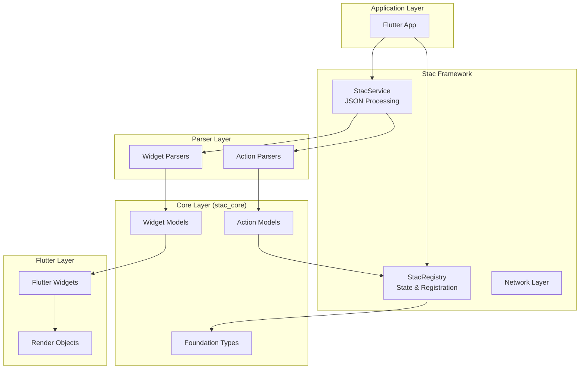
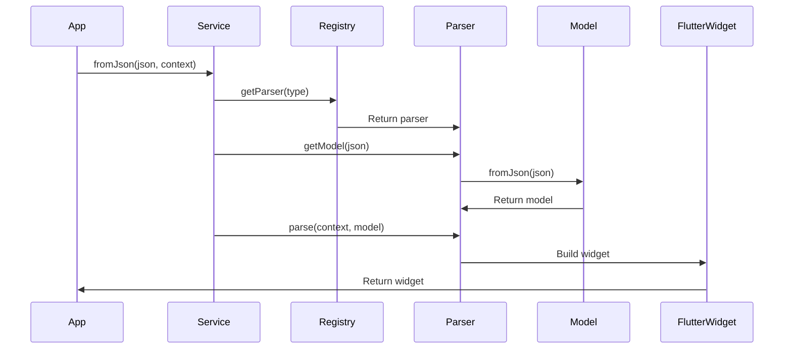
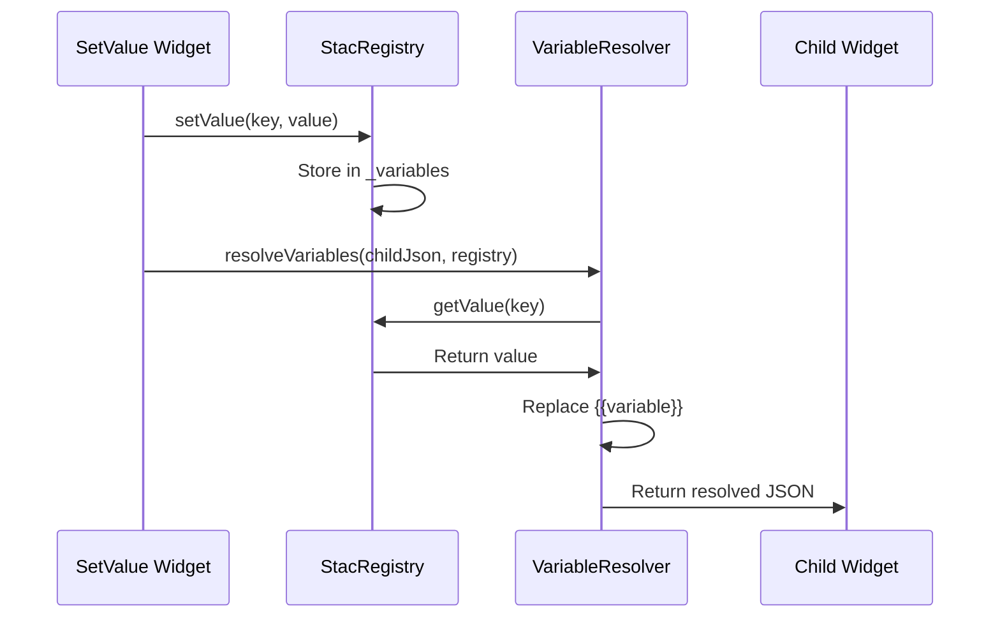
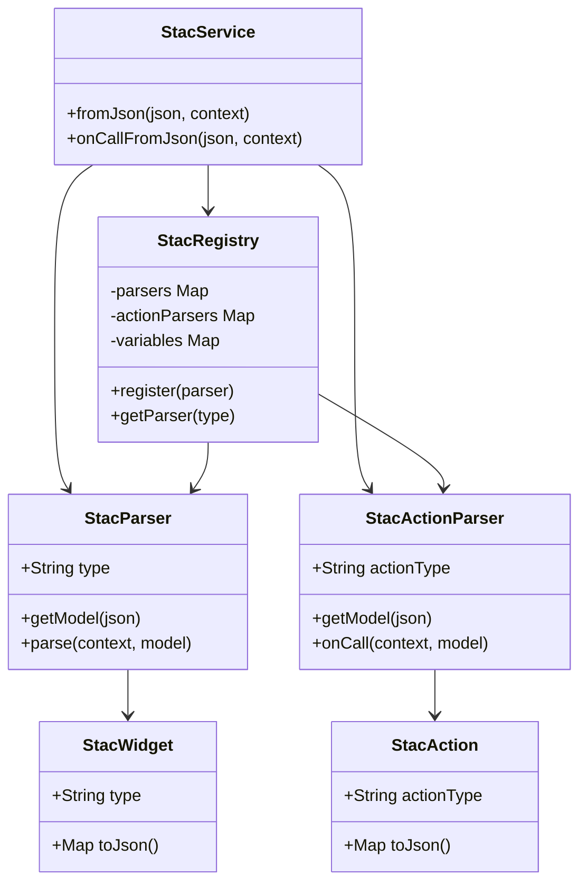

# Architecture Overview

## 📐 System Architecture

Stac follows a **modular, plugin-based architecture** built on Flutter's widget system. The architecture is designed around three core principles:

1. **JSON-Driven**: UI defined as JSON
2. **Registry-Based**: Central registration system for extensibility
3. **Parser Pattern**: Convert JSON to Flutter widgets at runtime

## 🏛️ High-Level Architecture



## 📦 Package Architecture

### Package Structure

```
.stac/packages/
├── stac_core/          # Pure Dart - Data models
├── stac/               # Flutter - Core framework
├── stac_framework/     # Parser interfaces
├── stac_logger/        # Logging utilities
└── stac_webview/       # WebView integration
```

### Core Packages Breakdown

#### 1. **stac_core** (Pure Dart)
- **Purpose**: Data models and interfaces
- **Dependencies**: `json_annotation`, `stac_logger`
- **Key Exports**:
  - `StacWidget` (base class)
  - `StacAction` (base class)
  - Widget models (StacText, StacContainer, etc.)
  - Action models (StacNavigateAction, etc.)
  - Foundation types (StacColor, StacBorder, etc.)

#### 2. **stac** (Flutter)
- **Purpose**: Core runtime and parsers
- **Dependencies**: `stac_core`, `stac_framework`, `stac_logger`
- **Key Components**:
  - `StacService`: JSON processing
  - `StacRegistry`: State management
  - Widget parsers (StacTextParser, etc.)
  - Action parsers (StacNavigateParser, etc.)

#### 3. **stac_framework**
- **Purpose**: Parser interfaces
- **Key Interfaces**:
  - `StacParser<T>`
  - `StacActionParser<T>`

## 🔄 Data Flow Architecture

### 1. JSON to Widget Flow



### 2. State Management Flow



## 🏗️ Design Patterns

### 1. Registry Pattern
The `StacRegistry` uses a singleton pattern to manage:
- Widget parsers
- Action parsers
- State variables

```dart
class StacRegistry {
  static final StacRegistry _instance = StacRegistry._internal();
  factory StacRegistry() => _instance;
  static StacRegistry get instance => _instance;
  
  final _stacParsers = <String, StacParser>{};
  final _stacActionParsers = <String, StacActionParser>{};
  final _variables = <String, dynamic>{};
}
```

### 2. Factory Pattern
Widget models use factory constructors for JSON deserialization:

```dart
@JsonSerializable()
class StacText extends StacWidget {
  const StacText({required this.data});
  
  factory StacText.fromJson(Map<String, dynamic> json) =>
      _$StacTextFromJson(json);
  
  @override
  Map<String, dynamic> toJson() => _$StacTextToJson(this);
}
```

### 3. Strategy Pattern
Parsers implement a common interface but provide different strategies:

```dart
abstract class StacParser<T> {
  String get type;
  T getModel(Map<String, dynamic> json);
  Widget parse(BuildContext context, T model);
}
```

## 🔌 Extensibility Points

### 1. Widget Extension

```dart
// 1. Create model
@JsonSerializable()
class CustomWidget extends StacWidget {
  final String customProperty;
  
  factory CustomWidget.fromJson(Map<String, dynamic> json) =>
      _$CustomWidgetFromJson(json);
  
  @override
  Map<String, dynamic> toJson() => _$CustomWidgetToJson(this);
}

// 2. Create parser
class CustomWidgetParser extends StacParser<CustomWidget> {
  @override
  String get type => 'custom';
  
  @override
  CustomWidget getModel(Map<String, dynamic> json) =>
      CustomWidget.fromJson(json);
  
  @override
  Widget parse(BuildContext context, CustomWidget model) {
    return CustomFlutterWidget(property: model.customProperty);
  }
}

// 3. Register
StacRegistry.instance.register(CustomWidgetParser());
```

### 2. Action Extension

```dart
// Similar pattern for actions
```

## 🎯 Key Architectural Decisions

### 1. Pure Dart Core
- **Why**: Platform-agnostic data models
- **Benefit**: Can be used in non-Flutter contexts

### 2. Generator-Based Serialization
- **Why**: Type-safe JSON conversion
- **Benefit**: Compile-time validation

### 3. Runtime Parsing
- **Why**: Dynamic UI rendering
- **Benefit**: Flexible, server-driven updates

### 4. Singleton Registry
- **Why**: Global state management
- **Benefit**: Easy access across the app

## 📊 Component Relationships



## 🔍 Critical Paths

### 1. Widget Rendering Path
```
JSON → StacService → Registry → Parser → Model → Flutter Widget
```

### 2. Action Execution Path
```
JSON → StacService → Registry → ActionParser → Business Logic
```

### 3. State Update Path
```
SetValue Widget → Registry → Variable Resolution → Child Widget
```

## 🚨 Architecture Constraints

1. **JSON-First**: All UI must be expressible as JSON
2. **Parser Required**: Every widget type needs a parser
3. **Synchronous Parse**: Widget parsing is synchronous
4. **Async Actions**: Actions can be asynchronous
5. **No Direct State**: Widgets don't hold state directly

## 🎓 Best Practices

1. **Keep Models Simple**: Models should be data containers
2. **Parser Separation**: Parsing logic in parsers, not models
3. **State in Registry**: All state managed via registry
4. **Error Handling**: Parsers should handle errors gracefully
5. **Documentation**: All public APIs must be documented
