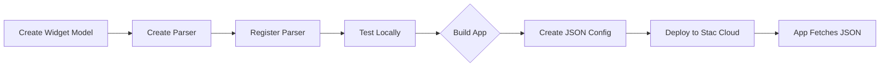

# Creating Custom Widgets and Actions

## 🎯 Overview

This guide provides step-by-step instructions for creating custom widgets and actions in Stac. It's designed to be **AI-friendly** for agents that need to understand and generate Stac components.

## 📋 Table of Contents

1. [Creating Custom Widgets](#creating-custom-widgets)
2. [Creating Custom Actions](#creating-custom-actions)
3. [Deployment & Testing](#deployment--testing) ⭐ **NEW**
4. [Best Practices](#best-practices)
5. [Common Patterns](#common-patterns)
6. [Troubleshooting](#troubleshooting)

---

## 🧩 Creating Custom Widgets

### Step-by-Step Process

#### Step 1: Create the Model

Create a Dart class in `stac_core/lib/widgets/` that extends `StacWidget`:

```dart
// widgets/custom_widget/stac_custom_widget.dart
import 'package:json_annotation/json_annotation.dart';
import 'package:stac_core/stac_core.dart';

part 'stac_custom_widget.g.dart';

@JsonSerializable()
class StacCustomWidget extends StacWidget {
  /// Creates a custom widget.
  const StacCustomWidget({
    required this.title,
    this.subtitle,
    this.onTap,
  });

  /// The title text to display.
  final String title;

  /// Optional subtitle text.
  final String? subtitle;

  /// Optional tap action.
  final StacAction? onTap;

  /// Widget type identifier.
  @override
  String get type => 'customWidget';

  /// Creates from JSON.
  factory StacCustomWidget.fromJson(Map<String, dynamic> json) =>
      _$StacCustomWidgetFromJson(json);

  /// Converts to JSON.
  @override
  Map<String, dynamic> toJson() => _$StacCustomWidgetToJson(this);
}
```

**Key Requirements:**
- Must extend `StacWidget`
- Must use `@JsonSerializable()` annotation
- Must implement `type` getter returning unique identifier
- Must implement `fromJson` and `toJson` methods
- Use `part` directive for generated code

#### Step 2: Generate Code

Run build_runner to generate serialization code:

```bash
dart run build_runner build --delete-conflicting-outputs
```

#### Step 3: Create the Parser

Create parser in `stac/lib/src/parsers/widgets/custom_widget/custom_widget_parser.dart`:

```dart
import 'package:flutter/material.dart';
import 'package:stac/src/framework/framework.dart';
import 'package:stac/src/utils/variable_resolver.dart';
import 'package:stac_core/stac_core.dart';
import 'package:stac_framework/stac_framework.dart';

class CustomWidgetParser extends StacParser<StacCustomWidget> {
  const CustomWidgetParser();

  @override
  String get type => 'customWidget';

  @override
  StacCustomWidget getModel(Map<String, dynamic> json) =>
      StacCustomWidget.fromJson(json);

  @override
  Widget parse(BuildContext context, StacCustomWidget model) {
    return GestureDetector(
      onTap: () {
        if (model.onTap != null) {
          StacService.onCallFromJson(model.onTap!.toJson(), context);
        }
      },
      child: Container(
        padding: const EdgeInsets.all(16),
        child: Column(
          crossAxisAlignment: CrossAxisAlignment.start,
          children: [
            Text(
              model.title,
              style: Theme.of(context).textTheme.titleLarge,
            ),
            if (model.subtitle != null)
              Text(
                model.subtitle!,
                style: Theme.of(context).textTheme.bodySmall,
              ),
          ],
        ),
      ),
    );
  }
}
```

**Key Requirements:**
- Must implement `StacParser<T>` interface
- Must implement `type` getter (matches model)
- Must implement `getModel` method
- Must implement `parse` method that returns Flutter `Widget`
- Use `StacService.onCallFromJson` for actions

#### Step 4: Register the Parser

In your app initialization:

```dart
void main() async {
  await Stac.initialize(
    parsers: const [
      CustomWidgetParser(),
      // ... other parsers
    ],
  );
  runApp(const MyApp());
}
```

Or register dynamically:

```dart
StacRegistry.instance.register(CustomWidgetParser());
```

#### Step 5: Export the Widget

Add export to `stac_core/lib/widgets/widgets.dart`:

```dart
export 'custom_widget/stac_custom_widget.dart';
```

---

## ⚡ Creating Custom Actions

### Step-by-Step Process

#### Step 1: Create the Action Model

Create a Dart class in `stac_core/lib/actions/` that extends `StacAction`:

```dart
// actions/custom_action/stac_custom_action.dart
import 'package:json_annotation/json_annotation.dart';
import 'package:stac_core/stac_core.dart';

part 'stac_custom_action.g.dart';

@JsonSerializable()
class StacCustomAction extends StacAction {
  /// Creates a custom action.
  const StacCustomAction({
    required this.message,
    this.showDialog = true,
  });

  /// The message to display or process.
  final String message;

  /// Whether to show a dialog.
  final bool showDialog;

  /// Action type identifier.
  @override
  String get actionType => 'customAction';

  /// Creates from JSON.
  factory StacCustomAction.fromJson(Map<String, dynamic> json) =>
      _$StacCustomActionFromJson(json);

  /// Converts to JSON.
  @override
  Map<String, dynamic> toJson() => _$StacCustomActionToJson(this);
}
```

**Key Requirements:**
- Must extend `StacAction`
- Must use `@JsonSerializable()` annotation
- Must implement `actionType` getter
- Must implement `fromJson` and `toJson` methods

#### Step 2: Generate Code

Run build_runner:

```bash
dart run build_runner build --delete-conflicting-outputs
```

#### Step 3: Create the Action Parser

Create parser in `stac/lib/src/parsers/actions/custom_action/custom_action_parser.dart`:

```dart
import 'package:flutter/material.dart';
import 'package:stac/src/framework/framework.dart';
import 'package:stac_core/stac_core.dart';
import 'package:stac_framework/stac_framework.dart';

class CustomActionParser implements StacActionParser<StacCustomAction> {
  const CustomActionParser();

  @override
  String get actionType => 'customAction';

  @override
  StacCustomAction getModel(Map<String, dynamic> json) =>
      StacCustomAction.fromJson(json);

  @override
  FutureOr onCall(BuildContext context, StacCustomAction model) async {
    // Business logic here
    if (model.showDialog) {
      await showDialog(
        context: context,
        builder: (context) => AlertDialog(
          title: const Text('Custom Action'),
          content: Text(model.message),
          actions: [
            TextButton(
              onPressed: () => Navigator.of(context).pop(),
              child: const Text('OK'),
            ),
          ],
        ),
      );
    } else {
      // Process message without dialog
      print('Custom Action: ${model.message}');
    }
  }
}
```

**Key Requirements:**
- Must implement `StacActionParser<T>` interface
- Must implement `actionType` getter
- Must implement `getModel` method
- Must implement `onCall` method (can be async)
- Return type is `FutureOr<dynamic>`

#### Step 4: Register the Action Parser

In your app initialization:

```dart
void main() async {
  await Stac.initialize(
    actionParsers: const [
      CustomActionParser(),
      // ... other action parsers
    ],
  );
  runApp(const MyApp());
}
```

Or register dynamically:

```dart
StacRegistry.instance.registerAction(CustomActionParser());
```

#### Step 5: Export the Action

Add export to `stac_core/lib/actions/actions.dart`:

```dart
export 'custom_action/stac_custom_action.dart';
```

---

## 🚀 Deployment & Testing

### Understanding the Deployment Process

Custom widgets and actions are **not deployed individually**. They are part of your app's code and compiled into the app binary. However, you can use the **Stac Cloud** platform to deploy JSON configurations that use your custom components.

### Workflow Overview



### Step-by-Step Deployment Guide

#### Step 1: Create and Test Components Locally

**Before deploying, test your custom components:**

```dart
// main.dart
import 'package:flutter/material.dart';
import 'package:stac/stac.dart';
import 'parsers/custom_widget_parser.dart';
import 'parsers/custom_action_parser.dart';

void main() async {
  await Stac.initialize(
    parsers: const [
      CustomWidgetParser(),
      // ... other parsers
    ],
    actionParsers: const [
      CustomActionParser(),
      // ... other action parsers
    ],
  );
  runApp(const MyApp());
}
```

**Test with hardcoded JSON:**

```dart
class TestScreen extends StatelessWidget {
  @override
  Widget build(BuildContext context) {
    return Scaffold(
      body: Center(
        child: StacService.fromJson({
          'type': 'customWidget',
          'title': 'Test Widget',
          'subtitle': 'Testing deployment',
          'onTap': {
            'actionType': 'customAction',
            'message': 'Action triggered!',
            'showDialog': true,
          },
        }),
      ),
    );
  }
}
```

#### Step 2: Build Your App

**Compile your app with custom components:**

```bash
# For Flutter
flutter build apk  # Android
flutter build ios  # iOS
flutter build web  # Web

# For development testing
flutter run
```

#### Step 3: Create JSON Configuration

**Create a JSON file that uses your custom components:**

```json
{
  "type": "scaffold",
  "appBar": {
    "type": "appBar",
    "title": {
      "type": "text",
      "data": "Custom Components Demo"
    }
  },
  "body": {
    "type": "column",
    "children": [
      {
        "type": "customWidget",
        "title": "Product Card",
        "subtitle": "iPhone 15 Pro",
        "onTap": {
          "actionType": "customAction",
          "message": "Product selected!",
          "showDialog": true
        }
      }
    ]
  }
}
```

#### Step 4: Deploy to Stac Cloud (Optional)

**If using Stac Cloud platform:**

```bash
# Install Stac CLI
curl -fsSL https://raw.githubusercontent.com/StacDev/install/main/install.sh | bash

# Login to Stac Cloud
stac login

# Initialize project (if not already done)
stac init

# Build and deploy
stac deploy
```

**Deployment output:**
```
[INFO] Building project before deployment...
[INFO] Building Stac project...
[INFO] Source directory: stac
[INFO] Output directory: stac/.build
[INFO] ✓ Generated: my_screen.json
[SUCCESS] ✓ Build completed successfully!
[INFO] Processed 1 function(s) and generated JSON files
[INFO] Build completed. Starting deployment...
[INFO] Deploying screens to cloud...
[INFO] Uploading: my_screen.json
[SUCCESS] ✓ Uploaded: my_screen.json
[SUCCESS] ✓ Deployment completed successfully!
```

#### Step 5: Fetch and Render in App

**Configure your app to fetch and render the deployed JSON:**

```dart
// main.dart
import 'package:flutter/material.dart';
import 'package:stac/stac.dart';
import 'default_stac_options.dart';

void main() async {
  await Stac.initialize(options: defaultStacOptions);
  runApp(const MyApp());
}

class MyApp extends StatelessWidget {
  const MyApp({super.key});

  @override
  Widget build(BuildContext context) {
    return MaterialApp(
      home: Scaffold(
        body: Stac(
          routeName: 'my_screen',  // Name of deployed screen
          projectId: 'your-project-id',
        ),
      ),
    );
  }
}
```

### Local Testing Best Practices

#### 1. Unit Testing Custom Components

```dart
// test/custom_widget_test.dart
void main() {
  group('CustomWidget', () {
    test('should serialize to JSON correctly', () {
      final widget = StacCustomWidget(
        title: 'Test Title',
        subtitle: 'Test Subtitle',
      );
      
      final json = widget.toJson();
      expect(json['type'], 'customWidget');
      expect(json['title'], 'Test Title');
      expect(json['subtitle'], 'Test Subtitle');
    });
    
    test('should deserialize from JSON correctly', () {
      final json = {
        'type': 'customWidget',
        'title': 'Test Title',
        'subtitle': 'Test Subtitle',
      };
      
      final widget = StacCustomWidget.fromJson(json);
      expect(widget.title, 'Test Title');
      expect(widget.subtitle, 'Test Subtitle');
    });
  });
}
```

#### 2. Widget Testing Parsers

```dart
// test/custom_widget_parser_test.dart
void main() {
  group('CustomWidgetParser', () {
    testWidgets('should render custom widget', (tester) async {
      final parser = CustomWidgetParser();
      final model = StacCustomWidget(
        title: 'Test',
        subtitle: 'Subtitle',
      );
      
      await tester.pumpWidget(
        MaterialApp(
          home: Scaffold(
            body: parser.parse(tester.element(find.byType(Scaffold)), model),
          ),
        ),
      );
      
      expect(find.text('Test'), findsOneWidget);
      expect(find.text('Subtitle'), findsOneWidget);
    });
  });
}
```

#### 3. Integration Testing with Actions

```dart
// test/integration_test.dart
void main() {
  group('Custom Component Integration', () {
    testWidgets('should trigger custom action on tap', (tester) async {
      await tester.pumpWidget(MyApp());
      
      // Find custom widget
      final customWidget = find.byType(CustomWidget);
      expect(customWidget, findsOneWidget);
      
      // Tap on widget
      await tester.tap(customWidget);
      await tester.pumpAndSettle();
      
      // Verify dialog appears
      expect(find.text('Custom Action'), findsOneWidget);
      expect(find.text('Action triggered!'), findsOneWidget);
    });
  });
}
```

### Deployment Checklist

#### Before Deployment

- [ ] All custom components are fully tested
- [ ] Parsers are registered in `main.dart`
- [ ] All required dependencies are in `pubspec.yaml`
- [ ] Code generation is up to date (`build_runner`)
- [ ] Unit tests pass
- [ ] Widget tests pass
- [ ] Integration tests pass (if applicable)

#### Deployment Steps

- [ ] Build the app (`flutter build`)
- [ ] Create/update JSON configuration files
- [ ] Validate JSON structure
- [ ] Test JSON locally before deploying
- [ ] Deploy to Stac Cloud (if using)
- [ ] Test deployed configuration
- [ ] Update app to fetch from Stac Cloud

#### Post-Deployment

- [ ] Monitor for runtime errors
- [ ] Check analytics/usage stats
- [ ] Gather user feedback
- [ ] Plan next iteration

### Common Deployment Issues

#### Issue 1: Parser Not Found After Deployment

**Error:** `Parser not found for type 'customWidget'`

**Solution:** Ensure the app binary includes your custom parser code:

```dart
// Make sure parsers are registered at app startup
void main() async {
  await Stac.initialize(
    parsers: const [
      CustomWidgetParser(),  // Must be included
    ],
  );
  runApp(const MyApp());
}
```

#### Issue 2: JSON Validation Failed

**Error:** `Invalid JSON structure`

**Solution:** Validate JSON before deployment:

```bash
# Use JSON validator
stac validate --file my_screen.json

# Or manually check structure
cat my_screen.json | python -m json.tool
```

#### Issue 3: Deployment Successful but Widget Not Rendering

**Error:** Widget not appearing in app

**Solution:** Check these points:

1. **Verify Parser Registration:**
```dart
// Ensure parser is registered with correct type
class CustomWidgetParser extends StacParser<StacCustomWidget> {
  @override
  String get type => 'customWidget';  // Must match JSON type
}
```

2. **Check JSON Structure:**
```json
{
  "type": "customWidget",  // Must match parser type
  "title": "Test"
}
```

3. **Verify App is Fetching Latest Version:**
```dart
// Force fetch latest version
Stac(routeName: 'my_screen', cache: false);
```

### CI/CD Integration

**Automate deployment with CI/CD:**

```yaml
# .github/workflows/deploy.yml
name: Deploy Custom Components

on:
  push:
    branches: [main]

jobs:
  deploy:
    runs-on: ubuntu-latest
    steps:
      - uses: actions/checkout@v2
      - uses: subosito/flutter-action@v2
        with:
          flutter-version: '3.24.0'
      
      - name: Install dependencies
        run: flutter pub get
      
      - name: Run tests
        run: flutter test
      
      - name: Build app
        run: flutter build apk --release
      
      - name: Deploy to Stac Cloud
        run: stac deploy
        env:
          STAC_API_KEY: ${{ secrets.STAC_API_KEY }}
```

### Summary: Deployment Workflow

1. **Development Phase:**
   - Create models and parsers
   - Write unit and widget tests
   - Test locally with hardcoded JSON

2. **Build Phase:**
   - Run `build_runner` to generate code
   - Compile app with custom components
   - Validate all parsers are registered

3. **Deployment Phase:**
   - Create JSON configurations
   - Validate JSON structure
   - Deploy to Stac Cloud (optional)
   - Update app to fetch configurations

4. **Testing Phase:**
   - Test deployed configurations
   - Monitor for errors
   - Gather feedback

This workflow ensures your custom components are properly integrated, tested, and deployed.

---

## ✅ Best Practices

### Widget Creation

#### ✅ DO:

1. **Use Descriptive Names**
   ```dart
   // ✅ Good
   class StacProductCard extends StacWidget { }
   
   // ❌ Bad
   class StacPC extends StacWidget { }
   ```

2. **Add Documentation**
   ```dart
   /// A widget that displays a product card with image, title, and price.
   ///
   /// Example:
   /// ```json
   /// {
   ///   "type": "productCard",
   ///   "title": "iPhone 15",
   ///   "price": 999
   /// }
   /// ```
   class StacProductCard extends StacWidget { }
   ```

3. **Use Nullable Types When Optional**
   ```dart
   // ✅ Good
   final String? subtitle;
   final StacAction? onTap;
   
   // ❌ Bad (forces required values)
   final String subtitle;
   final StacAction onTap;
   ```

4. **Handle Actions Properly**
   ```dart
   @override
   Widget parse(BuildContext context, StacCustomWidget model) {
     return GestureDetector(
       onTap: () {
         if (model.onTap != null) {
           StacService.onCallFromJson(model.onTap!.toJson(), context);
         }
       },
       child: // ... widget
     );
   }
   ```

5. **Resolve Variables When Needed**
   ```dart
   @override
   Widget parse(BuildContext context, StacCustomWidget model) {
     final resolvedJson = resolveVariablesInJson(
       model.toJson(),
       StacRegistry.instance,
     );
     // Use resolved values
   }
   ```

#### ❌ DON'T:

1. **Don't Store Context**
   ```dart
   // ❌ Bad
   final BuildContext context;
   ```

2. **Don't Add Business Logic to Models**
   ```dart
   // ❌ Bad
   class StacCustomWidget extends StacWidget {
     Widget buildWidget() { /* ... */ }  // Logic belongs in parser
   }
   ```

3. **Don't Forget Error Handling**
   ```dart
   // ✅ Good
   @override
   Widget parse(BuildContext context, StacCustomWidget model) {
     try {
       return _buildWidget(model);
     } catch (e) {
       return ErrorWidget('Failed to render: $e');
     }
   }
   ```

### Action Creation

#### ✅ DO:

1. **Use Async When Needed**
   ```dart
   @override
   FutureOr onCall(BuildContext context, StacCustomAction model) async {
     await Future.delayed(Duration(seconds: 2));
     // Action complete
   }
   ```

2. **Handle Errors Gracefully**
   ```dart
   @override
   FutureOr onCall(BuildContext context, StacCustomAction model) async {
     try {
       await performAction();
     } catch (e) {
       ScaffoldMessenger.of(context).showSnackBar(
         SnackBar(content: Text('Action failed: $e')),
       );
     }
   }
   ```

3. **Use BuildContext Properly**
   ```dart
   @override
   FutureOr onCall(BuildContext context, StacCustomAction model) async {
     // Use context for navigation, dialogs, etc.
     Navigator.of(context).pushNamed('/route');
   }
   ```

#### ❌ DON'T:

1. **Don't Block the UI**
   ```dart
   // ❌ Bad
   @override
   FutureOr onCall(BuildContext context, StacCustomAction model) async {
     // Synchronous operations
     for (int i = 0; i < 1000000; i++) { }
   }
   ```

2. **Don't Store Mutable State in Parsers**
   ```dart
   // ❌ Bad
   class CustomActionParser implements StacActionParser {
     int counter = 0;  // Should be in registry
   }
   ```

---

## 🎨 Common Patterns

### Pattern 1: Conditional Widget

```dart
class StacConditionalWidget extends StacWidget {
  const StacConditionalWidget({
    required this.condition,
    required this.trueChild,
    this.falseChild,
  });

  final bool condition;
  final StacWidget trueChild;
  final StacWidget? falseChild;

  @override
  String get type => 'conditionalWidget';
}

// Parser
@override
Widget parse(BuildContext context, StacConditionalWidget model) {
  if (model.condition) {
    return model.trueChild.parse(context);
  } else if (model.falseChild != null) {
    return model.falseChild!.parse(context);
  }
  return const SizedBox();
}
```

### Pattern 2: List Rendering

```dart
class StacListItem extends StacWidget {
  const StacListItem({
    required this.items,
    required this.template,
  });

  final List<dynamic> items;
  final StacWidget template;

  @override
  String get type => 'listItem';
}

// Parser
@override
Widget parse(BuildContext context, StacListItem model) {
  return Column(
    children: model.items.map((item) {
      return _applyItemToTemplate(model.template, item, context);
    }).toList(),
  );
}
```

### Pattern 3: Data Fetching Action

```dart
class StacFetchDataAction extends StacAction {
  const StacFetchDataAction({
    required this.url,
    this.method = 'GET',
    this.resultKey = 'data',
  });

  final String url;
  final String method;
  final String resultKey;

  @override
  String get actionType => 'fetchData';
}

// Parser
@override
FutureOr onCall(BuildContext context, StacFetchDataAction model) async {
  try {
    final response = await http.get(Uri.parse(model.url));
    final data = jsonDecode(response.body);
    
    // Store in registry
    StacRegistry.instance.setValue(model.resultKey, data);
  } catch (e) {
    // Handle error
  }
}
```

### Pattern 4: Navigation with Parameters

```dart
class StacNavigateAction extends StacAction {
  const StacNavigateAction({
    required this.route,
    this.arguments,
  });

  final String route;
  final Map<String, dynamic>? arguments;

  @override
  String get actionType => 'navigate';
}

// Parser
@override
FutureOr onCall(BuildContext context, StacNavigateAction model) async {
  Navigator.of(context).pushNamed(
    model.route,
    arguments: model.arguments,
  );
}
```

---

## 🔍 Troubleshooting

### Common Issues

#### Issue 1: Type Not Found

**Error:** `Parser not found for type 'customWidget'`

**Solution:**
1. Check parser is registered
2. Verify `type` getter matches in both model and parser
3. Ensure registration happens before parsing

```dart
// ✅ Good - Register before use
await Stac.initialize(parsers: [CustomWidgetParser()]);

// ❌ Bad - Missing registration
// Forgot to register the parser
```

#### Issue 2: JSON Serialization Error

**Error:** `JSON serialization failed`

**Solution:**
1. Run `build_runner` to generate code
2. Check all fields are JSON-serializable
3. Use `@JsonKey` for custom names

```dart
@JsonSerializable()
class StacCustomWidget extends StacWidget {
  final String title;
  
  @JsonKey(name: 'subTitle')  // Custom JSON key
  final String subtitle;
  
  @JsonKey(includeIfNull: false)  // Skip null values
  final String? optional;
}
```

#### Issue 3: Variable Not Resolving

**Error:** `Variable {{name}} not found`

**Solution:**
1. Ensure variable is set in registry
2. Use `resolveVariablesInJson` before parsing
3. Check variable name spelling

```dart
// ✅ Good - Resolve variables first
final resolvedJson = resolveVariablesInJson(
  model.toJson(),
  StacRegistry.instance,
);

// ❌ Bad - Variables not resolved
final json = model.toJson();
```

#### Issue 4: Action Not Triggering

**Error:** Action defined but nothing happens on tap

**Solution:**
1. Verify action is registered
2. Use `StacService.onCallFromJson` correctly
3. Check action JSON structure

```dart
// ✅ Good - Proper action triggering
onTap: () {
  if (model.onTap != null) {
    StacService.onCallFromJson(model.onTap!.toJson(), context);
  }
}

// ❌ Bad - Wrong method
onTap: () {
  model.onTap?.onCall(context);  // Won't work
}
```

---

## 📚 Additional Resources

### File Locations

- **Models:** `stac_core/lib/widgets/` or `stac_core/lib/actions/`
- **Parsers:** `stac/lib/src/parsers/widgets/` or `stac/lib/src/parsers/actions/`
- **Exports:** `stac_core/lib/widgets/widgets.dart` or `stac_core/lib/actions/actions.dart`

### Code Generation

```bash
# Watch mode (recommended during development)
dart run build_runner watch

# One-time build
dart run build_runner build --delete-conflicting-outputs
```

### Testing

```dart
void main() {
  test('Custom widget parsing', () {
    final json = {
      'type': 'customWidget',
      'title': 'Test Title',
    };
    
    final widget = StacCustomWidget.fromJson(json);
    expect(widget.title, 'Test Title');
  });
}
```

---

## 🎯 Summary

### Widget Creation Checklist

- [ ] Create model extending `StacWidget`
- [ ] Add `@JsonSerializable()` annotation
- [ ] Implement `type` getter
- [ ] Implement `fromJson` and `toJson`
- [ ] Run `build_runner` to generate code
- [ ] Create parser implementing `StacParser<T>`
- [ ] Implement parser methods
- [ ] Register parser in initialization
- [ ] Export in widgets.dart
- [ ] Test parsing and rendering

### Action Creation Checklist

- [ ] Create model extending `StacAction`
- [ ] Add `@JsonSerializable()` annotation
- [ ] Implement `actionType` getter
- [ ] Implement `fromJson` and `toJson`
- [ ] Run `build_runner` to generate code
- [ ] Create parser implementing `StacActionParser<T>`
- [ ] Implement `onCall` method
- [ ] Register parser in initialization
- [ ] Export in actions.dart
- [ ] Test action execution

This guide provides everything needed to create custom widgets and actions in Stac. Follow the patterns and best practices for success.
